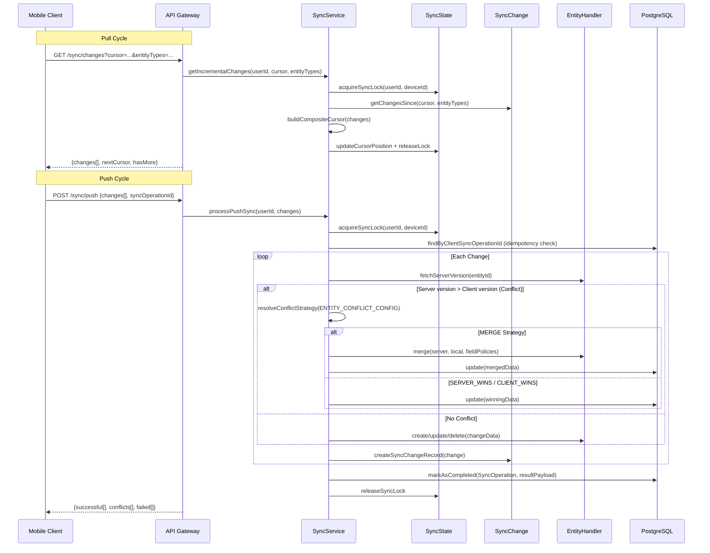
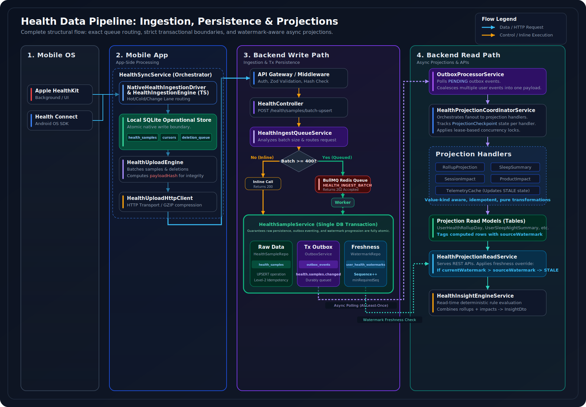
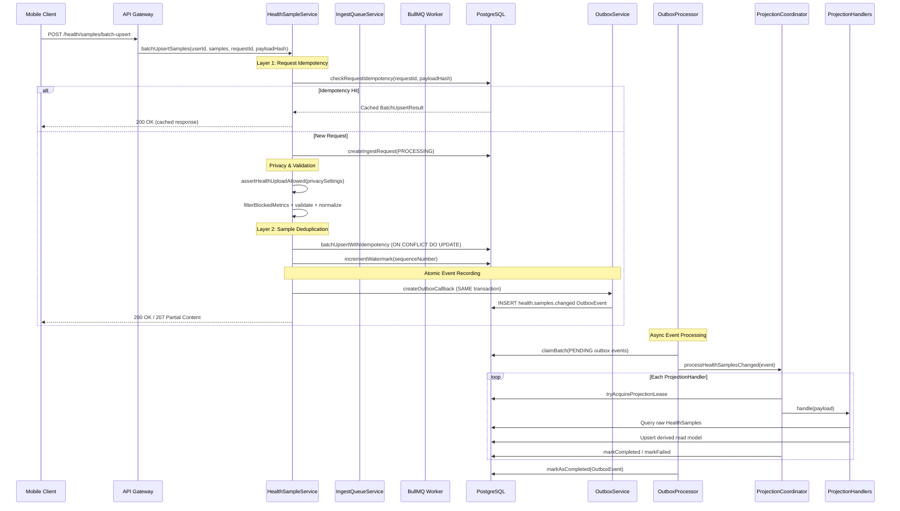
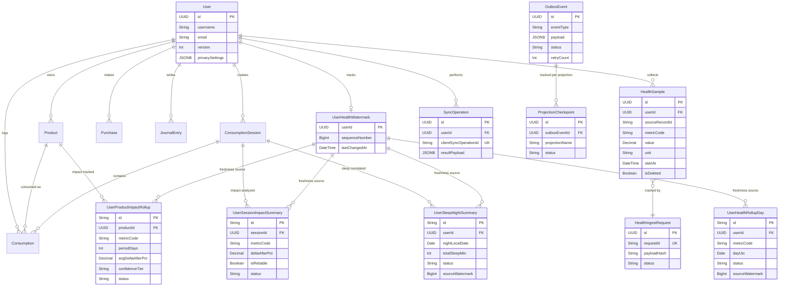

<div align="center">
  


  
</div>

<br>

## Overview

This repository details the architecture of a cloud-native, event-driven Node.js/TypeScript backend platform built on Express.js and PostgreSQL. It serves as the authoritative data layer for user profiles, consumption tracking, and health metrics, orchestrating multi-device data synchronization, high-throughput health ingestion, asynchronous projection pipelines, and AI-powered analytics.

We designed this system for the real world, not the happy path. It is engineered to handle unreliable mobile networks, long offline periods, bursty health data ingestion, and concurrent multi-device modifications. The architecture prioritizes **data integrity**, **idempotency**, and **explicit consistency tracking**. The platform remains correct, observable, and recoverable under all operating conditions.

<br>

## Engineering Principles

### 1. Guarantee event delivery through transactional atomicity
Every domain event is written to an `OutboxEvent` table within the same database transaction as the primary data change. A separate processor claims, routes, and completes events. If the app crashes between commit and delivery, events survive in the outbox. The dual-write problem is structurally eliminated.

> **Goal:** No data change silently drops its downstream side effects.

### 2. Resolve conflicts deterministically through shared configuration
Optimistic locking detects concurrent modifications. Conflict resolution is config-driven: field-level merge policies (`LOCAL_WINS`, `MONOTONIC`, `MAX_VALUE`) are declared in a shared contract package, consumed by both backend and mobile. No ad-hoc merge logic exists inside service methods.

> **Goal:** Every conflict outcome is reproducible, auditable, and testable in isolation.

### 3. Achieve idempotency at every trust boundary
Request-level idempotency uses `requestId` + `payloadHash` in a persistent tracking table. Sample-level deduplication relies on composite unique constraints. Sync operations are tracked by `clientSyncOperationId` with cached `resultPayload`. Retries are always safe.

> **Goal:** Network unreliability, client bugs, and background job retries never produce duplicate data.

### 4. Treat health data as a write-ahead, read-behind pipeline
Raw `HealthSample` ingestion is the write path: high throughput, append-only, minimal blocking. Derived read models (daily rollups, sleep summaries, session impacts, product impacts) are computed asynchronously via event-driven projection handlers, each with independent checkpoints and watermark-based freshness tracking.

> **Goal:** API reads are fast (pre-computed), writes are durable (transactional), and staleness is explicit (watermarks).

### 5. Inject dependencies explicitly, own the composition root
`bootstrap.ts` is the single composition root. Every service receives its dependencies through constructor injection. No service locators, no ambient singletons, no hidden coupling. The entire dependency graph is visible in one file.

> **Goal:** Maximum testability, minimal coupling, and complete transparency of system wiring.

---

## Bidirectional Sync Engine

The sync subsystem orchestrates bidirectional data synchronization between multiple offline-first mobile clients and the backend. Users make changes while offline; all local changes eventually reconcile with the server's authoritative state through deterministic conflict resolution. The engine uses cursor-based pagination, optimistic locking, and a transactional outbox to guarantee eventual consistency with zero data loss.

### Architecture

The push phase dequeues local outbox commands, performs FK translation and dependency ordering, and submits batched changes to the backend. The backend acquires a distributed lock, checks idempotency, detects conflicts via version comparison, and applies changes atomically using config-driven merge rules. The pull phase fetches incremental changes via composite cursors, applies them locally, then validates relational integrity before committing cursor advancement.

<div align="center">
  
</div>

<br>

<details>
<summary><strong>Sync Engine Sequence Diagram</strong></summary>
<br>



</details>

> **Guarantee:** Cursors never advance past corrupted state. Data integrity is enforced structurally, not by convention.

> For full implementation details -- conflict resolution policies, cursor semantics, and failure handling -- see [**docs/features/multi-device-sync-engine.md**](docs/features/multi-device-sync-engine.md).

---

## Health Data Pipeline

The health pipeline is divided into two decoupled phases: a **high-throughput ingestion write path** that validates, deduplicates, and persists raw health samples with transactional outbox events, and an **async projection pipeline** that transforms raw data into pre-computed read models with watermark-based freshness tracking.

### Ingestion and Projection Pipeline

<div align="center">
  
</div>

<br>

<details>
<summary><strong>End-to-End Ingestion Sequence Diagram</strong></summary>
<br>



</details>

> **Guarantee:** Zero dual-writes. Raw samples and outbox events are committed in a single atomic transaction. Downstream projections use watermark sequence numbers to detect and recover from staleness.

> For full implementation details -- idempotency layers, projection checkpoints, and watermark freshness -- see [**docs/features/idempotent-health-ingestion.md**](docs/features/idempotent-health-ingestion.md).

---

## Backend Async Processing

The backend separates work into two distinct asynchronous pipelines: a **BullMQ job-processing subsystem** for compute-heavy background tasks, and a **transactional outbox pipeline** for event-driven projections. Both run in a dedicated Worker Service process, sharing no state with the Web Service except through PostgreSQL and Redis.

<div align="center">
  
</div>

<br>

> **Guarantee:** Background jobs survive worker crashes via durable Redis queues. Outbox events survive application crashes via transactional persistence. Both pipelines are idempotent and retry-safe.

---

## Hardest Problems Solved

### 1. Guaranteed Event Delivery in Distributed Systems

**Problem:** Ensuring domain events are reliably emitted and processed from PostgreSQL, even with crashes or network failures.

**Solution:** The `OutboxService` implements the Transactional Outbox Pattern. Events are written to a dedicated `OutboxEvent` table within the same database transaction as the primary data change. An idempotent `OutboxProcessorService` polls, processes, and marks events as `COMPLETED`. Health events are further grouped for efficiency by `outbox-coalescing.ts`.

### 2. Eventually Consistent Multi-Client Data Sync

**Problem:** Reconciling complex, divergent local client states from potentially long offline periods with the server, handling version conflicts, and maintaining data integrity across all synced entities.

**Solution:** The `SyncService` orchestrates a cursor-based, bidirectional sync. Optimistic locking with `version` fields detects conflicts. Resolution uses configurable strategies (`LAST_WRITE_WINS`, `MERGE`) with field-level policies from shared contracts. Each entity type has a dedicated handler for specific merge logic.

### 3. High-Throughput Idempotent Health Data Ingestion with PHI Protection

**Problem:** Reliably processing large, bursty streams of sensitive health data without creating duplicates on retry, ensuring PHI redaction for AI, and maintaining performance.

**Solution:** Two-layer idempotency. Request-level uses a `HealthIngestRequest` table keyed by `requestId` and `payloadHash`. Sample-level deduplication relies on unique constraint `(user_id, source_id, source_record_id, start_at)`. Large batches are offloaded to BullMQ workers. The `AiPhiRedactionService` sanitizes PHI before AI processing.

<br>

## Layering and System Domains

| Domain | Description | Key Services |
| :--- | :--- | :--- |
| **API Gateway & Middleware** | Request routing, authentication, authorization, rate limiting, security headers, correlation context | `auth.middleware.ts`, `rateLimitQueue.middleware.ts`, `correlationContext.middleware.ts` |
| **Core Business Logic** | Domain operations for users, consumption, journaling, inventory, purchases, goals, achievements | `consumption.service.ts`, `session.service.ts`, `journal.service.ts` |
| **Data Storage & Access** | Prisma ORM repositories for all entities | `repository.factory.ts`, `health-sample.repository.ts` |
| **Multi-Client Sync** | Bidirectional sync with conflict detection and resolution | `sync.service.ts`, `syncLease.service.ts`, `handlers/*.handler.ts` |
| **Health Pipeline** | Ingestion, projection, aggregation, and read service | `healthSample.service.ts`, `health-projection-coordinator.service.ts` |
| **Async Jobs** | Background processing with BullMQ | `job-processor.ts`, `job-manager.service.ts` |
| **AI Integration** | LLM orchestration, PHI redaction, cost tracking | `ai.service.ts`, `ai-phi-redaction.service.ts` |
| **Real-time** | WebSocket communication via Socket.IO | `socket.service.ts`, `WebSocketBroadcaster.ts` |
| **Observability** | Tracing, logging, performance monitoring | `opentelemetry.ts`, `performanceMonitoring.service.ts` |

---

## Deep Dive: Technical Documentation

For granular analysis of each subsystem, refer to the domain-specific documentation below:

| Document | Focus Area |
| :--- | :--- |
| [**System Architecture**](docs/Architecture.md) | Layered system model, deployment topology, service boundaries, data flows, and bootstrap lifecycle. |
| [**Bidirectional Sync Engine**](docs/Sync-Backend.md) | Cursor-based sync, conflict resolution strategies, entity handlers, and admission control. |
| [**Health Ingestion Pipeline**](docs/HealthIngestion.md) | Trust boundary validation, throughput routing, dual-layer idempotency, and transactional outbox. |
| [**Health Projection Pipeline**](docs/HealthProjection.md) | CQRS read models, projection handlers, watermark freshness, and checkpoint coordination. |
| [**Data Integrity & Concurrency**](docs/Data-Integrity.md) | ACID boundaries, optimistic locking, idempotency guarantees, and concurrency control. |
| [**Failure Modes & Resilience**](docs/Failure-Modes.md) | Retry policies, circuit breakers, dead-letter queues, and self-healing mechanisms. |
| [**Architectural Decision Records**](docs/Decisions.md) | 21 ADRs covering DI, outbox, sync, watermarks, privacy gating, and more. |
| [**Worker Scalability**](docs/Worker-Scalability.md) | BullMQ topology, concurrency control, backpressure, distributed locks, and auto-scaling. |
| [**Multi-Device Sync Engine**](docs/features/multi-device-sync-engine.md) | Bidirectional sync feature deep-dive with conflict resolution and cursor semantics. |
| [**Idempotent Health Ingestion**](docs/features/idempotent-health-ingestion.md) | Two-layer idempotency, batch processing, privacy gating, and PHI redaction. |
| [**Real-Time Session Telemetry**](docs/features/real-time-session-telemetry.md) | Watermark-based caching, bounded compute, WebSocket delivery, and async recomputation. |
| [**ADR-001: Transactional Outbox**](docs/ADRs/ADR-001-Transactional-Outbox-Pattern.md) | Outbox pattern, event coalescing, retry/dead-letter, and crash safety. |
| [**ADR-002: Cursor-Based Sync**](docs/ADRs/ADR-002-Cursor-Based-Bidirectional-Sync.md) | Composite cursors, optimistic locking, and config-driven merge policies. |
| [**ADR-003: Dual-Driver Health Ingestion**](docs/ADRs/ADR-003-Dual-Driver-Health-Ingestion.md) | Native Swift + TypeScript fallback driver architecture for iOS HealthKit. |
| [**ADR-004: Health Projection Pipeline**](docs/ADRs/ADR-004-Health-Projection-Pipeline.md) | CQRS read models, watermark freshness, and per-projection checkpoints. |
| [**ADR-005: Offline-First Local Outbox**](docs/ADRs/ADR-005-Offline-First-Transactional-Local-Outbox.md) | Client-side transactional outbox, integrity gate, and offline durability. |

<br>

## Architectural & Reliability Patterns

| Pattern | Implementation |
| :--- | :--- |
| **Transactional Outbox** | Atomic DB write + event recording; at-least-once delivery guaranteed |
| **Optimistic Locking (MVCC)** | `version` fields prevent lost updates during concurrent sync |
| **Cursor-Based Pagination** | O(log N) keyset pagination, stable under concurrent writes |
| **Config-Driven Conflict Resolution** | `ENTITY_CONFLICT_CONFIG` with field-level policies (`LOCAL_WINS`, `MERGE_ARRAYS`, `MONOTONIC`) |
| **Event-Driven Architecture** | Domain events drive analytics, achievements, projections via decoupled subscribers |
| **Health Projection & Watermarks** | Derived read models with `sourceWatermark` for explicit freshness tracking |
| **Bounded Concurrency** | `BoundedComputeCoordinator` prevents resource exhaustion during high-volume processing |
| **Circuit Breaker** | Protects external API integrations from cascading failures |
| **Retry with Backoff + Jitter** | Applied consistently for transient errors |
| **PHI Redaction Pipeline** | `AiPhiRedactionService` removes health information before AI processing |
| **Strategy Pattern for Sync** | `SyncEntityHandler` implementations for entity-specific merge logic |
| **Pure DI Composition Root** | `bootstrap.ts` explicitly wires entire dependency graph |

---

## Technology Stack


<table>
<tr>
<td><strong>Runtime & Language</strong></td>
<td> </td>
</tr>
<tr>
<td><strong>API Framework</strong></td>
<td></td>
</tr>
<tr>
<td><strong>Database & ORM</strong></td>
<td> </td>
</tr>
<tr>
<td><strong>Cache & Background Jobs</strong></td>
<td> </td>
</tr>
<tr>
<td><strong>Authentication & Security</strong></td>
<td>  </td>
</tr>
<tr>
<td><strong>Real-Time & Sync</strong></td>
<td> </td>
</tr>
<tr>
<td><strong>Validation & Observability</strong></td>
<td>   </td>
</tr>
<tr>
<td><strong>Cloud Infrastructure</strong></td>
<td>   </td>
</tr>
<tr>
<td><strong>Testing & API</strong></td>
<td> </td>
</tr>
<tr>
<td><strong>CI/CD</strong></td>
<td> </td>
</tr>
</table>

---

<details>
<summary><h2>Data Model</h2></summary>
<br>



</details>

---

<details>
<summary><h2>API Surface</h2></summary>
<br>

### REST API Endpoints (`/api/v1/`)

**Health Data Ingestion & Query:**
- `POST /health/samples/batch-upsert` -- High-throughput, idempotent batch upload
- `GET /health/samples/cursor` -- Cursor-based paginated health samples
- `GET /health/rollups` -- Daily aggregated health metrics
- `GET /health/sleep` -- Summarized sleep data per night
- `GET /health/session-impact` -- Health impact analysis per consumption session
- `GET /health/impact/by-product` -- Aggregated product health impact

**Data Synchronization:**
- `POST /sync/lease` -- Sync lease admission control
- `GET /sync/changes` -- Incremental cursor-based data pull
- `POST /sync/push` -- Push local client changes with conflict resolution
- `POST /sync/conflicts/batch-resolve` -- Batch conflict resolution

**AI/ML Integrations:**
- `POST /ai/chat/message` -- AI chat with conversation history
- `GET /ai/analysis/journal` -- Journal entry analysis
- `GET /ai/recommendations/variant` -- Personalized product recommendations

### WebSocket Events (`socket.io`)
- `session:started/ended/updated` -- Real-time session lifecycle
- `consumption:update` -- Live consumption data streaming
- `sync:required/completed` -- Sync coordination signals

</details>

---

<details>
<summary><h2>Folder Structure</h2></summary>
<br>

```
src/
├── api/v1/
│   ├── controllers/        # Request handling (health, sync, ai, consumption, ...)
│   ├── middleware/          # Auth, caching, rate limiting, correlation, validation
│   ├── routes/             # Express route definitions
│   └── schemas/            # Zod validation schemas
├── bootstrap.ts            # Pure DI composition root
├── app.ts                  # Express application setup
├── server.ts               # HTTP server management
├── worker.ts               # BullMQ worker entry point
├── core/                   # DI infrastructure (controller/route/middleware registry)
├── events/                 # Domain event definitions & DomainEventService
├── jobs/                   # BullMQ job definitions, processor, schedules
├── repositories/           # Prisma-based data access layer
├── services/               # Core business logic
│   ├── sync/handlers/      # Entity-specific sync handlers
│   └── ...                 # Domain services (health, ai, inventory, safety, ...)
├── subscribers/            # Domain event handlers (analytics, goals, telemetry, ...)
└── utils/                  # Error handling, auth, crypto, retry utilities

prisma/
├── schema.prisma           # Database schema (40+ models)
└── migrations/             # Schema migration history

docs/
├── ADRs/                   # Architectural Decision Records
├── features/               # Feature deep-dives
├── Architecture.md
├── Sync-Backend.md
├── HealthIngestion.md
├── HealthProjection.md
├── Data-Integrity.md
├── Failure-Modes.md
├── Decisions.md
└── Worker-Scalability.md
```

</details>

---

<details>
<summary><h2>Getting Started</h2></summary>
<br>

```bash
# Clone
git clone https://github.com/adi2355/cloud-native-backend-platform.git
cd cloud-native-backend-platform

# Install
npm install

# Configure
cp .env.example .env
# Populate DATABASE_URL, REDIS_URL, COGNITO_USER_POOL_ID, JWT_SECRET

# Database
npx prisma migrate deploy

# Run
npm run dev          # Development with hot-reload
npm run start:worker # BullMQ background worker
```

</details>

---

<details>
<summary><h2>Testing Strategy</h2></summary>
<br>

| Type | Tool | Scope |
| :--- | :--- | :--- |
| **Unit** | Jest + ts-jest | Services, repositories, pure functions |
| **Integration** | Jest + Prisma test client | API routes, database operations, event flows |
| **E2E** | Jest + supertest | Full API lifecycle (auth -> CRUD -> sync -> health) |
| **Security** | Custom security test suite | Auth bypass, rate limiting, injection |
| **WebSocket** | Jest + socket.io-client | Real-time event delivery, authentication |
| **Load** | k6 | API throughput, latency percentiles, concurrent sync |

```bash
npm run test:unit          # Parallel unit tests
npm run test:integration   # Serial integration tests
npm run test:e2e           # End-to-end tests
npm run test:security      # Security test suite
npm run test:coverage      # Full coverage report
```

</details>

---

<div align="center">
  
</div>
