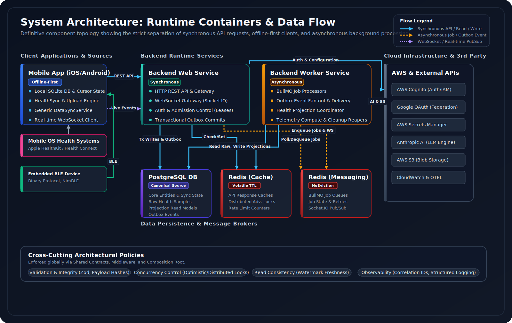
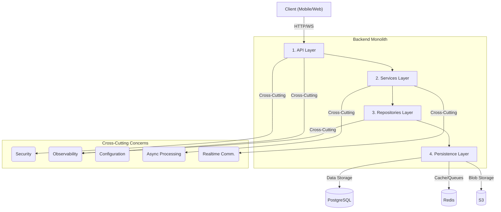
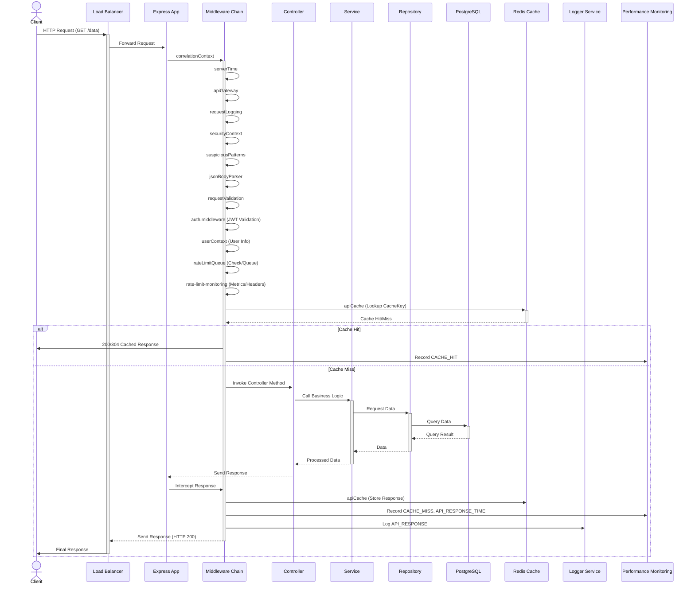
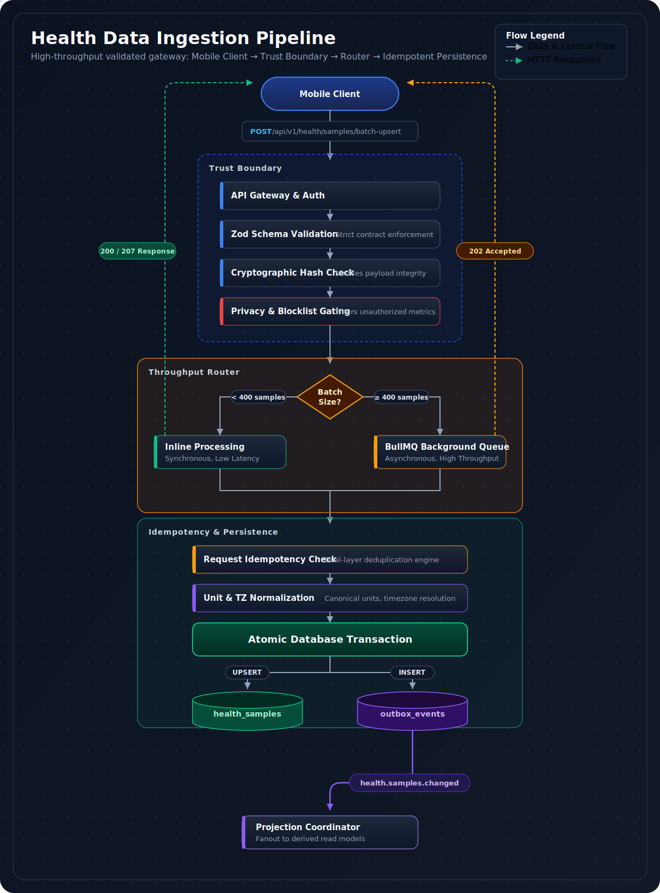
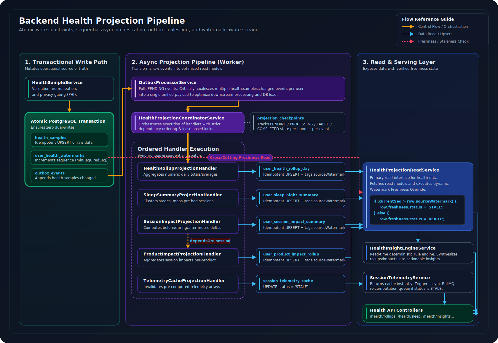
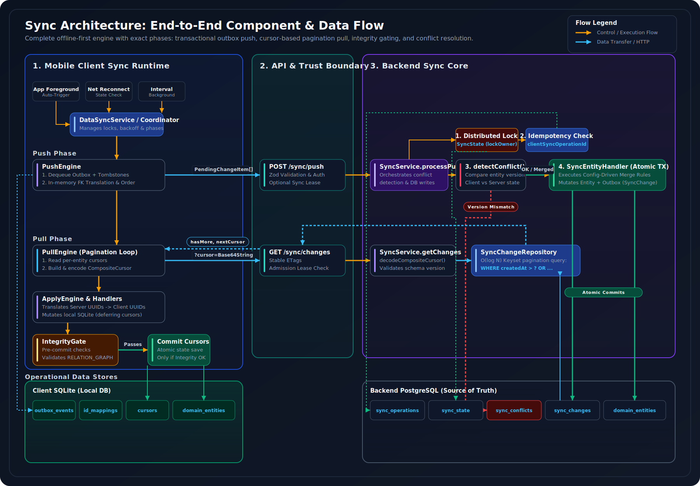
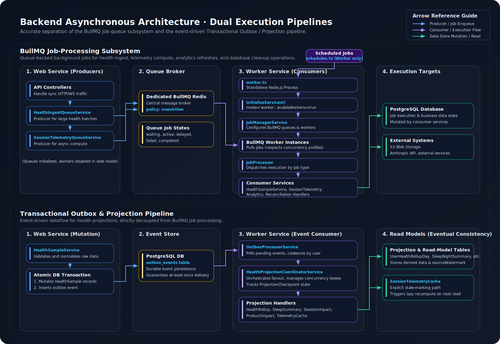

# Backend Architecture

## Overview

This document provides a comprehensive architecture overview of the AppPlatform backend — a cloud-native, event-driven Node.js/TypeScript platform built on Express.js and PostgreSQL. It serves as the central hub for health data ingestion, multi-device synchronization, asynchronous projection pipelines, AI-powered analytics, and real-time communication.

The backend is engineered for the real world, not the happy path. It handles unreliable mobile networks, extended offline periods, bursty health data ingestion, and concurrent multi-device modifications. The architecture prioritizes **data integrity**, **idempotency**, and **explicit consistency tracking** across all operating conditions.

**Scope:** This document covers the backend repository's internal architecture, external interfaces, and deployment topology. Client-side and firmware architectures are excluded unless they directly impact backend design.

 

## Core Principles

### 1. Layered architecture with strict separation of concerns
A clear separation into API, Services, Repositories, and Persistence layers. Each layer has a single responsibility and communicates only with adjacent layers through well-defined interfaces.

> **Goal:** Modularity, independent testability, and predictable change propagation.

### 2. Explicit dependency injection via a single composition root
[`bootstrap.ts`](./code-snippets/bootstrap.ts) is the sole composition root. Every service receives its dependencies through constructor injection. No service locators, no ambient singletons, no hidden coupling. The entire dependency graph is visible in one file.

> **Goal:** Maximum testability, minimal coupling, and complete transparency of system wiring.

### 3. Event-driven architecture with transactional outbox
Domain events (`DomainEventService`) drive analytics, achievements, projections, and notifications via decoupled subscribers. The `OutboxService` writes events to a dedicated table within the same database transaction as the primary data change, guaranteeing at-least-once delivery.

> **Goal:** No data change silently drops its downstream side effects.

### 4. CQRS for the health data pipeline
Write operations (raw `HealthSample` ingestion via `HealthSampleService`) are separated from read operations (pre-computed projections via `HealthProjectionReadService`). The write path is high-throughput and append-only. The read path serves fast, pre-computed results with explicit staleness via watermarks.

> **Goal:** API reads are fast, writes are durable, and staleness is always explicit.

### 5. Idempotency at every trust boundary
Request-level idempotency uses `requestId` + `payloadHash` in a persistent tracking table. Sample-level deduplication relies on composite unique constraints. Sync operations use `clientSyncOperationId` with cached results. Retries are always safe.

> **Goal:** Network unreliability, client bugs, and background job retries never produce duplicate data.

### 6. Fail-fast and fail-visible
Immediate error detection via explicit checks for invalid states, malformed data, and missing configurations. Errors are wrapped in `AppError` and logged with rich context via `LoggerService`. No silent failures, no swallowed exceptions.

> **Goal:** Every failure is observable, traceable, and actionable.

### 7. Single source of truth via shared contracts
Critical definitions — health metric types, sync entity types, conflict resolution policies, API contracts — are centralized in `packages/shared` and consumed by both backend and mobile. No ad-hoc logic duplication.

> **Goal:** Prevent semantic drift and ensure consistent behavior across the entire stack.

---

## Key Architectural Decisions

| Decision | Rationale |
| :--- | :--- |
| **PostgreSQL as canonical data store** | All data (including time-series via JSONB) consolidated into one store, simplifying persistence |
| **Separate Web and Worker processes** | Independent scaling, resource isolation, distinct entry points ([`src/index.ts`](./code-snippets/index.ts) / [`src/worker.ts`](./code-snippets/worker.ts)) |
| **Three-lane health ingestion** | HOT (recent), COLD (backfill), CHANGE (deletions) — each with distinct QoS and freshness guarantees |
| **Dedicated Redis for BullMQ** | `noeviction` policy for job durability, isolated from API cache's `volatile-ttl` policy |
| **Cursor-based sync** | O(log n) keyset pagination, stable under concurrent writes, enabling incremental pulls |
| **Config-driven conflict resolution** | Per-entity, per-field merge policies declared in shared contracts ([`conflict-configs.ts`](./packages/shared/src/sync-config/conflict-configs.ts)) — no ad-hoc merge logic |

---

## System Context & Boundaries

The AppPlatform backend operates within a broader ecosystem of clients, cloud infrastructure, and third-party services.

### External Interactions

| Category | Systems | Integration |
| :--- | :--- | :--- |
| **Mobile Clients** | iOS, Android | HTTP API, WebSocket, HealthKit/Health Connect data push |
| **Web Clients** | Browser | HTTP API, WebSocket |
| **AWS Infrastructure** | Cognito, Secrets Manager, S3, CloudWatch, RDS/Neon, ElastiCache | Auth, secrets, storage, logging, persistence, caching |
| **Third-Party APIs** | Google OAuth, Anthropic AI | Federated auth, LLM analysis and recommendations |
| **Health SDKs** | Apple HealthKit, Google Health Connect | Client-side collection, then batch upload — no direct backend integration |

 

  

 

### Deployment Model

The backend deploys as two distinct process types:

- **Web Service** ([`src/index.ts`](./code-snippets/index.ts)) — Handles synchronous HTTP API requests and WebSocket connections. Stateless, horizontally scalable behind a load balancer.
- **Worker Service** ([`src/worker.ts`](./code-snippets/worker.ts)) — Processes asynchronous BullMQ jobs (projections, analytics, reconciliation). Independent scaling and resource isolation from the web service.

---

## Deployment Topology

### Web Service

Multiple stateless instances run behind a load balancer. [`socket.service.ts`](./code-snippets/websocket/socket.service.ts) uses `@socket.io/redis-adapter` for horizontal WebSocket scaling — events emitted from any instance reach all connected clients via Redis Pub/Sub.

### Worker Service

Multiple instances consume jobs from shared BullMQ queues via [`job-manager.service.ts`](./code-snippets/jobs/job-manager.service.ts). Redis ensures job durability across worker crashes. Per-queue concurrency controls resource utilization.

### Horizontal Scaling

| Concern | Strategy |
| :--- | :--- |
| **API & WebSockets** | Stateless web instances + Redis adapter for Socket.IO |
| **Background Jobs** | Multiple worker instances + BullMQ load distribution |
| **Resource Isolation** | Web and worker processes are separate — heavy projections never block API latency |

### Persistence Topology

| Store | Role | Configuration |
| :--- | :--- | :--- |
| **PostgreSQL** | Canonical data store | Managed (RDS/Neon), strong consistency, JSONB support. [`database.service.ts`](./code-snippets/services/database.service.ts) manages connections with serverless retry logic |
| **Redis (API Cache)** | Response caching, rate limiting, distributed locks | `volatile-ttl` eviction policy via [`cache.service.ts`](./code-snippets/services/cache.service.ts) |
| **Redis (BullMQ/WS)** | Job queues, Socket.IO adapter | `noeviction` policy — strict separation prevents eviction conflicts |
| **AWS S3** | Blob storage | Journal photos, analytics reports, database backups via [`s3.service.ts`](./code-snippets/services/s3.service.ts) |

> **Key insight:** The architecture strictly separates Redis instances for API caching (`volatile-ttl`) and durable job queues (`noeviction`) to prevent eviction policy conflicts and ensure data integrity for background jobs.

---

## Application Architecture

The backend follows a four-layer architecture with cross-cutting concerns spanning multiple layers.

 

### API Layer

Located in [`code-snippets/api/v1/`](./code-snippets/api/v1/), this layer handles incoming requests, applies cross-cutting concerns, and routes to business logic.

| Component | Location | Responsibility |
| :--- | :--- | :--- |
| **Controllers** | [`code-snippets/api/v1/controllers/`](./code-snippets/api/v1/controllers/) | Thin request handlers — extract params, call services, format responses, delegate errors |
| **Middleware** | [`code-snippets/api/v1/middleware/`](./code-snippets/api/v1/middleware/) | Cross-cutting concerns via `MiddlewareFactory` for consistent DI |
| **Routes** | [`code-snippets/api/v1/routes/`](./code-snippets/api/v1/routes/) | Endpoint definitions with ordered middleware chains, registered via `RouteRegistry` in [`code-snippets/core/route-registry.ts`](./code-snippets/core/route-registry.ts) |
| **Schemas** | [`code-snippets/api/v1/schemas/`](./code-snippets/api/v1/schemas/) + [`packages/shared/src/contracts/`](./packages/shared/src/contracts/) | Zod schemas for request/response validation — canonical SSOT for API contracts |

<strong>Middleware Stack</strong>

 

| Middleware | Purpose |
| :--- | :--- |
| `correlationContext` | Generates and propagates `X-Correlation-ID` for end-to-end tracing |
| `serverTime` | Injects `Server-Time` header for client clock offset calculation |
| `apiGateway` | Circuit breakers and request/response transformations for external service calls |
| `logging` | Request-specific logging contexts and request/response details |
| `securityLogging` | Security context initialization and suspicious pattern detection |
| `jsonBodyParser` | JSON parsing with inflated size limits enforcement |
| `requestValidation` | Zod schema validation for params, query, and body |
| `auth` | JWT validation via Cognito, populates `req.user` with authenticated context |
| `userContext` | Extracts and validates user context from `req.user` |
| `rateLimitQueue` | API rate limiting with request queuing |
| `rate-limit-monitoring` | Rate limit metrics collection and response headers |
| `apiCache` | Redis-based response caching with ETags, conditional requests, and race condition prevention |
| `sessionSecurity` | Device fingerprinting and `X-Session-ID` validation for session integrity |
| `health-error` | Contract-compliant error formatting for health batch endpoints |

 

### Services Layer

Located in `code-snippets/services/`, this layer encapsulates all core business logic. Services coordinate repositories, other services, and external integrations.

<strong>Service Catalog</strong>

 

**Core Business Services**

| Service | Domain |
| :--- | :--- |
| `user.service.ts` | User management |
| `consumption.service.ts` | Consumption tracking |
| `session.service.ts` | Session management |
| `purchase.service.ts` | Purchase management |
| `journal.service.ts` | Journaling |
| `product.service.ts` | Product catalog |
| `inventory.service.ts` | Inventory management |
| `goals.service.ts` / `achievements.service.ts` | Goals and achievements |
| `safety.service.ts` | Safety and anomaly detection |
| `analytics.service.ts` | Analytics and reporting |

**Health Data Pipeline**

| Service | Responsibility |
| :--- | :--- |
| `healthSample.service.ts` | API ingestion with dual-layer idempotency, triggers outbox events |
| `healthIngestQueue.service.ts` | Large batch queuing for async worker processing |
| `health-aggregation.service.ts` | ValueKind-aware aggregation logic for raw samples |
| `health-projection-coordinator.service.ts` | Fan-out of `health.samples.changed` events to projection handlers |
| `health-projection-read.service.ts` | Queries derived read models with watermark freshness overrides |
| `health-insight-engine.service.ts` | Deterministic, evidence-backed insights at read time via pure rules |

**AI Integration**

| Service | Responsibility |
| :--- | :--- |
| `ai.service.ts` | Core orchestration for external AI providers (Anthropic) |
| `ai-context-aggregation.service.ts` | Rich AI prompt construction from aggregated user data |
| `ai-phi-redaction.service.ts` | PHI redaction before AI model submission |
| `ai-product-recommendation.service.ts` | Personalized product recommendations |
| `ai-journal-analysis.service.ts` | Journal entry analysis |
| `ai-weekly-report.service.ts` | Weekly health reports |
| `aiCostTracking.service.ts` | AI API usage and cost monitoring |

**User Profiling & ML**

| Service | Responsibility |
| :--- | :--- |
| `user-consumption-profile.service.ts` | EMA learning from purchase cycles, consumption prediction |
| `temporal-pattern.service.ts` | Dirichlet-multinomial temporal histogram engine for routine detection |
| `user-routine.service.ts` | User routine profile management |
| `inventory-prediction.service.ts` | Multi-factor depletion prediction and purchase recommendations |

**Cross-System Concerns**

| Service | Responsibility |
| :--- | :--- |
| `auth.service.ts` / `cognito.service.ts` | Authentication orchestration, Cognito integration |
| `cache.service.ts` | Redis-based caching and distributed advisory locks |
| `logger.service.ts` | Structured, context-rich logging |
| `securityLogger.service.ts` | Security event recording for audit and alerting |
| `performanceMonitoring.service.ts` | Application performance metrics collection |
| `outbox.service.ts` / `outbox-processor.service.ts` | Transactional outbox pattern and async event processing |
| `sync.service.ts` / `syncLease.service.ts` | Bidirectional sync, conflict resolution, admission control |
| `deviceTelemetry.service.ts` | Device-specific sensor data collection and retrieval |
| `sessionTelemetryQueue.service.ts` | Session telemetry computation job queuing |
| `job-manager.service.ts` | BullMQ job queue orchestration |
| `secrets.service.ts` | Secure access to application secrets (AWS Secrets Manager) |
| `correlationTracker.service.ts` | Distributed tracing correlation IDs |
| `requestValidation.service.ts` | Utility functions for schema-based request validation |
| `httpsValidation.service.ts` | HTTPS-related validation utilities |

 

### Repositories Layer

Located in [`code-snippets/repositories/`](./code-snippets/repositories/), this layer abstracts all direct database access via Prisma ORM.

- **`RepositoryFactory`** ([`repository.factory.ts`](./code-snippets/repositories/repository.factory.ts)) — Central mechanism for creating all repositories with consistent `PrismaClient`, `LoggerService`, and `PerformanceMonitoringService` injection.
- **Per-entity repositories** (e.g., `user.repository.ts`, `consumption.repository.ts`, `health-sample.repository.ts`, `sync-operation.repository.ts`) — Hide ORM details, enforce `userId`-scoped authorization to prevent IDOR, implement optimistic locking via `version` fields, and encapsulate complex query logic.

### Shared Contracts & Utilities

| Package | Purpose |
| :--- | :--- |
| [`code-snippets/core/`](./code-snippets/core/) | DI framework utilities — `controller-registry.ts`, `middleware-factory.ts`, `route-registry.ts`, common type definitions |
| [`code-snippets/utils/`](./code-snippets/utils/) | Helpers for authentication (`auth.utils.ts`), error handling (`error-handler.ts`), crypto, and device ID generation |
| [`packages/shared/`](./packages/shared/) | **Cross-application type safety** — canonical entity types (`entity-types.ts`), Zod contracts (`health.contract.ts`, `sync-lease.contract.ts`), health config (metric types, units, normalization, precision, payload hashing), sync config (relation graph, cursor formats, conflict strategies) |

---

## Bootstrap & Dependency Injection

[`bootstrap.ts`](./code-snippets/bootstrap.ts) is the single composition root — the sole, authoritative place responsible for instantiating every service, wiring all dependencies via constructor injection, and orchestrating initialization and shutdown in the correct order.

<strong>Initialization Stages</strong>

 

| Phase | Components | Purpose |
| :--- | :--- | :--- |
| **0** | OpenTelemetry SDK ([`instrumentation.ts`](./code-snippets/instrumentation.ts)) | Tracing and metrics collection before any app code loads — instruments Node.js, Express, Redis, PostgreSQL |
| **1** | `LoggerService`, `S3Service` | Foundational — `LoggerService` is a dependency for almost all other components |
| **2** | `ConfigSecurityService`, `AuthConfig` | Load and validate all configuration, including secrets from AWS Secrets Manager. Immutable `Config` object frozen after loading |
| **3** | `DatabaseService`, `CacheService`, `PerformanceMonitoringService`, `ProjectionCheckpointRepository`, `HealthProjectionCoordinatorService`, `HealthAggregationService`, `HealthProjectionReadService`, `HealthInsightEngineService` | Core infrastructure — database connections, caching, metrics, projection coordination |
| **4** | `RepositoryFactory` + all entity repositories | Data access layer — `PrismaClient` from `DatabaseService` injected into all repositories |
| **5** | `DomainEventService`, `OutboxService`, `CognitoService`, `SocketService`, `SecurityLoggerService`, `AuthRateLimitService`, `SessionSecurityService`, `SyncLeaseService` | Core platform services bridging infrastructure and business logic |
| **6** | `ConsumptionService`, `JournalService`, `HealthSampleService`, etc. | Domain-specific business services |
| **7** | `UserConsumptionProfileService`, `TemporalPatternService`, `InventoryPredictionService` | User profiling and ML services (depend on Phase 6 business services) |
| **8** | `ControllerRegistry`, `MiddlewareFactory`, `RouteRegistry`, Express `App` | API layer assembly and route registration |

 

### Service Lifecycle

- **Constructor injection** — Pure classes receiving all dependencies through constructors. Enforces explicit contracts and simplifies unit testing.
- **`initialize()` methods** — Async setup (database connections, event handler registration, configuration loading) that cannot run in synchronous constructors.
- **`shutdown()` methods** — Graceful cleanup of external resources (database connections, Redis clients, timers) orchestrated in reverse dependency order by `bootstrap.ts`.

---

## Data Flows & Pipelines

### HTTP Request Lifecycle

Incoming requests pass through an ordered middleware chain before reaching controller logic. The chain handles correlation tracking, security, authentication, rate limiting, caching, and validation.

<strong>HTTP Request Sequence Diagram</strong>

 

 

> **Key insight:** On cache hit, responses are served without touching PostgreSQL. On cache miss, the full layer stack executes and the response is cached for subsequent requests.

---

### Health Data Ingestion

The ingestion pipeline moves health data from mobile devices through the backend's trust boundary into PostgreSQL, with transactional outbox events for downstream projection processing.

  

 

**Client-Side Ingestion (`packages/app`):**

| Component | Responsibility |
| :--- | :--- |
| `HealthKitContext.tsx` | HealthKit permissions and raw data access |
| `HealthKitService.ts` | Abstracts HealthKit operations (availability, permissions, data reads) |
| `HealthKitAdapter.ts` | Implements `HealthDataProviderAdapter` for iOS HealthKit — metric configurations and category code mapping |
| `DirtyKeyComputer.ts` | Computes dirty projection keys from ingested samples |
| `HealthIngestionEngine.ts` | Three-lane pipeline (HOT for recent UI data, COLD for historical backfill, CHANGE for deletions/edits) — enforces cursor updates, validation, and idempotent writes |
| `HealthSyncCoordinationState.ts` | Manages ingestion intervals, backoff, and single-operation enforcement |
| `HealthUploadEngine.ts` | Batch staging with `staged_batch_id` for atomic claims and crash recovery, serialization, payload size limits |
| `HealthUploadHttpClientImpl.ts` | HTTP client wrapping `BackendAPIClient` for auth and retry |

**Backend Ingestion (`packages/backend`):**

| Component | Responsibility |
| :--- | :--- |
| `health.controller.ts` | Receives `POST /health/samples/batch-upsert`, delegates to `healthIngestQueue.service.ts` for async and `healthSample.service.ts` for idempotency |
| `healthIngestQueue.service.ts` | Pre-processing queue — enqueues large batches into BullMQ to prevent HTTP timeouts |
| `HealthSampleService.ts` | Core ingestion logic (see details below) |
| `HealthSampleRepository` | Persists `HealthSample` entities to PostgreSQL |
| `HealthIngestRequest` table | Tracks request-level idempotency — ensures same batch isn't processed twice |

**`HealthSampleService` internals:**
- **Two-layer idempotency:** `requestId` + `payloadHash` for request-level (`HealthIngestRequest` table), and `(userId, sourceId, sourceRecordId, startAt)` unique constraint for sample-level deduplication
- **Privacy gating:** Enforces `allowHealthDataUpload` and `blockedMetrics` from user privacy settings (via `UserRepository`)
- **Unit normalization:** Ensures all values and units conform to canonical forms ([`unit-normalization.ts`](./packages/shared/src/health-config/unit-normalization.ts), [`metric-types.ts`](./packages/shared/src/health-config/metric-types.ts))
- **Transactional outbox:** Triggers `health.samples.changed` events via `OutboxService` within the same transaction as `HealthSample` persistence

> **Guarantee:** Zero dual-writes. Raw samples and outbox events are committed in a single atomic transaction.

> For detailed ingestion logic, three-lane contract, and backend processing, see [`HEALTH-INGESTION-PIPELINE.MD`](./HEALTH-INGESTION-PIPELINE.MD).

---

### Health Projection Pipeline

After ingestion, raw health data changes are asynchronously transformed into pre-computed read models with watermark-based freshness tracking. This implements the read side of the CQRS pattern.

  

 

**Projection Handlers:**

| Handler | Output Table | Logic |
| :--- | :--- | :--- |
| `HealthRollupProjectionHandler` | `user_health_rollup_day` | Daily numeric aggregates (avg heart rate, total steps) via `HealthAggregationService` for ValueKind-aware logic |
| `SleepSummaryProjectionHandler` | `user_sleep_night_summary` | Nightly sleep summaries — clustering, nap detection, canonical source selection |
| `SessionImpactProjectionHandler` | `user_session_impact_summary` | Before/during/after health metric deltas around consumption sessions |
| `ProductImpactProjectionHandler` | `user_product_impact_rollup` | Per-product impact aggregation (depends on session-impact completing) |
| `TelemetryCacheProjectionHandler` | `session_telemetry_cache` | Marks entries STALE when underlying samples change — triggers lazy recomputation on read |

**Coordination Mechanisms:**

- **Checkpoint tracking** — `ProjectionCheckpointRepository` tracks per-projection status (`PENDING` → `PROCESSING` → `COMPLETED`/`FAILED`), enabling idempotent retries and independent failure isolation
- **Lease-based concurrency** — Prevents multiple workers from processing the same projection for the same event
- **Watermark freshness** — `HealthProjectionReadService` overrides a row's status to `STALE` if its `sourceWatermark` is behind the current `UserHealthWatermark`
- **Event coalescing** — `outbox-coalescing.ts` groups related events for processing efficiency
- **Read-time insights** — [`health-insight-engine.service.ts`](./code-snippets/services/health-insight-engine.service.ts) generates deterministic insights from projection data using pure rule-based logic ([`health-insight-rules.ts`](./code-snippets/services/health-insight-rules.ts))

> **Guarantee:** Individual projection failures don't block other projections. Watermarks provide explicit freshness tracking — no silent staleness.

> For detailed projection coordination, checkpointing, and watermark logic, see [`PROJECTION-PIPELINE.MD`](./PROJECTION-PIPELINE.MD).

---

### Data Synchronization

The sync pipeline enables bidirectional data synchronization between multiple offline-first mobile clients and the backend, with config-driven conflict resolution and structural integrity enforcement.

  

 

**Key Mechanisms:**

| Mechanism | Implementation |
| :--- | :--- |
| **Offline-first** | Clients create and modify data offline using client-generated UUIDs (`clientConsumptionId`, `clientEntryId`) |
| **Cursor-based pull** | `CompositeCursor` from [`packages/shared/src/sync-config/cursor.ts`](./packages/shared/src/sync-config/cursor.ts), topologically sorted by `ENTITY_SYNC_ORDER` (parents before children) to prevent FK violations |
| **Push idempotency** | `syncOperationId` + cached `resultPayload` in `SyncOperation` table — repeated pushes return cached results without reprocessing |
| **Optimistic locking** | `version` fields on syncable entities detect conflicts when `clientVersion < serverVersion` |
| **Conflict resolution** | Config-driven via `ENTITY_CONFLICT_CONFIG` from [`conflict-configs.ts`](./packages/shared/src/sync-config/conflict-configs.ts) — strategies: `LAST_WRITE_WINS`, `CLIENT_WINS`, `SERVER_WINS`, `MERGE`, `MANUAL` |
| **Field-level policies** | For `MERGE` strategy: `LOCAL_WINS` (notes), `MERGE_ARRAYS` (tags), `MAX_VALUE` (counters), `MONOTONIC` (status). Pure merge via [`entity-merger.ts`](./code-snippets/services/sync/entity-merger.ts) |
| **Entity handlers** | [`code-snippets/services/sync/handlers/`](./code-snippets/services/sync/handlers/) — entity-specific `create()`, `update()`, `delete()`, `fetchServerVersion()`, `merge()` with Zod validation and transactional writes |
| **Change tracking** | Every mutation writes to `SyncChange` table (source for pull sync). `SyncState` tracks `lastSyncCursor` per `(userId, deviceId)` |
| **Distributed locks** | `SyncLeaseService` (Redis) for admission control + `SyncStateRepository` (PostgreSQL) for per-device serialization via `lockOwner`/`lockAcquiredAt` |

> **Guarantee:** Cursors never advance past corrupted state. Conflict resolution is deterministic, auditable, and testable in isolation.

> For detailed sync mechanics, entity handlers, and conflict algorithms, see [`SYNC-ENGINE.MD`](./SYNC-ENGINE.MD).

---

### Async Job Processing

A dedicated worker process handles all background tasks, isolating compute-heavy operations from the web service's request path.

  

 

**Key Components:**

| Component | Responsibility |
| :--- | :--- |
| [`JobManagerService`](./code-snippets/jobs/job-manager.service.ts) | Manages BullMQ `Queue` and `Worker` instances. Dedicated Redis with `noeviction`. Provides `enqueueJob()` for producers, `getQueueDepth()` for backpressure. Per-queue config (`maxQueueLen`, `concurrency`, `removeOnComplete/Fail`) |
| [`JobProcessor`](./code-snippets/jobs/job-processor.ts) | Core dispatch logic in worker processes — delegates to specific services based on `JobNames` enum. Fault-isolated via `try/catch` with structured error logging |
| [`schedules.ts`](./code-snippets/jobs/schedules.ts) | Recurring cron jobs via BullMQ repeatable jobs — analytics refresh, health ingest reaper, inventory reconciliation, stale session reconciliation |

**Job Types:**

| Job | Purpose |
| :--- | :--- |
| `HEALTH_INGEST_BATCH` | Async processing of large health uploads |
| `SESSION_TELEMETRY_COMPUTE` | Derived health data for session visualizations |
| `REFRESH_ANALYTICS_MVS` | PostgreSQL materialized view refresh for analytics |
| `HEALTH_INGEST_REAPER` | Stale ingestion request cleanup |
| `HEALTH_SAMPLE_SOFT_DELETE_PURGER` | Hard-delete old soft-deleted samples |
| `INVENTORY_RECONCILIATION` | Link unlinked consumptions to inventory items |
| `STALE_SESSION_RECONCILIATION` | Complete sessions whose end time has passed |

> **Guarantee:** Jobs survive worker crashes via durable Redis queues. All jobs are idempotent and retry-safe.

> For BullMQ configuration, concurrency control, and failure modes, see [`WORKER-SCALABILITY.MD`](./WORKER-SCALABILITY.MD).

---

### Real-time Communication

The backend supports real-time updates via Socket.IO WebSockets for live session events, sync notifications, and instant UI feedback.

**Connection Flow:**

1. Mobile/Web clients establish WebSocket connections to the backend's web service instances
2. JWT authenticated via `CognitoService.validateToken()`, Cognito sub mapped to internal `userId` for consistency with HTTP API
3. Authenticated sockets join rooms: `user:{userId}`, `device:{deviceId}`, `session:{sessionId}`
4. Domain events (e.g., `consumption.created`, `session.ended`) emitted by `DomainEventService`
5. `WebSocketEventSubscriber` converts events to minimal, type-safe `RealtimeEnvelopeV1` (from [`packages/shared/src/realtime/contracts/events.ts`](./packages/shared/src/realtime/contracts/events.ts)) — includes `userId`, `entityId`, `eventType`, and cache-patch payload
6. [`WebSocketBroadcaster`](./code-snippets/realtime/WebSocketBroadcaster.ts) emits to appropriate rooms via `socket.service.ts`
7. Clients patch local React Query caches directly from the payload — no full API refetch

**Reliability:**

| Concern | Mechanism |
| :--- | :--- |
| **Horizontal scaling** | `@socket.io/redis-adapter` on the dedicated BullMQ/WS Redis instance broadcasts events across all web instances |
| **Authentication** | JWT validation via `CognitoService` on every connection |
| **Tenancy enforcement** | `WebSocketBroadcaster` validates `userId` match — no cross-user data leakage |
| **Deduplication** | `dedupeCache` keyed by `(eventType, entity, entityId)` prevents duplicate emissions during failover/retry |

---

## Data Persistence & Storage

### PostgreSQL

The **canonical, primary, and single source of truth** for all application data. Managed via Prisma ORM with schema defined in [`prisma/schema.prisma`](./prisma/schema.prisma).

<strong>Schema Categories</strong>

 

| Category | Tables |
| :--- | :--- |
| **Core Business** | `User`, `Consumption`, `ConsumptionSession`, `JournalEntry`, `Purchase`, `Product`, `InventoryItem`, `Goal`, `Achievement`, `UserAchievement`, `Device`, `SafetyRecord` |
| **Sync Metadata** | `SyncOperation`, `SyncConflict`, `SyncChange`, `SyncState` |
| **Event Outbox** | `OutboxEvent` (central to the Transactional Outbox Pattern) |
| **Health Data** | `HealthSample` (raw samples — time-series, likely optimized with TimescaleDB), `HealthIngestRequest` (idempotency tracking) |
| **Health Projections** | `UserHealthRollupDay`, `UserSleepNightSummary`, `UserSessionImpactSummary`, `UserProductImpactRollup` (optimized read models) |
| **AI** | `AiUsageRecord`, `AiChatThread`, `AiChatMessage`, `AiAnalysis`, `AiRecommendationSet`, `AiRecommendationItem`, `AiResponseCache` |
| **Telemetry** | `SessionTelemetryCache` (precomputed session health data), `UserHealthWatermark`, `ProjectionCheckpoint` |
| **Real-time** | `WebSocketEvent`, `LiveConsumption`, `SessionMessage` (raw events for audit/reconciliation) |

 

**Key PostgreSQL Features:**

| Feature | Usage |
| :--- | :--- |
| **JSONB columns** | Flexible schemas for `User.privacySettings`, `Device.specifications`, `HealthSample.metadata`, `SessionTelemetryCache.metricsJson` — schema evolution without costly migrations |
| **Decimal & BigInt** | Precise numerics for `Consumption.quantity`, `AiUsageRecord.totalCost`, `UserHealthWatermark.sequenceNumber` — no floating-point inaccuracies |
| **Partial unique indexes** | Critical for idempotency (e.g., `Purchase_userId_productId_active_unique`) |
| **Optimistic locking** | `version` fields (`@default(1)`) for concurrency control across many models |
| **TimescaleDB (inferred)** | `HealthSample` table's time-series nature strongly implies hypertable, compression, and retention policies |

[`DatabaseService`](./code-snippets/services/database.service.ts) manages `PrismaClient` connections, transactions, and retry logic optimized for serverless environments (e.g., Neon cold starts).

### Redis

Two strictly separated instances prevent eviction policy conflicts:

| Instance | Policy | Usage |
| :--- | :--- | :--- |
| **API Cache** | `volatile-ttl` | Response caching ([`apiCache.middleware.ts`](./code-snippets/api/v1/middleware/apiCache.middleware.ts)), distributed advisory locks (e.g., `SyncLeaseService`, `UserConsumptionProfileService.performEMALearning`), rate limit counters ([`authRateLimit.middleware.ts`](./code-snippets/api/v1/middleware/authRateLimit.middleware.ts), [`rateLimitQueue.middleware.ts`](./code-snippets/api/v1/middleware/rateLimitQueue.middleware.ts)) |
| **BullMQ / WebSocket** | `noeviction` | BullMQ job data, queues, and locks ([`job-manager.service.ts`](./code-snippets/jobs/job-manager.service.ts)); Socket.IO Redis adapter for horizontal WebSocket scaling ([`socket.service.ts`](./code-snippets/websocket/socket.service.ts)) |

### AWS S3

Durable blob storage via [`S3Service`](./code-snippets/services/s3.service.ts):

- **User-uploaded content** — Journal entry photos (`journal.service.ts`)
- **System-generated artifacts** — Analytics reports, user data exports
- **Database backups** — `DatabaseService.performPgDumpBackup()` uploads PostgreSQL backups to S3

---

## Cross-Cutting Concerns

### Authentication & Authorization

- **Authentication** — AWS Cognito as IdP via [`CognitoService`](./code-snippets/services/cognito.service.ts). JWT validation by [`auth.middleware.ts`](./code-snippets/api/v1/middleware/auth.middleware.ts) (HTTP) and [`socket.service.ts`](./code-snippets/websocket/socket.service.ts) (WebSocket). Federated Google OAuth supported
- **Authorization** — RBAC enforced via [`authorization.middleware.ts`](./code-snippets/api/v1/middleware/authorization.middleware.ts) and controller-level guards (e.g., `createRequireAdmin`). `UserRepository` maps Cognito IDs to internal user IDs for consistent authorization checks
- **Protection** — [`auth-monitoring.middleware.ts`](./code-snippets/api/v1/middleware/auth-monitoring.middleware.ts) logs suspicious authentication patterns. [`authRateLimit.middleware.ts`](./code-snippets/api/v1/middleware/authRateLimit.middleware.ts) provides brute-force protection, account lockout, and CAPTCHA integration via `AuthRateLimitService` (Redis-backed)

### Security & Compliance

| Concern | Implementation |
| :--- | :--- |
| **Secrets** | [`SecretsService`](./code-snippets/services/secrets.service.ts) fetches from AWS Secrets Manager; [`ConfigSecurityService`](./code-snippets/services/configSecurity.service.ts) validates, enforces minimum JWT secret lengths, and freezes configuration |
| **HTTPS** | [`httpsEnforcement.middleware.ts`](./code-snippets/api/v1/middleware/httpsEnforcement.middleware.ts) redirects HTTP to HTTPS in production, injects HSTS |
| **Input validation** | Strict Zod schemas (`packages/shared/src/contracts/*`, `code-snippets/api/v1/schemas/*`) at API boundaries via [`requestValidation.middleware.ts`](./code-snippets/api/v1/middleware/requestValidation.middleware.ts). Payload size limits enforced by [`jsonBodyParser.middleware.ts`](./code-snippets/api/v1/middleware/jsonBodyParser.middleware.ts) |
| **Session integrity** | [`sessionSecurity.middleware.ts`](./code-snippets/api/v1/middleware/sessionSecurity.middleware.ts) performs device fingerprinting and `X-Session-ID` validation for anomaly detection |
| **PHI redaction** | [`ai-phi-redaction.service.ts`](./code-snippets/services/ai-phi-redaction.service.ts) strips Protected Health Information before AI model submission |
| **Data integrity** | Optimistic locking, transactional outbox, strict schema validation |

> For detailed data integrity guarantees, see [`DATA-INTEGRITY-GUARANTEES.MD`](./DATA-INTEGRITY-GUARANTEES.MD).

### Observability

| Pillar | Implementation |
| :--- | :--- |
| **Logging** | [`LoggerService`](./code-snippets/services/logger.service.ts) — structured JSON, log levels, categories. Integrates with [`CloudWatchLogsService`](./code-snippets/services/cloudwatch-logs.service.ts) for centralized aggregation |
| **Metrics** | [`PerformanceMonitoringService`](./code-snippets/services/performanceMonitoring.service.ts) — API response times, DB query durations, cache hit rates, job processing times. OpenTelemetry-compatible export |
| **Tracing** | `CorrelationContextManager` via [`correlationContext.middleware.ts`](./code-snippets/api/v1/middleware/correlationContext.middleware.ts) — `X-Correlation-ID` propagation across HTTP, service calls, and async events |
| **Health checks** | `/health`, `/health/rate-limit`, `/api/v1/monitoring/health` — real-time service status and detailed metrics |

### Configuration Management

- **Centralized & secure** — [`ConfigSecurityService`](./code-snippets/services/configSecurity.service.ts) loads from environment and AWS Secrets Manager (via `SecretsService`)
- **Immutable** — All `Config` objects frozen after loading ([`initializeConfig`](./code-snippets/config/index.ts)) to prevent runtime tampering
- **Validated** — Zod schemas enforce security policies at startup (JWT secret strength, CORS origins in production)
- **Shared** — `packages/shared` defines common configuration contracts for frontend/backend consistency

---

## External Integrations

| Integration | Service | Purpose |
| :--- | :--- | :--- |
| **AWS Cognito** | [`cognito.service.ts`](./code-snippets/services/cognito.service.ts) | User identity management (user pools), authentication, token validation |
| **AWS Secrets Manager** | [`secrets.service.ts`](./code-snippets/services/secrets.service.ts) | Secure storage and retrieval of API keys, DB credentials, sensitive config |
| **AWS S3** | [`s3.service.ts`](./code-snippets/services/s3.service.ts) | Durable blob storage for user content, system reports, and database backups |
| **AWS CloudWatch** | [`cloudwatch-logs.service.ts`](./code-snippets/services/cloudwatch-logs.service.ts) | Centralized log aggregation, monitoring, and analysis |
| **OpenTelemetry SDK** | [`instrumentation.ts`](./code-snippets/instrumentation.ts) | Node.js instrumentation for traces and metrics collection |
| **OpenTelemetry Collector** | *(inferred)* | Agent for exporting traces (Jaeger/Datadog) and metrics (Prometheus/Grafana) |
| **Google OAuth** | [`auth.service.ts`](./code-snippets/services/auth.service.ts) | Federated authentication with server-side Google ID token validation |
| **Anthropic AI** | [`ai.service.ts`](./code-snippets/services/ai.service.ts) | LLM-powered journal analysis, weekly reports, product recommendations. Key securely loaded from Secrets Manager |
| **HealthKit / Health Connect** | *(client-side only)* | Mobile clients collect data via OS SDKs, then batch-upload to `/health/samples/batch-upsert` |

---

## Design Trade-offs

<strong>Architectural Trade-off Analysis</strong>

 

### Pure Functions / Impure Shell

Core business logic and complex transformations are encapsulated in pure, deterministic, side-effect-free functions (e.g., `computeBinIndex` in [`temporal-pattern.service.ts`](./packages/backend/src/services/temporal-pattern.service.ts), `calculateQuantityFromDuration` in [`personalized-consumption-rate.service.ts`](./packages/backend/src/services/personalized-consumption-rate.service.ts), `computeProductImpactAggregate` in [`product-impact-compute.ts`](./packages/backend/src/services/product-impact-compute.ts), `canonicalizePayload` in [`payload-hash.ts`](./packages/shared/src/health-config/payload-hash.ts)). The "impure shell" (services, controllers) orchestrates these pure functions and handles I/O, state, and side effects. This enhances testability and predictability at the cost of maintaining a clear separation discipline.

### Composition Root

[`bootstrap.ts`](./code-snippets/bootstrap.ts) centralizes all instantiation and wiring via constructor injection. This eliminates hidden dependencies and promotes explicit contracts. The trade-off is verbosity for very large applications — the entire dependency graph lives in one file.

### CQRS

Separating health write and read paths enables independent optimization of each for their specific workload characteristics. The trade-off is eventual consistency between raw data and projections, managed by the transactional outbox and watermark-based staleness detection.

### Transactional Outbox

Atomic event recording within the same transaction as primary data changes adds write-path complexity and requires a dedicated `OutboxProcessorService` in workers. The payoff is structurally eliminating the dual-write problem — strong data integrity guarantees without distributed transactions.

### Single Source of Truth

Centralizing definitions in `packages/shared` prevents semantic drift and ensures consistent behavior (unit conversions, entity types, conflict rules). The trade-off is strict adherence to shared contracts and potentially coordinated updates for breaking changes across packages.

### Event-Driven Architecture

Domain events via `DomainEventService` enable asynchronous processing and system extensibility — new subscribers can be added without modifying event producers. The trade-off is added complexity in tracing event flows (mitigated by correlation IDs) and ensuring delivery guarantees (mitigated by transactional outbox).

### Bounded Contexts

Services organized around business domains reduce cognitive load and enable independent evolution. The trade-off is potential overhead for cross-domain queries, often addressed by denormalized read models or specialized queries.

### Optimistic Locking & Idempotency

`version` fields prevent lost updates during concurrent sync. All critical writes are safely retryable (`requestId` + `payloadHash` for health; `clientSyncOperationId` for sync). The trade-off is conflict resolution complexity on both client and server, centralized in shared contracts to keep it manageable.

---

---
