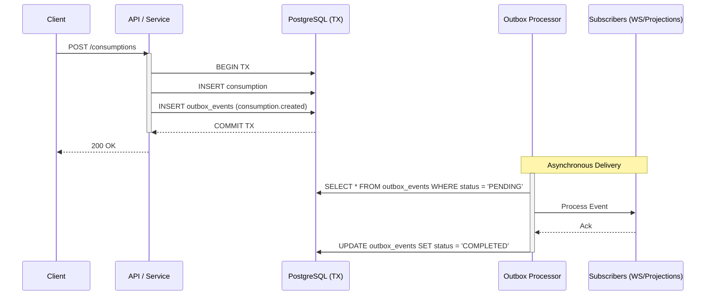
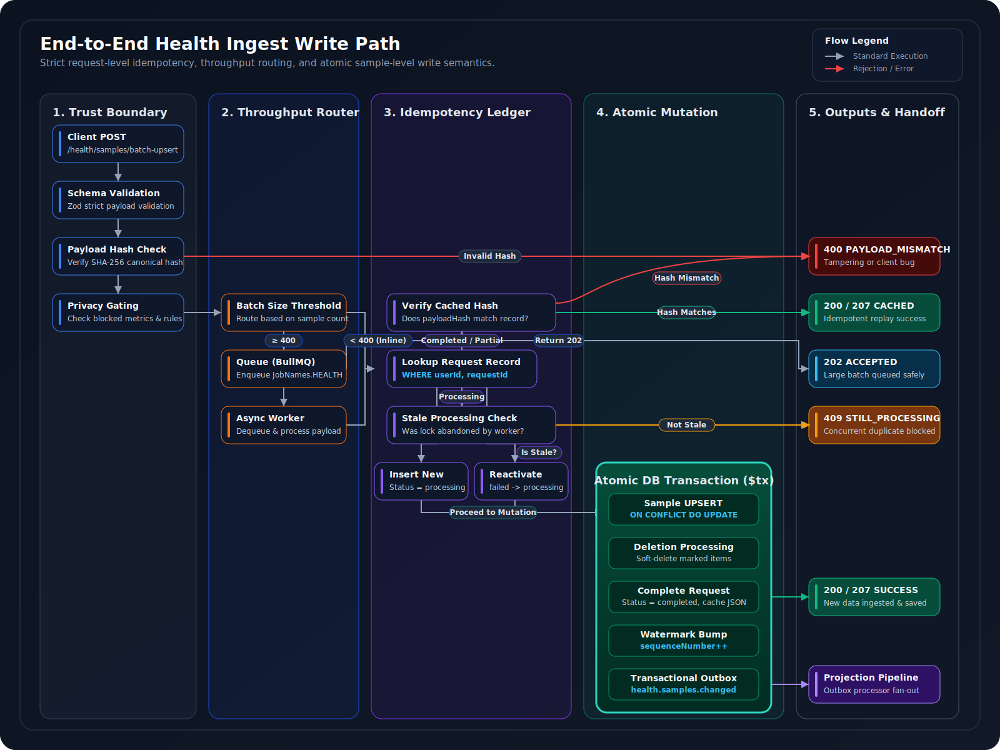
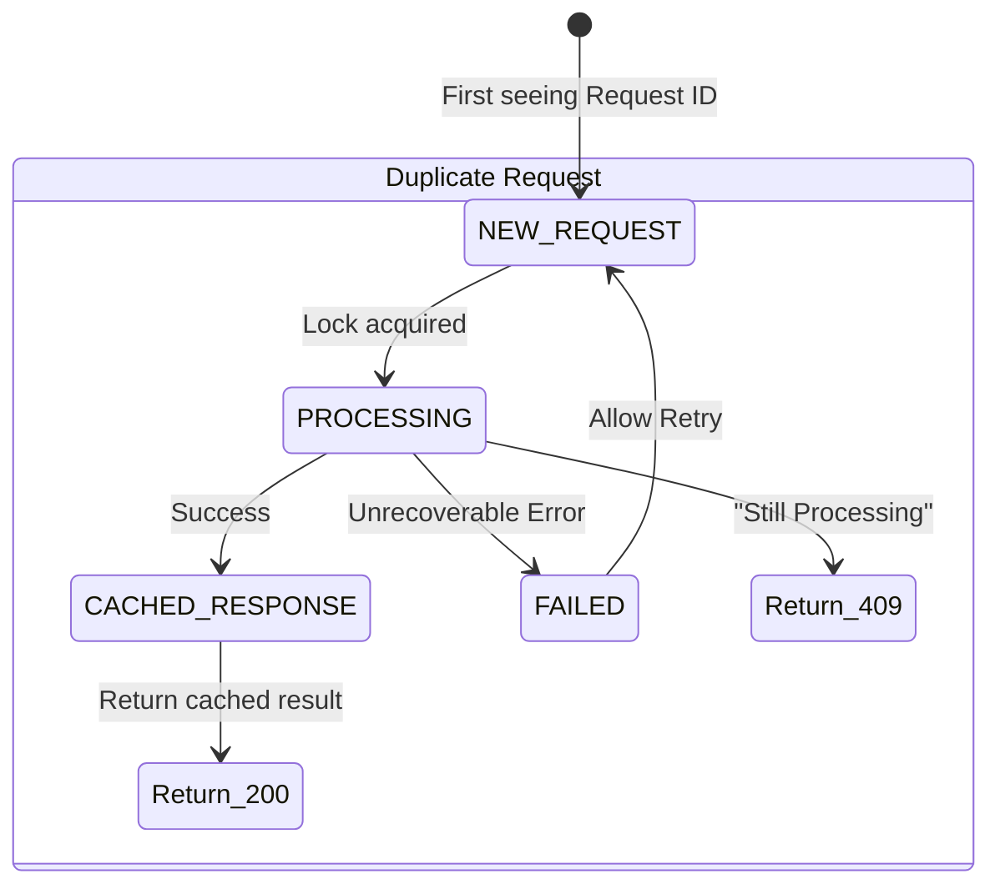

# Data Integrity & Concurrency Guarantees

This document defines the architectural contract for data integrity, concurrency control, and consistency in the AppPlatform backend. It details the precise mechanisms used to prevent data loss, duplication, race conditions, and corruption in a highly concurrent, offline-first, distributed environment.

 

---

## 1. Architectural Philosophy

The backend data integrity model is built on four core principles:

1. **Fail-Fast at Trust Boundaries**: Invalid, unauthenticated, or malformed data is rejected at the earliest possible middleware layer, preventing it from reaching business logic.
2. **ACID for Primary Mutations**: All state-changing operations on core domain entities (Consumptions, Purchases, Sessions) are wrapped in strict PostgreSQL transactions.
3. **Eventual Consistency for Projections**: Analytical rollups, aggregations, and derived health data are computed asynchronously, decoupled from the critical write path.
4. **No Dual-Writes**: Emitting events to external systems (WebSockets, Analytics, AI queues) directly from business logic is strictly prohibited. All domain events are staged via a Transactional Outbox.

---

## 2. Boundary Validation & Defense in Depth

Integrity begins before data reaches the database. The system enforces strict validation at the API boundary.

* **Zod Strictness**: All API payloads are validated using Zod schemas configured with `.strict()`. This prevents parameter pollution and ensures that unrecognized fields are explicitly rejected rather than silently ignored.

* **Cryptographic Payload Integrity**: Health sync operations (e.g., `/health/samples/batch-upsert`) enforce request integrity via a SHA-256 `payloadHash`. The `validateBatchUpsertRequestWithHash` middleware recomputes the hash of the incoming canonicalized payload and strictly rejects mismatches (`PAYLOAD_HASH_MISMATCH`), preventing in-transit tampering or client-side serialization bugs.

* **Deterministic Normalization**: Inputs are normalized deterministically before processing. Timezone offsets (`timezoneOffsetMinutes`) are extracted to ensure precise UTC-to-local date bucketing, and platform-specific units (e.g., HealthKit's `degC`) are resolved to canonical SI units (`°C`) via `tryNormalizeToCanonicalUnit`.

> **Guarantee:** No unvalidated, unnormalized, or tampered payload reaches the persistence layer. Validation failures are surfaced immediately with structured error codes.

---

## 3. Transactional Boundaries (ACID)

For core entity mutations, the system relies on PostgreSQL's ACID guarantees via `Prisma.$transaction`.

### Compound Operations

Complex workflows that span multiple entities are executed as a single atomic unit. A prime example is `PurchaseService.endAndCreatePurchase`:

1. Verifies the old purchase exists and is active.
2. Updates the old purchase's `finishedDate`.
3. Backfills and zero-outs corresponding `InventoryItem` records.
4. Creates a new `Purchase` record.
5. Stages a `purchase.finished` and `purchase.created` event into the outbox.

If *any* step fails (e.g., due to an inventory validation error), the entire operation rolls back. The user is never left in a partial state (e.g., an ended purchase without a new active one).

### Constraint Violation Handling

Database-level constraints are used as a final safety net. Unique constraint violations (`P2002`) are caught and mapped to semantic application errors or used to trigger retry loops. For example, a `P2002` on the partial unique index `Purchase_userId_productId_active_unique` is intercepted and transformed into an `ACTIVE_PURCHASE_EXISTS` error, prompting the frontend to safely resolve the state.

> **Guarantee:** All multi-entity mutations are atomic. Partial state is structurally impossible — every compound operation either commits completely or rolls back entirely.

---

## 4. The Transactional Outbox Pattern

To reliably notify downstream consumers (analytics, WebSockets, projection builders) without falling victim to the "Dual-Write" distributed systems problem, the backend utilizes the **Transactional Outbox Pattern**.

### Mechanism

Business services *never* call `domainEventService.emitEvent()` directly after a mutation. Instead, they pass the active transaction client `tx` to `outboxService.addEvent(tx, payload)`. The event is inserted into the `outbox_events` table in the exact same transaction as the primary mutation.

### Delivery Guarantees

The `OutboxProcessorService` runs as a background worker, polling the `outbox_events` table for `PENDING` records. It guarantees **at-least-once delivery**. If the server crashes immediately after the database commits but before the WebSocket broadcaster fires, the outbox processor will resume the event upon restart. Downstream subscribers must be idempotent.

<strong>Outbox Delivery Sequence Diagram</strong>

 

 

> **Guarantee:** Zero dual-writes. The primary mutation and its domain event are committed in a single atomic transaction. If the process crashes after commit, the outbox processor resumes delivery on restart.

---

## 5. Idempotency & Replay Safety

Idempotency ensures that retried network requests or duplicated outbox events do not result in corrupted or duplicated state.

  

 

### Request-Level Idempotency (Health Sync)

Large batch operations utilize a dedicated `HealthIngestRequest` table to track request states.

<strong>Request Idempotency State Machine</strong>

 

 

If a client retries a request with the exact same `requestId` and `payloadHash`, the system identifies it as `CACHED_RESPONSE` and returns the exact JSON response of the original successful request without re-processing the data.

### Entity-Level Idempotency

For offline-first creation, clients generate UUIDs (e.g., `clientConsumptionId`, `clientPurchaseId`). The backend defines unique constraints on `(userId, clientConsumptionId)`. If a sync push is interrupted and re-sent, `INSERT ... ON CONFLICT` safely skips or merges the duplicate record rather than creating a second consumption.

> **Guarantee:** Network unreliability, client retries, and background job replays never produce duplicate data. Idempotency is enforced at both the request level and the individual entity level.

---

## 6. Concurrency Control Strategy

The backend employs a three-tier locking strategy depending on the scale and isolation requirements of the operation.

| Strategy Type | Mechanism | Primary Use Case | Codebase Example |
| :--- | :--- | :--- | :--- |
| **Optimistic** | `@version` column + Retry Loop | High-throughput, low-contention entity updates | `UserRoutineProfileRepository.update` (retries up to 3 times on `P2002`/`P2034`) |
| **Pessimistic / Advisory** | `pg_advisory_xact_lock` | Serializing operations on specific entity keys within a single database instance | `SyncService.createSyncChangeRecord` (prevents `syncVersion` collisions) |
| **Distributed** | Redis `SET NX PX` | Cross-node exclusion for long-running or computationally expensive async jobs | `CacheService.acquireLock` (used in EMA learning `performEMALearning` & Session Telemetry) |

> **Note:** Distributed locks include a TTL (`PX`) to prevent permanent deadlocks if the worker node crashes while holding the lock.

---

## 7. Eventual Consistency & Projections

Health dashboards, charts, and product impacts are derived asynchronously from raw samples to keep the ingestion path fast.

### Watermark-Based Staleness

To prevent the frontend from displaying stale data silently, the system uses a monotonic `UserHealthWatermark` sequence number.

1. When a raw health sample is ingested, the user's watermark sequence increments.
2. Projection rows (e.g., `UserHealthRollupDay`) store a `sourceWatermark` representing the sequence number they were computed against.
3. **Read-Time Enforcement**: During a `GET` request, the `HealthProjectionReadService` runs `applyWatermarkFreshness()`. If the user's current watermark is greater than the row's `sourceWatermark`, the data is intercepted and its status is overridden to `STALE`. The UI reacts by showing an "Updating..." badge while the background outbox processor catches up.

### Partial Failure Isolation

The `HealthProjectionCoordinatorService` uses independent checkpoints for each projection handler (e.g., `health-rollup`, `sleep-summary`). If the `health-rollup` handler times out or fails, its checkpoint is marked `FAILED`, but `sleep-summary` continues processing. On the next outbox retry, only the `FAILED` handlers are re-run, ensuring idempotency and fault isolation.

> **Guarantee:** Staleness is explicit, never silent. Watermark comparison at read-time ensures the frontend always knows whether data is current, stale, or computing. Projection failures are isolated per-handler — one failure never blocks another.

---

## 8. Sync Engine Integrity

The offline-first Sync Engine coordinates data merging between devices and the server.

  

 

### Conflict Resolution Policies

Conflicts are resolved deterministically using a configured strategy defined in `sync-config/conflict-configs.ts`:

* `LAST_WRITE_WINS`: Used for user-editable timestamps. Compares `version` or `updatedAt`.
* `LOCAL_WINS`: Client is strictly authoritative (e.g., user `notes` on a consumption).
* `SERVER_WINS`: Server is strictly authoritative (e.g., backend-derived aggregates).
* `MERGE`: Deep merges arrays (e.g., Journal `tags`) using `MERGE_ARRAYS` policy, creating a deduplicated union.

### Canonical ID Resolution (Model A)

AppPlatform uses the `PRIMARY_KEY_IS_SERVER_ID` strategy. When a client pushes a new entity, it supplies a temporary client UUID. The backend inserts the record and may assign a new Server UUID. The response payload maps `clientId -> serverId`. Any foreign keys (e.g., a Consumption referencing a Session) pushed in the same batch are resolved in-memory (`resolveMappedIdsInChange`) to ensure referential integrity before insertion.

> **Guarantee:** Every conflict outcome is reproducible, auditable, and config-driven. Foreign key integrity is maintained across ID translation boundaries within a single push batch.

---

## 9. Operational Safety & Fallbacks

### Soft Deletes vs. Hard Purges

To preserve audit trails and sync tombstoning, entities like `HealthSample` are soft-deleted (`isDeleted = true`). However, to prevent unbounded storage growth, a background worker (`healthSampleSoftDeletePurger`) periodically hard-deletes records that have exceeded the 30-day retention period. This shifts heavy deletion I/O out of the critical path.

### Dead Letter Queue (DLQ)

If an outbox event fails repeatedly and exceeds `maxRetries` (default 3, or 5 for critical health events), the `OutboxProcessorService` transitions its status to `DEAD_LETTER`. These events cease blocking the queue and remain safely isolated for manual engineering triage or automated administrative replay.

> **Guarantee:** Failed events never block the processing pipeline. Dead-lettered events are preserved for forensic analysis and safe replay — no data is silently dropped.

---

> For related architectural context, see [**System Architecture**](Architecture.MD), [**Failure Modes & Resilience**](Failure-Modes.MD), and [**Health Ingestion Pipeline**](HealthIngestion.MD).
