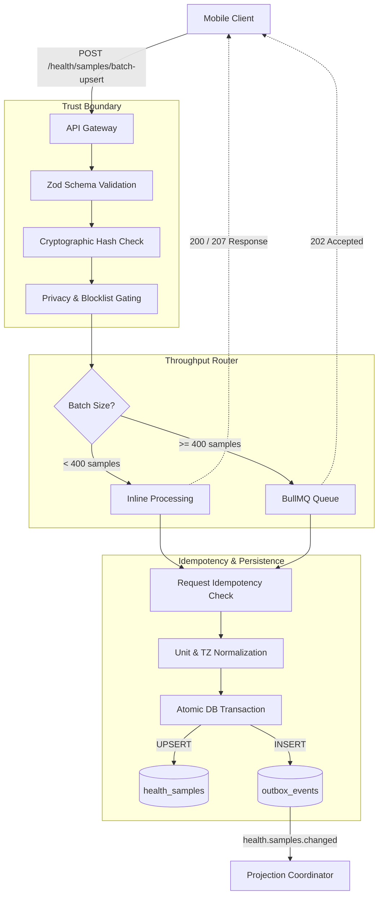
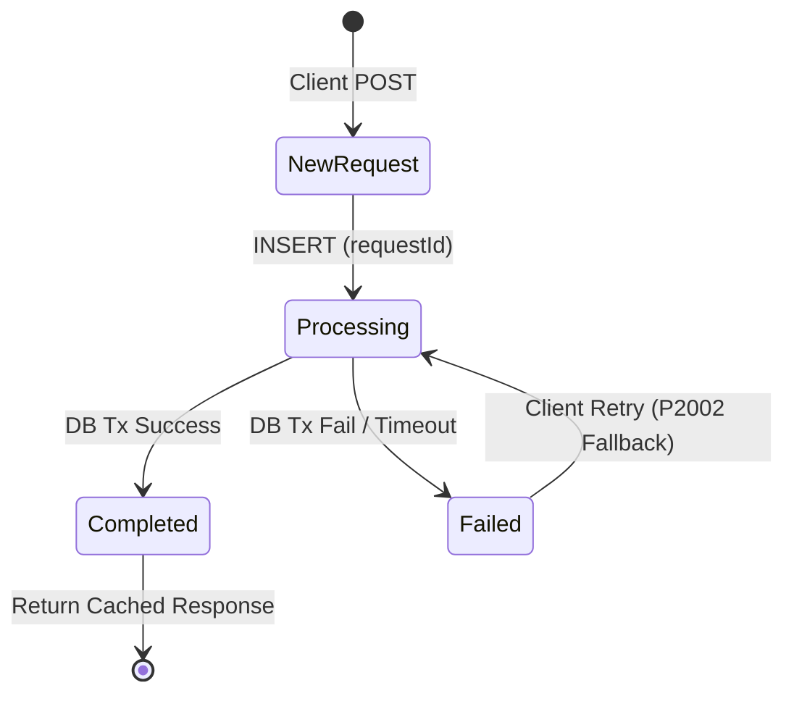

# Health Data Ingestion Pipeline

The Health Data Ingestion Pipeline is the high-throughput, highly validated gateway for all health data entering the AppPlatform backend from mobile operating systems (Apple HealthKit and Google Health Connect). It is responsible for securely validating, deduplicating, normalizing, and durably persisting raw health samples before handing them off to the downstream projection tier.

This document details the architecture, routing logic, normalization rules, and idempotency guarantees that protect data integrity — zero data loss, zero duplication, zero system degradation.

 

## Architectural Overview

The ingestion pipeline operates on a **push-only** model. Mobile clients continuously batch and push new or modified health samples to the backend. The backend's primary responsibility is to securely validate, deduplicate, normalize, and durably persist this data before signaling downstream systems to update user analytics.

  

 

### Core Guarantees

| Guarantee | Description |
| :--- | :--- |
| **At-Least-Once Delivery** | Client retries are expected and safely absorbed |
| **Zero Dual-Writes** | Raw samples and outbox events are committed in a single, atomic PostgreSQL transaction (Transactional Outbox) |
| **Strict Ordering** | Downstream projectors use watermark sequence numbers (`minRequiredSeq`) to detect and recover from out-of-order event processing |
| **Fail-Fast Boundary** | Malformed payloads, invalid units, and unauthorized metrics are rejected synchronously at the HTTP boundary before database ingestion |

<strong>End-to-End Ingestion Flow Diagram</strong>

 

 

> **Guarantee:** Zero dual-writes. Raw samples and downstream notification events are committed in a single atomic PostgreSQL transaction. Downstream projectors use watermark sequence numbers to detect and recover from staleness.

---

## API Boundary & Trust Validation

Data originates from diverse mobile operating systems. The API boundary (`POST /api/v1/health/samples/batch-upsert`) enforces rigorous validation to protect backend integrity.

  

 

### The `BatchUpsertSamplesRequest` Contract

The payload undergoes deep validation via Zod schemas. The contract requires:

1. **`requestId`** — A client-generated UUID for request-level idempotency.
2. **`payloadHash`** — A SHA-256 hash of the canonicalized samples array.
3. **`samples`** — Array of health samples (max 500 per batch).
4. **`deleted`** — Optional array of soft-delete requests (max 500 per batch).

### Cryptographic Payload Verification

The pipeline computes an order-invariant SHA-256 hash of the incoming `samples` and `deleted` arrays (`computeBatchPayloadHash`). If the computed hash does not match the client-provided `payloadHash`, the request is rejected with `PAYLOAD_HASH_MISMATCH`.

This guarantees:

- **Tamper Resistance** — Data was not modified in transit.
- **Idempotency Safety** — A client cannot reuse a `requestId` for a different set of samples.
- **Lost-ACK Recovery** — If a client retries because it dropped the server's HTTP response, the exact payload hash ensures the server returns the cached response safely.

### Bounded and Whitelisted Metadata

Health data metadata is highly variable. To prevent DoS attacks via memory exhaustion or massive DB rows, metadata is sanitized through `WhitelistedMetadataSchema`:

- **Allowlist Only** — Keys must explicitly exist in the allowlist (e.g., `deviceModel`, `osVersion`, `sampleReliability`). Unknown keys are dropped.
- **Bounded Depth & Size** — Max depth of 3, max 20 top-level keys, max 4096 total bytes.

### Server-Side Privacy Gating

Before any processing begins, `assertHealthUploadAllowed` fetches the user's `HealthPrivacySettings`. If the user has disabled health sync, the request fails with a `403 Forbidden`. If specific metrics are blocked (e.g., a user disables location or weight tracking), those samples are quarantined and returned as `PRIVACY_BLOCKED` failures in a `207 Partial Success` response.

> **Guarantee:** Malformed payloads, invalid units, unauthorized metrics, and privacy-blocked samples are rejected synchronously at the HTTP boundary before any database write.

---

## Throughput Routing

To protect the database connection pool during massive historical backfills (e.g., a user syncing 3 years of heart rate data upon initial login), the `HealthIngestQueueService` acts as a dynamic router.

| Path | Condition | Behavior | Client Response |
| :--- | :--- | :--- | :--- |
| **Inline Processing** | Batch size < 400 | Processed synchronously | `200 OK` / `207 Multi-Status` |
| **Queue Processing** | Batch size >= 400 | Enqueued to BullMQ (`HEALTH_INGEST_BATCH`) | `202 Accepted` with `retryAfterMs` |
| **Rejected** | Payload > 5 MB | Synchronously rejected (Redis OOM protection) | `413 Payload Too Large` |

For queued batches, the client polls the endpoint using the same `requestId` and `payloadHash` to retrieve the final cached result once the worker finishes processing.

**Payload Circuit Breaker:** BullMQ stores jobs in Redis. To prevent Redis OOM evictions or socket write failures, any payload exceeding `MAX_JOB_PAYLOAD_BYTES` (5 MB) is synchronously rejected before touching Redis.

---

## Dual-Layer Idempotency Engine

Mobile networks are unreliable. Clients aggressively retry requests when connections drop. The pipeline uses a dual-layer idempotency engine to guarantee zero data duplication.

  

 

### Layer 1: Request-Level Idempotency

The system tracks the lifecycle of every `requestId` in the `health_ingest_requests` table:

| State | Meaning | Server Behavior |
| :--- | :--- | :--- |
| `NEW_REQUEST` | Novel request | Insert row as `processing`, proceed |
| `CACHED_RESPONSE` | Previously completed | Bypass all processing, return stored `responseJson` |
| `STILL_PROCESSING` | Concurrent duplicate | Reject with `409 Conflict` (client backs off) |
| `PAYLOAD_MISMATCH` | Same `requestId`, different hash | Reject as tampering / client bug |

**The `P2002` Reactivation Fallback:** If a worker crashes mid-processing, the request row remains stuck in `processing` (eventually transitioning to `failed` via the Reaper job). When a client retries, the initial `INSERT` triggers a `P2002` unique constraint violation. The service catches this, verifies the `payloadHash`, and atomically executes `reactivateFailedIngestRequest` to transition the row from `failed` back to `processing`.

### Layer 2: Sample-Level Deduplication

Individual samples are uniquely identified by a 4-column composite key: `(userId, sourceId, sourceRecordId, startAt)`.

Database insertions use `ON CONFLICT DO UPDATE`. If a sample is ingested twice (e.g., overlapping batches), the database updates non-key fields (like `metadata` or `endAt`) while preserving the entity's primary identity — true idempotency at the row level.

<strong>Request Lifecycle State Machine</strong>

 

 

> **Guarantee:** Network unreliability, client bugs, and background job retries never produce duplicate data. Request-level and sample-level idempotency are enforced independently.

---

## Data Normalization & Storage

Before reaching PostgreSQL, raw data undergoes strict normalization to conform to the shared health contracts.

### The `valueKind` Discriminated Union

The pipeline supports diverse data shapes via the `valueKind` discriminator, enforced by PostgreSQL `CHECK` constraints:

| `valueKind` | Semantic Meaning | Required Fields | Forbidden Fields | Example Metric |
| :--- | :--- | :--- | :--- | :--- |
| `SCALAR_NUM` | Instantaneous numeric reading | `value`, `unit` | `categoryCode` | `heart_rate` |
| `CUMULATIVE_NUM` | Accumulated numeric total | `value`, `unit` | `categoryCode` | `steps` |
| `INTERVAL_NUM` | Duration-based numeric reading | `value`, `unit`, `durationSeconds` | `categoryCode` | `workout_duration` |
| `CATEGORY` | Discrete categorical state | `categoryCode` | `value`, `unit` | `sleep_stage` |

### Unit Normalization and Aliasing

Mobile OSes often return varying unit strings (e.g., Apple Health returns `count/min` for heart rate, while the canonical unit is `bpm`). The `resolveMetricUnitAlias` function resolves these platform quirks *before* validating against the metric's allowed units (`assertUnitAllowedForMetric`). If normalization fails, the sample is quarantined with `UNIT_NORMALIZATION_FAILED`.

### Timezone Handling & Local Date Anchoring

Correct aggregation — especially for sleep — requires accurate local time. The resolution chain:

1. **Per-sample** `timezoneOffsetMinutes` overrides the request-level header.
2. **Request-level** `X-Timezone-Offset` header provides a fallback.
3. **Sleep metrics** *fail-fast* if timezone data is completely missing (`TIMEZONE_REQUIRED`).
4. **Standard scalar metrics** without a timezone safely fall back to UTC (`0`).

---

## Transactional Outbox & Downstream Handoff

The core ingestion logic in `HealthSampleService` is entirely decoupled from analytics and projection logic. Communication with downstream systems happens exclusively through the Transactional Outbox.

Once samples are formatted, the system opens a single PostgreSQL transaction (`$transaction`). Inside this transaction:

1. Validated samples are upserted into `health_samples`.
2. A single `health.samples.changed` domain event is inserted into `outbox_events`.

### The `health.samples.changed` Payload

This event payload is optimized for targeted cache invalidation and re-projection:

| Field | Purpose |
| :--- | :--- |
| `affectedLocalDates` | Array of `YYYY-MM-DD` strings derived from sample timestamps. Ensures downstream processors only recalculate affected days. Handles midnight-spanning intervals via `getAffectedLocalDates()`. |
| `metricCodes` | The distinct set of metrics altered in this batch |
| `minRequiredSeq` | The `UserHealthWatermark` sequence number resulting from this transaction |

**Dual-Write Prevention:** If the database commits, the outbox event is guaranteed to exist. If the database rolls back, no outbox event is emitted. The `OutboxProcessorService` later polls this table and synchronously routes the payload to the `HealthProjectionCoordinatorService` for fanout to read models.

> **Guarantee:** No data change silently drops its downstream side effects. Outbox events are committed atomically with the primary data write.

---

## Failure Handling & Background Maintenance

The pipeline is designed to gracefully degrade and self-heal across three distinct mechanisms.

### The `207` Partial Success Model

If a batch contains 500 samples and 2 possess invalid units or out-of-bounds values, the pipeline **does not** fail the entire request:

- **498 samples** are successfully persisted.
- **2 samples** are quarantined.
- The API returns HTTP `207 Multi-Status`, providing an array of `failed` samples with granular `SampleErrorCode`s (e.g., `VALUE_OUT_OF_BOUNDS`, `INVALID_CATEGORY_CODE`) so the client can correct or discard them.

### Proactive Recovery: `HealthIngestReaper`

If a BullMQ worker crashes while processing an async batch, the `health_ingest_requests` row is stranded in `processing` status. A scheduled cron job (`JobNames.HEALTH_INGEST_REAPER`) runs every 15 minutes, finding rows stuck in `processing` for more than 5 minutes and safely transitioning them to `failed`. This allows the client's next polling attempt to initiate a clean retry.

### Storage Management: `HealthSampleSoftDeletePurger`

When clients delete a sample on the mobile device, the ingestion pipeline performs a *soft-delete* (`isDeleted = true`). This ensures the deletion propagates safely through the projection pipeline (e.g., removing a deleted sleep stage from the nightly aggregate).

To prevent unbounded storage growth, the `JobNames.HEALTH_SAMPLE_SOFT_DELETE_PURGER` runs daily at 4:00 AM UTC. It physically `DELETE`s any row where `isDeleted = true` and `deletedAt` is older than 30 days.

> **Guarantee:** Background jobs survive worker crashes via durable Redis queues. Soft-deleted records are purged on a predictable schedule. No failure mode leads to permanent data loss or unbounded storage growth.

---

> For the downstream projection pipeline — watermark freshness, read models, and checkpoint coordination — see [**Health Projection Pipeline**](HealthProjection.MD).
