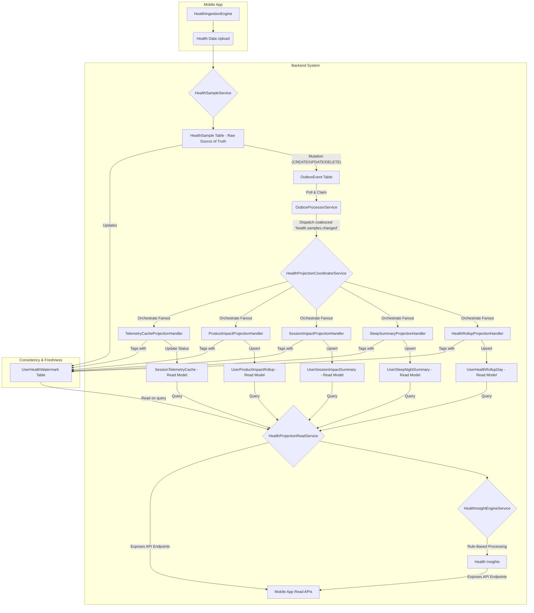
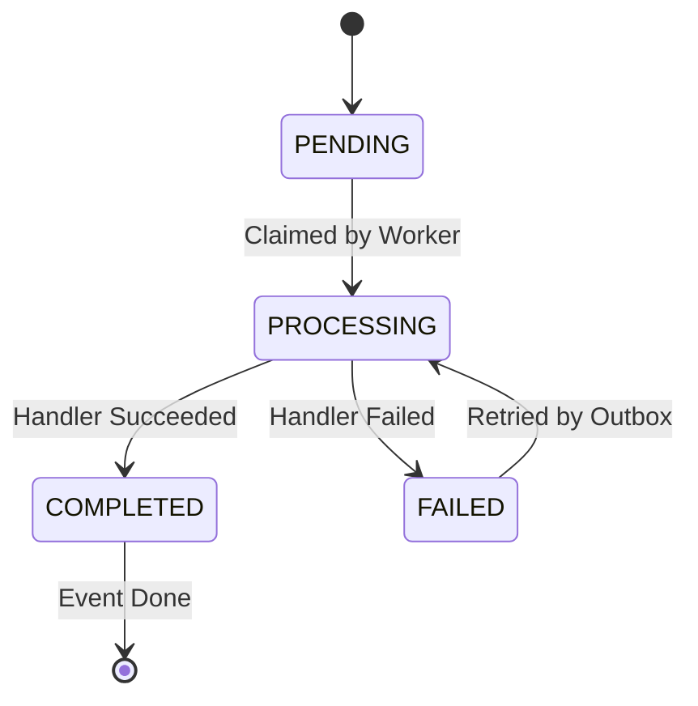
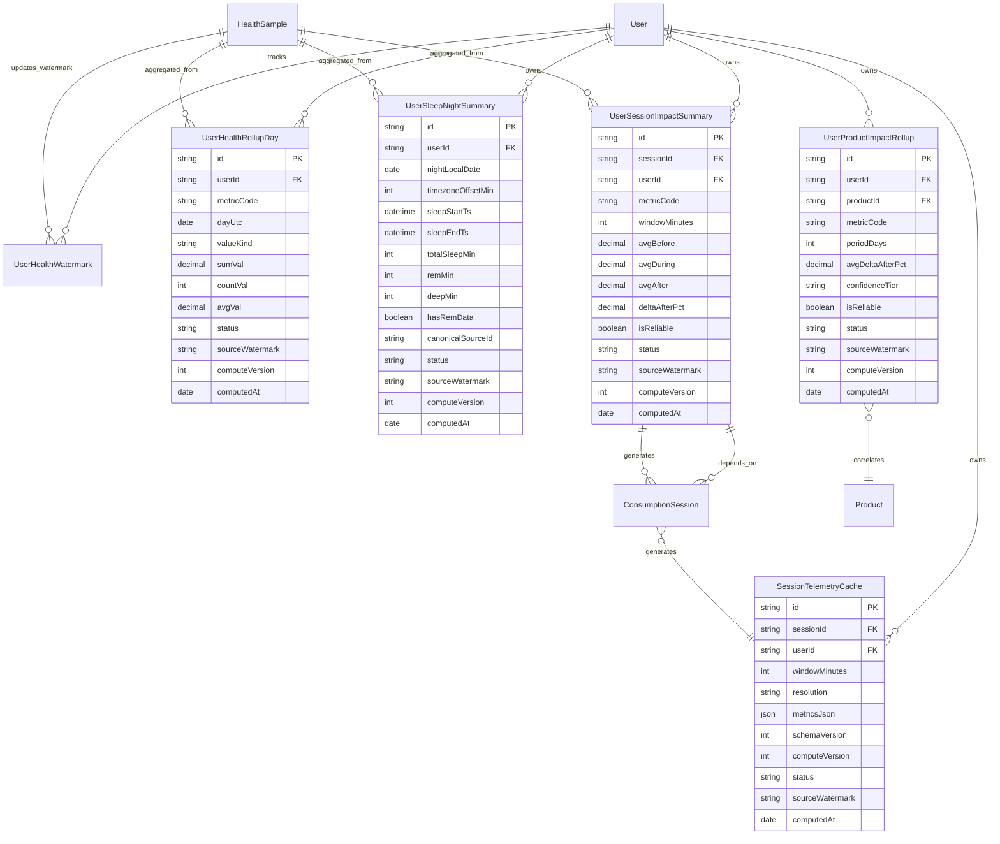

# Health Projection Pipeline

## Overview

This document details the architecture, data flow, processing logic, and consistency model of the health projection pipeline in the AppPlatform backend. It serves as the definitive guide for understanding how raw health data is transformed into optimized, user-facing read models.

Analyzing high-volume, granular health data (e.g., heart rate every minute) directly for UI display or aggregated insights is computationally expensive and slow. Projections solve this by pre-aggregating, denormalizing, and enriching raw data into purpose-built read models. This enables fast, responsive UI experiences, complex analytical queries, and powers features like session impact analysis and personalized insights without impacting the transactional write path.

 

### Core Principles

#### 1. Drive all updates through domain events
All projection updates are triggered by `health.samples.changed` domain events, ensuring loose coupling between the write path and the read-model computation layer.

> **Goal:** Projection logic never depends on synchronous request-path execution.

#### 2. Guarantee event delivery through transactional atomicity
The Transactional Outbox Pattern ensures at-least-once delivery of projection triggers. Events are committed in the same database transaction as the raw data mutations.

> **Goal:** No data change is committed without a corresponding projection trigger. No event is emitted for uncommitted data.

#### 3. Accept eventual consistency on the read side
Projections are eventually consistent with the raw source data, optimizing for read availability and performance. Staleness is tracked explicitly through watermarks.

> **Goal:** Clients always know whether the data they are reading is current, stale, or failed.

#### 4. Denormalize aggressively for query performance
Read models are highly denormalized and optimized for specific query patterns, eliminating complex joins and real-time aggregation during API requests.

> **Goal:** Every read-path query hits a single pre-computed table, not a chain of joins.

#### 5. Keep transformations pure and deterministic
Core aggregation and insight logic is implemented using pure, testable functions with no side effects, ensuring reproducible and verifiable transformations.

> **Goal:** Any projection output can be recomputed from the same inputs and produce an identical result.

#### 6. Fail fast and fail visibly
Errors are detected and propagated early, preventing silent data corruption. Failed projections enter dead-letter queues rather than producing incorrect read models.

> **Goal:** No silent failures. Every error is surfaced, logged, and recoverable.

---

## Architecture

The health projection pipeline is a robust, event-driven system designed to transform raw, high-volume health data into performant read models. It operates asynchronously, ensuring that complex computations do not block the critical path of raw data ingestion.

  

 

The pipeline follows a six-stage flow:

1. **Raw Data Ingestion** -- Mobile applications ingest raw health data (e.g., steps, heart rate, sleep stages) via `HealthIngestionEngine`, which is then uploaded to the backend and stored in the `HealthSample` table.
2. **Event Emission** -- Any mutation to `HealthSample` records triggers a `health.samples.changed` domain event, which is durably committed to the `OutboxEvent` table using the [Transactional Outbox Pattern](#atomic-event-emission).
3. **Asynchronous Processing** -- A background `OutboxProcessorService` periodically picks up `PENDING` `OutboxEvent`s. It coalesces multiple `health.samples.changed` events for the same user to optimize processing.
4. **Projection Coordination** -- The coalesced event is dispatched to the `HealthProjectionCoordinatorService`, which orchestrates the fanout to individual Projection Handlers.
5. **Read Model Creation** -- Each Projection Handler transforms the event data into a specific denormalized read model (e.g., daily rollups, sleep summaries) and upserts it into its dedicated projection table.
6. **Read API Layer** -- The `HealthProjectionReadService` exposes these optimized read models via public API endpoints. This service applies watermark-based freshness checks to ensure clients receive accurate data status.

 

### Key Components

| Component | Responsibility |
| :--- | :--- |
| **`HealthSampleService`** | Backend service for processing raw `HealthSample` uploads |
| **`OutboxService`** | Manages durable `OutboxEvent` persistence |
| **`OutboxProcessorService`** | Background worker processing `OutboxEvent`s |
| **`HealthProjectionCoordinatorService`** | Orchestrates fanout to projection handlers, manages checkpoints and dependencies |
| **Projection Handlers** | `HealthRollupProjectionHandler`, `SleepSummaryProjectionHandler`, `SessionImpactProjectionHandler`, `ProductImpactProjectionHandler`, `TelemetryCacheProjectionHandler` |
| **Projection Read Models** | Dedicated PostgreSQL tables (`UserHealthRollupDay`, `UserSleepNightSummary`, etc.) optimized for query |
| **`HealthProjectionReadService`** | Serves projection data via REST APIs, applying freshness logic |
| **`HealthInsightEngineService`** | Generates rule-based insights from projection data at read-time |

 

<strong>Pipeline Architecture Diagram</strong>

 

---

## Write-Side Source of Truth: Raw Health Samples

The `HealthSample` table is the foundational data store for all health-related information in AppPlatform. It directly reflects the data ingested from external health providers or manual user input.

### `HealthSample` Table

This table (`packages/backend/prisma/schema.prisma:1052`) stores individual, granular health data points. It is optimized for high-volume, append-only writes, with a primary focus on data integrity and auditability.

Key fields include `userId`, `sourceId`, `sourceRecordId` (platform-assigned unique ID), `metricCode`, `valueKind` (e.g., `SCALAR_NUM`, `CATEGORY`), `value`/`unit` (for numeric samples), `categoryCode` (for categorical samples), `startAt`, `endAt`, `durationSeconds`, `timezoneOffsetMin`, and `isDeleted`.

 

### Invariants

**Idempotency.** A unique composite index on `(userId, sourceId, sourceRecordId, startAt)` ensures that duplicate raw samples are handled via upsert, preventing data duplication.

**Soft Deletes.** Health data is never hard-deleted from this table. Instead, the `isDeleted` flag is set to `true`, preserving the audit trail and allowing for analytics on historical (even deleted) data. A background job (`HealthSampleSoftDeletePurgerJob`) eventually hard-deletes old `isDeleted` records.

**ValueKind Discriminator.** The `valueKind` field (`packages/shared/src/contracts/health.contract.ts:321`) enforces mutual exclusivity between numeric values (`value`/`unit`) and categorical values (`categoryCode`) at the database level, ensuring data model consistency.

### Raw Data Ingestion

Raw health samples are first collected and normalized by the mobile application's `HealthIngestionEngine` (`packages/app/src/services/health/HealthIngestionEngine.ts`). They are then batched and uploaded to the backend via the `HealthUploadEngine` (`packages/app/src/services/health/HealthUploadEngine.ts`), which interfaces with `HealthSampleService` on the server.

---

## Event-Driven Trigger: The Transactional Outbox

All updates to the projection read models are initiated by domain events. To ensure reliability and eventual consistency, the system employs the Transactional Outbox Pattern for triggering these events.

  

 

### The `health.samples.changed` Domain Event

This event carries all necessary context for downstream projection handlers. Its structure is defined in `packages/shared/src/contracts/health-projection.contract.ts` and `packages/backend/src/events/domain.events.ts` (`HealthSamplesChangedEvent`).

| Field | Purpose |
| :--- | :--- |
| `userId` | The owner of the health data |
| `requestId` | The client's unique request ID for the original upload batch |
| `metricCodes` | Sorted list of unique `metricCode`s affected by the changes |
| `affectedLocalDates` | Sorted list of unique local calendar dates (YYYY-MM-DD) impacted, crucial for targeted rollup re-computation |
| `rangeStartMs` / `rangeEndMs` | Overall UTC time window spanned by the affected samples |
| `timezoneOffsetMinutes` / `timezoneExplicit` / `offsetRange` | Detailed timezone context for accurate local date derivation, particularly important for sleep metrics and users who travel |
| `minRequiredSeq` | The `sequenceNumber` from `UserHealthWatermark` *after* the `HealthSample` mutations were committed -- the cornerstone of watermark-based freshness tracking |

 

### Atomic Event Emission

When `HealthSampleService.batchUpsertSamples` processes an incoming health data batch, it uses a callback (`HealthSampleService.createOutboxCallback`) that is executed *within the same PostgreSQL database transaction* as the `HealthSample` inserts, updates, and deletes. This callback invokes `OutboxService.addEvent(tx, ...)` to durably persist the `health.samples.changed` event to the `OutboxEvent` table (`packages/backend/prisma/schema.prisma:630`).

This is the [Transactional Outbox Pattern](https://microservices.io/patterns/data/transactional-outbox.html). It guarantees atomicity: if the raw health data write succeeds, the event is guaranteed to be persisted. If the raw data write fails (e.g., a database constraint violation), the event is rolled back along with the data changes. This eliminates the dual-write anti-pattern and ensures that projection updates are never triggered for uncommitted data, nor are data changes committed without a corresponding projection trigger.

> **Guarantee:** No data change is committed without a corresponding projection trigger event. No event is emitted for uncommitted data.

**Code Reference:** `packages/backend/src/services/healthSample.service.ts` (`createOutboxCallback` method), `packages/backend/src/services/outbox.service.ts` (`addEvent` method).

 

### Asynchronous Processing & Event Coalescing

The `OutboxProcessorService` (`packages/backend/src/services/outbox-processor.service.ts`) runs as a dedicated background worker. It periodically polls the `OutboxEvent` table for `PENDING` events whose `nextAttemptAt` timestamp has elapsed (or is `NULL`).

`OutboxProcessorService.processPendingEvents` groups multiple `health.samples.changed` events for the *same user* into batches. Before dispatching, it uses the `coalesceHealthPayloads` function (`packages/backend/src/services/outbox-coalescing.ts`) to merge these individual event payloads into a single, comprehensive `HealthSamplesChangedPayload`. This merged payload combines `metricCodes`, `affectedLocalDates`, `rangeStartMs`/`rangeEndMs`, and `minRequiredSeq` (taking the maximum sequence number).

This optimization significantly reduces the load on the downstream projection pipeline, especially during bulk ingestion scenarios (e.g., a 90-day HealthKit backfill could generate thousands of individual events). Coalescing prevents redundant computations and ensures that the projection handlers execute once per logical update for a user.

**Code Reference:** `packages/backend/src/services/outbox-processor.service.ts` (`processPendingEvents` method), `packages/backend/src/services/outbox-coalescing.ts` (`coalesceHealthPayloads` function).

---

## Projection Coordination

The `HealthProjectionCoordinatorService` (`packages/backend/src/services/health-projection-coordinator.service.ts`) is the central component responsible for orchestrating the fanout of `health.samples.changed` events to the individual projection handlers. It receives coalesced `HealthSamplesChangedPayload`s from the `OutboxProcessorService` and manages the execution lifecycle of all registered `HealthProjectionHandler`s for that specific event.

### ProjectionCheckpoint Tracking

For every `OutboxEvent` and every registered `HealthProjectionHandler`, a `ProjectionCheckpoint` record (`packages/backend/prisma/schema.prisma:1584`) is created. This record tracks the processing status of each individual projection handler.

**Code Reference:** `packages/backend/src/repositories/projection-checkpoint.repository.ts`.

<strong>ProjectionCheckpoint State Machine</strong>

 

 

### Lease-Based Concurrency

Before executing any handler, `HealthProjectionCoordinatorService` calls `ProjectionCheckpointRepository.tryAcquireProjectionLease(eventId, projectionName, leaseDurationMs)`. This atomically transitions the checkpoint status to `PROCESSING` and sets an expiration timestamp (`leaseExpiresAt`).

This prevents multiple workers (in a horizontally scaled environment) from concurrently processing the same `(eventId, projectionName)` combination. If a lease is already held by another worker, the current worker `SKIPS` the handler. If a worker crashes while holding a lease, the `leaseExpiresAt` will eventually pass. `OutboxProcessorService` periodically calls `ProjectionCheckpointRepository.recoverStaleProcessing`, which reclaims these expired leases by marking them `FAILED` (allowing them to be picked up by another worker).

### Dependency Chaining

Projection handlers can declare dependencies on other handlers using `readonly dependsOn: readonly string[]` (e.g., `ProductImpactProjectionHandler` declares `dependsOn = ['session-impact']`). The Coordinator ensures that a handler only executes if all its declared dependencies have successfully `COMPLETED` for the *current* `OutboxEvent`.

This ensures data consistency. For instance, `ProductImpactProjectionHandler` relies on `UserSessionImpactSummary` data. If `SessionImpactProjectionHandler` failed for a given event, `ProductImpactProjectionHandler` is skipped and marked `FAILED` to prevent it from consuming outdated or incomplete data. On retry, both handlers will re-run in the correct order.

### Timeouts & Error Handling

Each handler's `handle` method execution is wrapped in a `withTimeout` guard (`HealthProjectionCoordinatorService.withTimeout`), with a default `timeoutMs` of 30 seconds (`DEFAULT_PROJECTION_TIMEOUT_MS`). If a handler's execution exceeds this timeout, the coordinator marks its `ProjectionCheckpoint` as `FAILED` (releasing the lease).

Any unhandled exception within a handler (or a timeout) causes its checkpoint to be marked `FAILED`. The `OutboxProcessorService` detects this failure, increments the `retryCount` of the original `OutboxEvent`, and reschedules it with exponential backoff. This ensures robust, at-least-once delivery for projection updates.

> **Guarantee:** Every projection handler runs at-least-once per event. Lease-based concurrency prevents duplicate processing. Dependency chaining prevents stale reads. Timeouts prevent indefinite blocking.

---

## Projection Handlers

Projection Handlers are the core transformation units of the pipeline. Each handler is responsible for a specific read model, performing denormalization, aggregation, and enrichment based on the `HealthSamplesChangedPayload`. All handlers are defined in `packages/backend/src/services/health-projection-coordinator.service.ts`.

### Common Handler Principles

- **Input:** Always a `HealthSamplesChangedPayload` (`packages/shared/src/contracts/health-projection.contract.ts`) containing the changes that occurred.
- **Output:** An upsert operation into its respective projection table.
- **Idempotency:** All handler write operations are upserts based on natural keys (e.g., `(userId, metricCode, dayUtc)` for rollups), ensuring that replaying events does not create duplicate data.
- **Bounded Reads:** Handlers use helper functions like `fetchAllActivePages` to query `HealthSample` data in paginated chunks (e.g., `MAX_SAMPLE_PAGES` limit), preventing unbounded database reads.
- **ValueKind-Aware Logic:** Processing adapts based on the `HealthMetricValueKind` (e.g., `SCALAR_NUM`, `CUMULATIVE_NUM`, `INTERVAL_NUM`, `CATEGORY`), ensuring semantically correct aggregations.
- **Watermark Tagging:** Each projection row is tagged with the `sourceWatermark` (the `minRequiredSeq` from the payload). This enables [watermark-based staleness detection](#watermark-based-staleness-detection).

 

### Handler Summary

| Handler | Output Read Model | Key Logic | Dependencies |
| :--- | :--- | :--- | :--- |
| **`health-rollup`** | `UserHealthRollupDay` | `aggregateWithValueKind` for `SCALAR_NUM` (avg), `CUMULATIVE_NUM` (delta), `INTERVAL_NUM` (sum). Handles timezone offset ranges. | -- |
| **`sleep-summary`** | `UserSleepNightSummary` | `getSleepNightAnchorDate`, `clusterSleepSamples`, `detectNap`, `computeStageAvailability`, `selectCanonicalSource`. Pre-bed session correlation. | -- |
| **`session-impact`** | `UserSessionImpactSummary` | Before/during/after bucketing around sessions. AVG, MIN, MAX, DELTAs. Cadence-aware `coverage` and `isReliable` flags. | -- |
| **`product-impact`** | `UserProductImpactRollup` | Statistical aggregation via `product-impact-compute.ts` (mean, median, CI, confidence tiers) across 7d/30d/90d windows. | `session-impact` |
| **`telemetry-cache`** | `SessionTelemetryCache` | Identifies overlapping sessions. Marks cache entries `STALE`. Threshold-based fine-grained vs. user-wide invalidation. | -- |

 

### `HealthRollupProjectionHandler`

Computes and stores daily aggregate values (sum, count, min, max, avg) for all numeric health metrics. The `UserHealthRollupDay` read model facilitates fast querying of daily trends and totals.

The handler retrieves all `HealthSample`s for a specific user, metric, and local calendar date. It then delegates the core aggregation logic to `HealthAggregationService.aggregateWithValueKind` (`packages/backend/src/services/health-aggregation.service.ts`), which applies the appropriate aggregation strategy based on the `metricCode`'s `ValueKind`: average for `SCALAR_NUM` (e.g., heart rate), delta (max-min) for `CUMULATIVE_NUM` (e.g., steps), and sum for `INTERVAL_NUM` (e.g., active energy burned). It also handles the complexities of `timezoneOffsetMin` and multi-offset ranges to ensure correct local date attribution for samples that cross midnight or are from different timezones within a batch.

**Output:** Upserts records into `UserHealthRollupDay` (`packages/backend/prisma/schema.prisma:1631`).

 

### `SleepSummaryProjectionHandler`

Creates a denormalized, comprehensive summary of a user's sleep for a given "night of" date. The `UserSleepNightSummary` read model is optimized for displaying sleep scores, stage breakdowns, and related correlations in the UI without complex joins.

This handler is triggered by sleep-related metrics (e.g., `sleep_stage`). It uses `getSleepNightAnchorDate` (`packages/shared/src/health-config/sleep-utils.ts`) to determine the canonical "night of" date. It then groups contiguous sleep stages into logical sleep sessions (clusters) using `clusterSleepSamples` (`packages/shared/src/health-config/sleep-clustering.ts`), detects naps (`detectNap`), and computes stage availability (`computeStageAvailability`). For multi-device scenarios, `selectCanonicalSource` (`packages/shared/src/health-config/source-resolution.ts`) selects the single authoritative source for sleep data, preventing double-counting. It also integrates pre-bed session correlation by querying `SessionRepository` for user activity sessions ending within a 4-hour window before sleep onset.

**Output:** Upserts records into `UserSleepNightSummary` (`packages/backend/prisma/schema.prisma:1708`).

 

### `SessionImpactProjectionHandler`

Computes and stores before/during/after health metric deltas around each `ConsumptionSession`. The `UserSessionImpactSummary` read model enables rapid visualization of immediate physiological responses to consumption, eliminating the need for real-time aggregation.

The handler queries `HealthSample`s within a wider time window (e.g., 60 minutes before and after) around a `ConsumptionSession`. It buckets these samples into `before`, `during`, and `after` intervals relative to the session start and end times. For each bucket, it computes aggregated statistics (average, minimum, maximum, count) and calculates delta values (absolute and percentage change) relative to the `before` baseline. It also calculates `coverage` (adjusted for the metric's expected cadence) and `isReliable` flags to indicate data quality.

**Output:** Upserts records into `UserSessionImpactSummary` (`packages/backend/prisma/schema.prisma:1807`).

 

### `ProductImpactProjectionHandler`

Aggregates session-level health impacts into per-product summaries over specific time periods (7, 30, 90 days), providing insights into how individual products affect health metrics.

This handler declares a dependency on `session-impact` (`readonly dependsOn = ['session-impact']`). The `HealthProjectionCoordinatorService` ensures that the `SessionImpactProjectionHandler` successfully `COMPLETES` for the current `OutboxEvent` before `product-impact` executes. This guarantees that `ProductImpactProjectionHandler` always operates on up-to-date `UserSessionImpactSummary` data.

It queries `UserSessionImpactSummary` records linked to a specific `productId` and `metricCode`, then delegates the core statistical aggregation (mean, median, confidence intervals, confidence tiers, and quality flags) to `computeProductImpactAggregate` (`packages/backend/src/services/product-impact-compute.ts` -- a pure, stateless function). It handles multi-period aggregation, computing separate rollups for 7-day, 30-day, and 90-day windows.

**Output:** Upserts records into `UserProductImpactRollup` (`packages/backend/prisma/schema.prisma:1930`).

 

### `TelemetryCacheProjectionHandler`

Manages the freshness state of `SessionTelemetryCache` entries. This handler does not compute telemetry directly but signals when existing cache entries are out-of-date.

In response to a `health.samples.changed` event, this handler identifies all `ConsumptionSession`s whose telemetry windows overlap the time range of the affected `HealthSample`s. It then marks the corresponding `SessionTelemetryCache` entries as `STALE`.

The handler employs a threshold-based invalidation strategy. For wide time ranges (characteristic of historical backfills) or high sample counts within a narrow window, it performs a coarse user-level invalidation (a single `UPDATE` query for all of the user's cache entries). For narrower, smaller updates, it performs fine-grained invalidation (per-session `UPDATE`). This optimizes performance by avoiding `O(N)` individual updates during large events.

**Output:** Updates the `status` column of `SessionTelemetryCache` records (`packages/backend/prisma/schema.prisma:1497`) to `STALE`. This status then triggers lazy recomputation by the `SessionTelemetryService` when the cache entry is next requested by a client.

---

## Read Models

The projection tables serve as the denormalized read models of the health pipeline. They are specifically structured to provide rapid, efficient access to aggregated health data for various UI components and analytical queries. These tables are materialized views that encapsulate complex aggregation logic and denormalize data relationships, significantly reducing query latency by avoiding expensive joins and real-time computation during API requests.

Each record in these tables includes crucial freshness metadata -- `status`, `computedAt`, `sourceWatermark`, and `computeVersion` -- which is key to maintaining consistency with the raw source data.

 

### `UserHealthRollupDay`

Pre-computed daily aggregate values for all numeric health metrics. Ideal for displaying daily trends, summaries, and averages in dashboards.

**Key Fields:** `userId`, `metricCode`, `dayUtc` (local calendar date), `valueKind`, `sumVal`, `countVal`, `minVal`, `maxVal`, `avgVal`, `timezoneOffsetMin`, `freshness`.

**Schema:** `packages/backend/prisma/schema.prisma` (`model UserHealthRollupDay`).

 

### `UserSleepNightSummary`

A comprehensive, single-row summary of a user's sleep for a specific "night of" date. This denormalized structure is optimized for rendering sleep scores, stage breakdowns, and related correlations in the UI.

**Key Fields:** `userId`, `nightLocalDate`, `sleepStartTs`, `sleepEndTs`, `totalSleepMin`, `remMin`, `deepMin`, `lightMin`, `sleepEfficiency`, `wakeEvents`, `hadSessionBefore`, `sessionIdBefore`, `canonicalSourceId`, `freshness`.

**Schema:** `packages/backend/prisma/schema.prisma` (`model UserSleepNightSummary`).

 

### `UserSessionImpactSummary`

Pre-computed before/during/after delta statistics for health metrics around each `ConsumptionSession`. Enables instant display of physiological impact analysis in session detail screens.

**Key Fields:** `sessionId`, `metricCode`, `windowMinutes`, `avgBefore`, `avgDuring`, `avgAfter`, `deltaDuringPct`, `deltaAfterPct`, `beforeCoverage`, `duringCoverage`, `afterCoverage`, `isReliable`, `freshness`.

**Schema:** `packages/backend/prisma/schema.prisma` (`model UserSessionImpactSummary`).

 

### `UserProductImpactRollup`

Aggregated health impact data per product over specific time periods (7, 30, 90 days), answering questions like "Which products affect my heart rate most?".

**Key Fields:** `productId`, `productName`, `metricCode`, `periodDays`, `sessionCount`, `avgDeltaDuringPct`, `confidenceTier`, `isReliable`, `qualityFlags`, `freshness`.

**Schema:** `packages/backend/prisma/schema.prisma` (`model UserProductImpactRollup`).

 

### `SessionTelemetryCache`

Caches downsampled health telemetry time-series data for fast session visualization charts. Stores a JSONB blob of `MetricSeriesData` at various resolutions.

**Key Fields:** `sessionId`, `windowMinutes`, `resolution`, `metricsJson` (JSONB blob), `schemaVersion`, `computeVersion`, `status` (`READY`, `COMPUTING`, `STALE`, `FAILED`), `sourceWatermark`.

**Schema:** `packages/backend/prisma/schema.prisma` (`model SessionTelemetryCache`).

 

<strong>Health Projection Data Model</strong>

 

---

## View Consistency: Watermarks and Freshness

Maintaining consistency between the rapidly changing raw `HealthSample` data and the eventually consistent read models is paramount. The system relies on a robust watermark-based freshness mechanism and explicit status flags.

### `UserHealthWatermark` Table

This table (`packages/backend/prisma/schema.prisma:1614`) is the central component for tracking the latest mutation version of a user's raw health data. It stores a monotonically increasing `sequenceNumber` (PostgreSQL `BIGINT`) for each `userId`. This `sequenceNumber` is atomically incremented within the `HealthSample` transaction *after* any data mutations (inserts, updates, or soft-deletes) are committed.

**Code Reference:** `packages/backend/src/repositories/user-health-watermark.repository.ts`.

 

### Watermark-Based Staleness Detection

During any read operation from the `HealthProjectionReadService` (e.g., when a mobile app requests rollups), the `applyWatermarkFreshness` method (`packages/backend/src/services/health-projection-read.service.ts:250`) fetches the `currentSourceWatermark` for the `userId` from `UserHealthWatermark`. It then compares this to each projection row's `sourceWatermark` (a `BIGINT` value stored in the projection row during its computation).

**Staleness Rule:** If `currentSourceWatermark > row.sourceWatermark`, it means newer raw data exists that has not yet been reflected in the projection. The `HealthProjectionReadService` dynamically marks the DTO's `freshness.status` as `STALE`.

This mechanism provides "read-your-writes" consistency. Even if a projection is `READY` (meaning it was computed successfully at some point), if the underlying `HealthSample` data has changed since its last computation, the client is explicitly informed that the data is `STALE` and a re-projection is pending. This is crucial for avoiding silent data discrepancies in the UI.

> **Guarantee:** Staleness is never hidden. If raw data has advanced beyond a projection's watermark, the client is always informed explicitly.

 

### Freshness Status

The `FreshnessStatus` type (`packages/shared/src/health-config/freshness-types.ts`) includes `READY`, `COMPUTING`, `STALE`, `FAILED`, and `NO_DATA`.

The mobile frontend consumes these flags from the API response (`packages/shared/src/contracts/health-projection.contract.ts:167`) to dynamically update the UI. For instance, `COMPUTING` status might display a spinner, `STALE` status a small "Updating..." badge, and `FAILED` status an error message with a retry option. The `getFreshnessUiState` utility (`packages/shared/src/health-config/freshness-types.ts`) maps these statuses to concrete UI rendering decisions.

 

### Re-Projection Strategies

#### Dirty Keys (Rollups, Sleep, Product Impact)

The `DirtyKeyComputer` (on the mobile app, `packages/app/src/services/health/DirtyKeyComputer.ts`) analyzes newly ingested `HealthSample`s to identify specific `dayUtc` (for rollups) or `nightLocalDate` (for sleep summaries) that are affected. It then enqueues these affected keys into `LocalRollupDirtyKeyRepository` and `LocalSleepDirtyNightRepository` (app-side SQLite tables).

The `HealthProjectionRefreshService.runRepairPass` (running as a backend worker or triggered by the app) periodically dequeues these dirty keys. For each dirty key, it instructs the `HealthProjectionHydrationClient` to re-fetch/re-project the affected data from the backend API. The dirty key is cleared *only if* the hydration is successful and the server-side projection is in a terminal-success `FreshnessStatus`.

#### Explicit `STALE` Marking (Session Telemetry)

The `TelemetryCacheProjectionHandler` (`packages/backend/src/services/health-projection-coordinator.service.ts`) explicitly marks `SessionTelemetryCache` entries as `STALE` when overlapping `health.samples.changed` events occur.

The `SessionTelemetryQueueService` (`packages/backend/src/services/sessionTelemetryQueue.service.ts`) schedules asynchronous recomputation jobs (`SESSION_TELEMETRY_COMPUTE`) for these `STALE` caches.

When a client requests session telemetry and finds a `STALE` cache entry, the `SessionTelemetryService` (`packages/backend/src/services/session-telemetry.service.ts`) immediately returns the stale data (to meet UI latency budgets) and simultaneously triggers a background recomputation of the cache. This ensures data freshness eventually without blocking the user.

---

## Read API Endpoints

The `HealthProjectionReadService` (`packages/backend/src/services/health-projection-read.service.ts`) exposes projection data through a set of REST API endpoints. It integrates the watermark-based freshness logic and maps raw database results to API-friendly Data Transfer Objects (DTOs).

The `HealthController` (`packages/backend/src/api/v1/controllers/health.controller.ts`) handles incoming HTTP requests for health projection data, validates query parameters using Zod schemas, and routes them to the `HealthProjectionReadService`. It also instruments query performance (`measureProjectionQuery`) to track latency against defined P99 targets.

 

| Path | Purpose | Output DTO | Pagination | Key Contracts |
| :--- | :--- | :--- | :--- | :--- |
| `GET /health/rollups` | Daily aggregate values for a specified health `metricCode` within a date range | `HealthRollupDayDto` | Cursor (keyset) / Offset | `GetRollupsQuerySchema` |
| `GET /health/sleep` | Nightly sleep summaries for a user within a date range | `SleepNightSummaryDto` | None (unpaginated) | `GetSleepSummariesQuerySchema` |
| `GET /health/session-impact` | Before/during/after health metric deltas for a specific `sessionId` | `SessionImpactDto` | None (unpaginated) | `GetSessionImpactQuerySchema` |
| `GET /health/session-impact/recent` | Recent session impact records enriched with session and product context | `RecentSessionImpactDto` | Limit-based | `GetRecentSessionImpactQuerySchema` |
| `GET /health/impact/by-product` | Aggregated per-product health impact rollups for specific `metricCode`(s) and `periodDays` | `ProductImpactDto` | Limit-based | `GetProductImpactQuerySchema` |
| `GET /health/insights` | Deterministic, rule-based health insights at read-time from projections | `InsightDto` | Limit-based | `GetInsightsQuerySchema` |

All contract schemas are defined in `@shared/contracts/health-projection.contract.ts`.

 

### Health Insight Engine

The `HealthInsightEngineService` (`packages/backend/src/services/health-insight-engine.service.ts`) computes deterministic, evidence-backed health insights at read-time. Unlike other read models, insights are not stored in a projection table -- they are generated dynamically from the underlying projection data.

The engine orchestrates fetching relevant data from `UserHealthRollupDay`, `UserSessionImpactSummary`, and `UserProductImpactRollup` tables. It then delegates the core insight generation to pure rule functions (`computeTrendInsight`, `computeSessionCorrelationInsight`, `computeProductEffectInsight`, `computeBloodOxygenAnomalyInsight`) defined in `packages/backend/src/services/health-insight-rules.ts`. These rules apply predefined logic and thresholds to identify trends, correlations, or anomalies, generating `InsightDto` objects with traceable evidence and confidence scores.

To ensure performance, the engine utilizes an `AsyncSemaphore` (`packages/backend/src/services/health-insight-engine.service.ts:98`) to limit concurrent database queries during insight generation, preventing resource exhaustion. Individual data fetching operations are guarded by `withTimeout` (e.g., `ROLLUP_QUERY_BUDGET_MS`, `SESSION_IMPACT_QUERY_BUDGET_MS`), ensuring latency budgets are met for the API response.

---

## Reliability, Observability, and Scalability

The health projection pipeline is engineered for high reliability, comprehensive observability, and horizontal scalability, addressing the demands of a high-volume, eventually consistent data system.

 

### Reliability

**Transactional Outbox.** The cornerstone of reliability. Guarantees atomicity between `HealthSample` mutations and `health.samples.changed` event emission, ensuring no data changes are lost or trigger inconsistencies.

**Checkpointing.** `ProjectionCheckpoint` records ensure that each projection handler for a given `OutboxEvent` is processed at-least-once, with idempotent upserts preventing duplicate writes on retry.

**Lease-Based Concurrency.** The `ProjectionCheckpointRepository`'s lease mechanism (`tryAcquireProjectionLease`) prevents race conditions between concurrent workers, ensuring that a projection is processed by only one worker at a time.

**Retry with Exponential Backoff.** The `OutboxProcessorService` implements exponential backoff for `OutboxEvent`s that fail processing, rescheduling them for later attempts. Projection handlers themselves include retry logic where appropriate.

**Dead-Letter Queue.** Events that fail persistently after exhausting all retries are moved to a `DEAD_LETTER` status in the `OutboxEvent` table, allowing for manual investigation and preventing a single problematic event from blocking the entire pipeline.

**Idempotent Upserts.** All projection handler write operations are upserts based on natural keys, ensuring that replaying events does not create duplicate records or unintended data mutations.

 

### Observability

**Structured Logging.** The `LoggerService` provides detailed, structured logs at every critical stage of the pipeline: event emission, processing by `OutboxProcessorService`, handler execution start/completion/failure, and API response generation.

**Performance Metrics.** The `PerformanceMonitoringService` tracks key metrics such as latency for event processing, handler execution durations, API response times, BullMQ queue depths, and error rates, providing real-time insights into system health and performance bottlenecks.

**Checkpoint Visibility.** The status of `ProjectionCheckpoint`s offers granular visibility into the processing state of each projection handler for every `OutboxEvent`, enabling detailed monitoring of the pipeline's health and progress.

**Reaper Jobs.** Background jobs like `HealthIngestReaperJob` and `SessionTelemetryLockReaperJob` proactively recover from stuck `PROCESSING` states (e.g., from crashed workers), ensuring operational health and preventing deadlocks without manual intervention.

 

### Scalability

**Asynchronous Processing.** The pipeline leverages asynchronous processing with the `OutboxProcessorService` and `JobManagerService` (using BullMQ queues), enabling horizontal scaling of background workers to handle increasing event volumes independently from the API layer.

**Bounded Computations.** All database queries and computations within handlers and insight generation are strictly bounded by configurable limits (e.g., `MAX_SAMPLE_PAGES` for data fetches, `MAX_CONCURRENT_COMPUTES` for parallel processing), preventing resource exhaustion and ensuring predictable performance under high load.

**Denormalized Read Models.** The use of highly denormalized read models significantly optimizes read performance by pre-calculating aggregates and flattening relationships, reducing the computational burden on the database during API requests.

**Event Coalescing.** The `OutboxProcessorService` coalesces multiple `health.samples.changed` events for the same user, reducing redundant processing by projection handlers and optimizing resource utilization.

---

## Gaps, Risks, and Assumptions

### Known Gaps

**Full Historical Replay Job.** A dedicated, scheduled job for completely re-projecting *all* user history (e.g., after a major algorithm change) is not yet implemented. The current system relies on app-side triggers or individual dirty-key-based re-projection through the `HealthProjectionRefreshService`.

**Real-Time Stream Processing.** The current system uses an asynchronous, batch-oriented event-driven approach. True real-time, sub-second latency streaming projections for immediate UI updates (beyond simple WebSocket event hints) are not explicitly implemented.

**Complex AI/ML Anomaly Detection.** The `HealthInsightEngineService` currently relies on rule-based logic. Integration with advanced AI/ML models for more sophisticated anomaly detection or personalized insights is a separate integration point, likely involving the `AIController` and `AiAnalysisService`.

**Fine-Grained Source Tracking.** While the `HealthSourceRegistry` exists for multi-device support, the `HealthSample` schema currently derives platform from the `sourceId` string (e.g., `"apple_healthkit"`). A dedicated `platform` column would provide explicit, structured provenance tracking.

 

### Risks

**Configuration Drift.** Discrepancies in `HEALTH_CONFIG_VERSION` (mobile app vs. backend) or `HealthMetricDefinition`s could lead to data rejection or incorrect processing. Mitigated by explicit version validation in `BatchUpsertSamplesRequestSchema`.

**Performance Bottlenecks.** Extreme data volumes from very active users could challenge database query performance for `HealthSample` lookups or Redis capacity for queues/locks. Mitigated by concurrency limits and batching. Continuous monitoring is crucial.

**Redis Downtime.** The pipeline's core components (`OutboxProcessorService`, `JobManagerService` for BullMQ, `SyncLeaseService` via `CacheService`) heavily rely on Redis. A Redis outage would significantly stall or halt event processing, though error handling exists to prevent data loss.

**Data Integrity.** Subtle race conditions or bugs in conflict resolution logic could theoretically lead to data integrity issues. Mitigated by idempotent upserts, checkpointing, and `minRequiredSeq` watermark validation.

 

### Assumptions

**Transactional Outbox Guarantees.** The system assumes PostgreSQL's transactionality is robust and reliable for atomic `OutboxEvent` writes, ensuring the fundamental guarantee of the pattern.

**PostgreSQL Performance.** The underlying PostgreSQL database (potentially with TimescaleDB extensions for `HealthSample`) is sufficiently performant to handle the load for projection writes, reads, and batch operations.

**System Clock Synchronization.** Server clocks are accurately synchronized (e.g., via NTP) across all instances for consistent timestamp comparisons, which is critical for time-based logic (e.g., `sessionEndTimestamp` reconciliation).

**Client-Side Dirty Key Accuracy.** The `DirtyKeyComputer` on the mobile app reliably identifies affected projection keys to trigger efficient re-projection from the app side.

---

<strong>Document Review Checklist</strong>

 

To ensure this document is clean, complete, code-grounded, and professional, the following questions should be asked:

1. **Code-Grounding:** Does every claim about the system's behavior, data structures, and code interactions explicitly reference the codebase (file paths, method names, schema fields)?
2. **Clarity & Flow:** Is the end-to-end data flow (trigger, processing, read models, API) exceptionally clear and easy for any engineer to follow?
3. **Concept Deep Dive:** Are core concepts (Transactional Outbox, Watermark-based Freshness, Denormalization, Idempotency) explained with sufficient depth, examples, and justification?
4. **Source vs. Projection:** Is the distinction between the raw `HealthSample` source of truth and the optimized projection read models clearly articulated?
5. **Event-Driven Details:** Is the event-driven trigger mechanism, including `OutboxService`'s role and `HealthProjectionCoordinatorService`'s fanout, explained in full detail, encompassing reliability and failure modes?
6. **Transformation Logic:** Are the specific transformation and aggregation algorithms within each Projection Handler adequately described, highlighting ValueKind-aware processing and pure functions?
7. **Consistency Mechanism:** Is the staleness detection (watermarks) and re-projection strategy (dirty keys, `STALE` flags) explained robustly, demonstrating how consistency is achieved?
8. **Honest Appraisal:** Are the "Gaps, Risks, and Assumptions" honestly and clearly articulated, providing essential context without being misleading?
9. **Professionalism:** Is the document free of grammatical errors, typos, and unclear phrasing, maintaining a high standard of professional engineering communication?
10. **Visuals & Tables:** Are all diagrams and tables well-designed, informative, and integrated effectively, adding significant value beyond the text?

