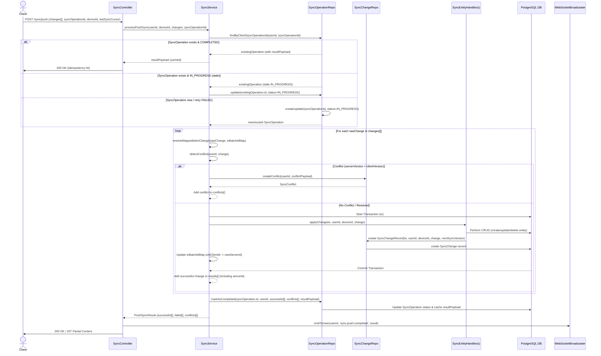
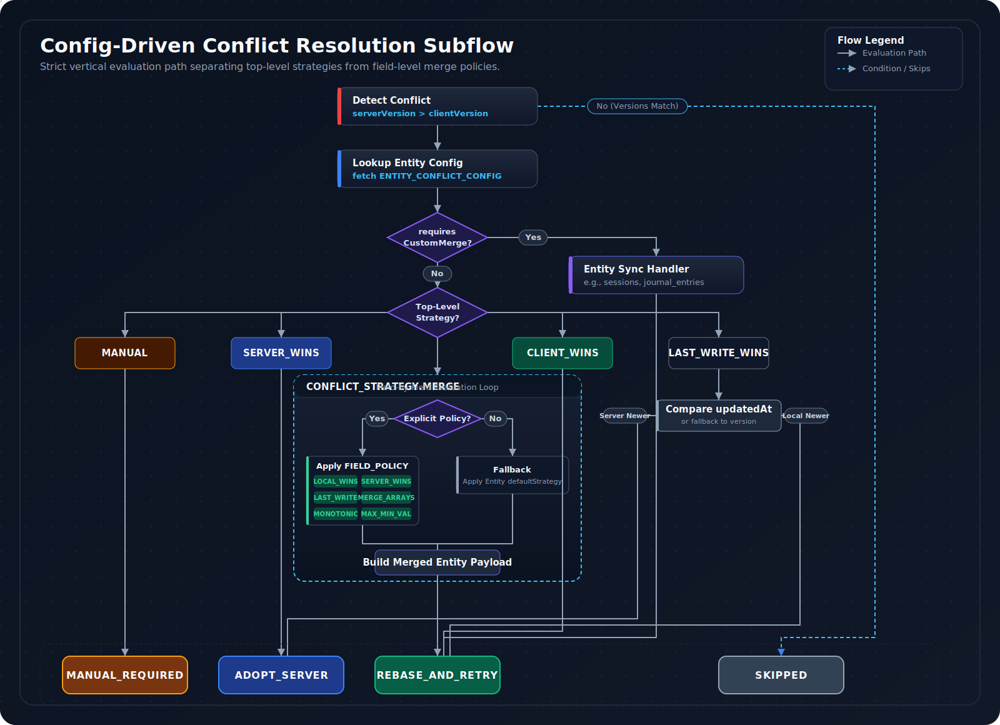

# Sync Engine

The Sync Engine is the backend's core synchronization subsystem, orchestrating bidirectional data reconciliation between offline-first mobile clients and the server's authoritative state. This document is the definitive technical specification for how client data changes are processed, conflicts are resolved, and consistency is maintained across the AppPlatform platform.

---

## Overview

**Scope:** This document covers the backend components, data models, APIs, and algorithms involved in synchronizing core entity data (sessions, consumptions, journals, products). It excludes client-side implementation details and the specialized health data ingestion pipeline, which is documented in [HEALTH-INGESTION-PIPELINE.MD](./HEALTH-INGESTION-PIPELINE.MD).

**Key Principles:**

*   **Offline-First Design** — Clients operate autonomously; the server reconciles when connectivity returns.
*   **Idempotency** — Every push operation is safe to retry. Request-level and operation-level deduplication prevent duplicate state.
*   **Eventual Consistency** — All clients converge to the same state through deterministic conflict resolution.
*   **Config-Driven Conflict Resolution** — Merge policies are declared in shared contracts, not embedded in service logic.
*   **Transactional Outbox** — Domain events are recorded atomically with data changes, guaranteeing reliable downstream propagation.

**Audience:** Backend Engineers (implementation and debugging), Frontend Engineers (API contracts and conflict expectations), Architects (robustness and scalability evaluation), QA Engineers (comprehensive test planning), and SRE/Operations (monitoring and troubleshooting).

---

## Core Concepts & Data Models

### Offline-First Architecture

The Sync Engine is built on an **Offline-First** paradigm, allowing client applications to operate autonomously without network connectivity and synchronize changes when online.

*   **Server's Role:** The backend acts as the eventual consistent source of truth, reconciling client-side changes against its own state. It gracefully handles out-of-order changes, processes client-generated UUIDs, and implements robust conflict detection and resolution mechanisms.
*   **Client-Generated IDs:** For client-side record creation (e.g., when offline), entities receive temporary client-generated UUIDs. These are stored in fields like `clientSessionId` on `ConsumptionSession` or `clientPurchaseId` on `Purchase` (see `prisma/schema.prisma`). During push synchronization, the backend resolves these temporary IDs to canonical server-assigned `id`s (the Prisma primary key). This mapping is crucial for subsequent Foreign Key (FK) resolution.
*   **Backend Perspective:** Supporting offline-first means accepting `CREATE` operations for entities that may already exist on the server (requiring idempotent handling), receiving `UPDATE`s for entities that may not yet have a server-assigned ID, and always providing the latest state of an entity during pull to allow client reconciliation.

<br>

### Entity Types & Sync Order

The sync system operates on a predefined set of **canonical entity types**, ensuring consistency across the entire application stack.

*   **Canonical `EntityType`:** All syncable data models are represented by their canonical `EntityType` (e.g., `sessions`, `products`, `journal_entries`), as defined in `packages/shared/src/sync-config/entity-types.ts`. This serves as the single source of truth for entity naming.

    ```typescript
    // packages/shared/src/sync-config/entity-types.ts
    export const ENTITY_TYPES: readonly (typeof _ENTITY_TYPES)[number][] = Object.freeze([..._ENTITY_TYPES]);
    export type EntityType = (typeof _ENTITY_TYPES)[number];
    ```

*   **Dependency Hierarchy:** Entities are synchronized in a strict, **dependency-based order** defined by `ENTITY_SYNC_ORDER` (see `packages/shared/src/sync-config/entity-types.ts`). Parent entities (e.g., `products`, `devices`) are processed before their children (e.g., `consumptions`, `sessions`) to prevent FK constraint violations during pull and apply operations. The `compareBySyncOrder` function (from `packages/shared/src/sync-config/relation-graph.ts`) provides a deterministic sorting mechanism for entity lists.
*   **Model Name Mapping:** The `LEGACY_MODEL_TO_ENTITY` and `ENTITY_TO_MODEL_NAME` mappings (`packages/shared/src/sync-config/entity-types.ts`) provide bidirectional conversion between Prisma model names (PascalCase, singular) and the canonical `EntityType` (lowercase, plural), bridging internal backend representations with the sync contract.

<br>

### Versioning & Optimistic Locking

The Sync Engine employs a layered versioning scheme, with optimistic locking as the primary mechanism for detecting concurrent modifications.

*   **Entity Version (`version`):** All syncable Prisma models (e.g., `User`, `Product`, `ConsumptionSession`) include an `Int @default(1) version` field in `prisma/schema.prisma`. This monotonic counter, incremented on every successful update, forms the basis for optimistic locking. During a sync push, if the `serverVersion` exceeds the `clientVersion` provided in the `SyncChange`, an optimistic locking conflict is detected by `SyncService.detectConflict`.
*   **`SyncChange` Version (`syncVersion`):** `SyncChange` records (`packages/backend/src/repositories/sync-change.repository.ts`) also include a `syncVersion` field, storing the entity's `version` at the time the `SyncChange` record was created. This tracks entity state at the point of change propagation.
*   **Cursor Schema Version (`CURSOR_SCHEMA_VERSION`):** Defined in `packages/shared/src/sync-config/cursor.ts`, this integer version tracks the schema of the `CompositeCursor` itself. It enables backward compatibility when the cursor format evolves, allowing the server to reject cursors from newer clients or upgrade older formats.
*   **Configuration Version (`HEALTH_CONFIG_VERSION`):** Defined in `packages/shared/src/contracts/health.contract.ts`, this version dictates compatibility of health data contracts, including metric definitions and hashing algorithms. It ensures client and server are aligned on how health data is interpreted.

> **Trade-off:** Optimistic locking was chosen for its simplicity and performance benefits over more complex concurrency control mechanisms like CRDTs, which would introduce significant complexity for the application's current needs.

<br>

### Foreign Key Resolution & Cascades

Maintaining referential integrity is crucial, especially when client-generated IDs are remapped to server-assigned IDs.

*   **`RELATION_GRAPH`:** The `packages/shared/src/sync-config/relation-graph.ts` module defines the canonical `RELATION_GRAPH`, mapping all FK dependencies between `EntityType`s. This graph is critical for ID cascade planning on the client and FK resolution on the backend.

    ```typescript
    // packages/shared/src/sync-config/relation-graph.ts
    export const RELATION_GRAPH: readonly ForeignKeyRelation[] = Object.freeze([
      { sourceEntity: 'consumptions', sourceField: 'productId', targetEntity: 'products', optional: true, sqliteColumn: 'variant_id' },
      { sourceEntity: 'purchases', sourceField: 'productId', targetEntity: 'products', optional: false, sqliteColumn: 'productId' },
      // ... more relations
    ]);
    ```

*   **ID Strategy (Model A):** All current syncable entities operate under **Model A (`PRIMARY_KEY_IS_SERVER_ID`)**. The `id` (primary key) field, initially client-generated, is replaced by a server-assigned UUID after a successful `CREATE` operation. This requires explicit FK cascade updates.
*   **Backend Role in FK Updates:** The server's `SyncService.applyChange` method, through its `SyncEntityHandler` implementations, updates FK references *within the same push batch*. When a client-generated ID is remapped to a `serverId` by `SyncEntityHandler.create` (e.g., a `DeviceHandler` finding an existing device by MAC address), any subsequent changes in that batch referencing the old client ID are transparently updated to the new `serverId` by `SyncService.resolveMappedIdsInChange`.
*   **Frontend Role (Implied):** The frontend uses utilities like `buildIdCascadeStatements` from `packages/shared/src/sync-config/relation-graph.ts` to generate and execute SQL statements for updating its local SQLite FK references when it receives an ID remapping from the server.
*   **Optional FKs:** Helper functions like `isOptionalForeignKey` and `getOptionalForeignKeyFields` manage nullable FKs, allowing them to remain `NULL` if not resolved during reconciliation.

<br>

### Data Ownership & Permissions

Security and multi-tenancy are built into the sync system at a fundamental level.

*   **`userId` Scoping:** All sync operations (read and write) are strictly `userId`-scoped. Repository methods (`SyncStateRepository`, `SyncChangeRepository`, etc.) enforce this by including `userId` in their `WHERE` clauses, preventing Insecure Direct Object Reference (IDOR) vulnerabilities.
*   **Product `isPublic` Flag:** The `ProductService` (`packages/backend/src/services/product.service.ts`) enforces specific rules for `isPublic` products (the public catalog). Only the `CATALOG_USER_ID` (a system-level user, see `packages/backend/src/utils/constants.ts`) can create or modify public products. Other users' attempts to set `isPublic=true` are automatically coerced to `false` (`ProductService.updateProduct`), preventing privilege escalation and unauthorized additions to the shared catalog.

---

## Synchronization Flows

The sync lifecycle is orchestrated by `SyncService` (`packages/backend/src/services/sync.service.ts`), coordinating push, pull, full resync, and reset operations through distributed locking, idempotency tracking, and admission control.

<div align="center">
  
</div>

<br>

### Lifecycle & State Management

*   **Sync Session:** A conceptual unit representing a continuous period of data exchange between a client and the server.
*   **`SyncOperation` Record:** Each push or pull attempt is tracked by a `SyncOperation` record (`sync-operation.repository.ts`), storing metadata (status, device, conflicts, errors) for idempotency and metrics.
*   **Distributed Lock (`SyncState`):** To prevent concurrent syncs from the same `userId` and `deviceId` (which could lead to race conditions and inconsistent state), a pessimistic distributed lock is implemented. The `SyncState` table (`sync-state.repository.ts`) stores `syncInProgress`, `lockOwner`, and `lockAcquiredAt` fields. `SyncService.acquireSyncLock` obtains this lock, blocking other syncs.
*   **Heartbeat Mechanism:** For long-running `SyncService.processPushSync` operations, a heartbeat (using `HEARTBEAT_INTERVAL_MS` in `sync.service.ts`) periodically refreshes the `SyncOperation.updatedAt` timestamp. This prevents the operation from being prematurely classified as "stale" and reaped by `SyncOperationRepository.recoverStaleProcessing`.
*   **Admission Control (`SyncLeaseService`):** For bulk sync operations (e.g., `catalog_sync` for products), a higher-level Redis-backed admission control mechanism issues "leases" (`leaseId`) with limited requests and time windows, preventing server overload from large concurrent syncs (`SyncLeaseService.requestLease`).

<br>

### Client Push (`POST /api/v1/sync/push`)

Clients push `CREATE`, `UPDATE`, or `DELETE` operations performed locally (potentially offline) to the server.

**Request Contract:** The `PushSyncCursorSchema` (`packages/backend/src/api/v1/schemas/sync.schemas.ts`) defines the expected payload. Key fields in the `changes[]` array (`PendingChangeItem` in `sync.service.ts`) include `entityType`, `entityId`, `changeType`, `changeData`, `syncVersion`, `clientId` (client's UUID for traceability), and `requestId` (the client's outbox event ID for precise update tracking).

**Idempotency (`syncOperationId`):** `SyncService.processPushSync` uses the client-generated `syncOperationId` (from the `PushSyncCursorSchema` body) to guarantee request-level idempotency via `SyncOperationRepository.findByClientSyncOperationId`. If a `SyncOperation` with the same `syncOperationId` has already `COMPLETED` and has a cached `resultPayload`, the cached result is returned instantly without reprocessing (`SyncService.processPushSync` lines 270-302).

**Change Processing:**

1.  `SyncService.processPushSync` iterates through the `changes[]` array received from the client.
2.  `SyncService.resolveMappedIdsInChange` ensures that any FKs in the `changeData` referring to client-generated IDs from earlier in the *same batch* are transparently remapped to their newly assigned server IDs. This is crucial for maintaining referential integrity in complex dependency graphs (e.g., a session is created, then a consumption referencing it).
3.  `SyncService.detectConflict` performs optimistic locking checks. If `serverVersion > clientVersion` for an entity, an optimistic locking conflict is identified.
4.  `SyncService.applyChange` acts as a central dispatch, invoking the appropriate `SyncEntityHandler.create/update/delete` method based on the `entityType`. Each `applyChange` operation is wrapped in a dedicated database transaction.

**Transactional Guarantees:** Each individual entity change (CREATE/UPDATE/DELETE) is applied within its own **database transaction** by `SyncService.applyChange`. Either the entity's state change *and* its corresponding `SyncChange` record are committed, or both operations are rolled back.

> **Guarantee:** Partial updates and lost events due to crashes are structurally prevented by per-change transactional atomicity.

**Outbox Pattern (`SyncChange`):** A `SyncChange` record (`sync-change.repository.ts`) is created **transactionally** by `applyChange` *within the same database transaction* as the entity modification. These `SyncChange` records serve as an outbox, notifying other devices about changes made by this sync.

**Response Contract:** The `PushSyncResult` interface (`sync.service.ts`) specifies the response, including `successful[]`, `failed[]` (with `clientId` and `requestId` for precise outbox tracking), and `conflicts[]` arrays.

**Real-time Notifications:** Upon completion or conflict, WebSocket events (`sync:push:completed`, `sync:conflicts:resolved`) are emitted via the `WebSocketBroadcaster`, providing immediate feedback to connected clients.

<details>
<summary><strong>Push Sequence Diagram</strong></summary>
<br>



</details>

<br>

### Server Pull (`GET /api/v1/sync/changes`)

Clients pull only the changes that have occurred since their last known sync state, optimizing bandwidth and processing.

*   **Request Contract:** The `SyncChangesSchema` (`packages/backend/src/api/v1/schemas/sync.schemas.ts`) defines query parameters, including an optional `cursor`, `entityTypes[]` to filter for specific data models, `limit` for pagination, and `leaseId` for admission control.
*   **Cursor Decoding:** `SyncService.getIncrementalChanges` decodes the `CompositeCursor` from the `cursor` parameter. This cursor (defined in `packages/shared/src/sync-config/cursor.ts`) contains `lastCreatedAt` and `lastId` for keyset pagination, along with per-entity cursors. Invalid cursors result in an `InvalidCursorError` (HTTP 400) (see `packages/shared/src/sync-config/cursor.ts` lines 50-71).
*   **Change Retrieval:** `SyncChangeRepository.getChangesSince` (`packages/backend/src/repositories/sync-change.repository.ts`) fetches `SyncChange` records based on the provided cursor, `userId`, `deviceId`, and `entityTypes`. This acts as the backend's "delta calculation" mechanism, providing the *latest full state* of changed entities since the last sync point. The backend does not compute minimal diffs; it sends the latest full state of the changed entity.
*   **Cursor Encoding:** `SyncService.getIncrementalChanges` encodes the `nextCursor` (a new `CompositeCursor`) for subsequent requests. It uses a **MIN strategy** (`getMinCursor` from `packages/shared/src/sync-config/cursor.ts`) to ensure the composite cursor reflects the *earliest* `lastCreatedAt` across all `entityTypes` in the fetched batch. This prevents data from being missed if new changes arrive for one entity type while a client is paginating through another.
*   **Response Contract:** The `PullSyncResult` interface (`sync.service.ts`) returns `changes[]`, `cursor` (the `nextCursor`), `hasMore`, `recordsReturned`, and `entityCursors` (per-entity cursor strings).
*   **ETag Caching:** The `apiCache.middleware.ts` utilizes `computeSyncChangesEtag` (from `packages/shared/src/contracts/sync-etag.contract.ts`) to generate stable ETags for responses. This enables HTTP 304 Not Modified responses for clients when no new changes are available for the given cursor and filter parameters.

<br>

### Full Resync (`POST /api/v1/sync/full`)

This endpoint triggers a comprehensive, bidirectional reconciliation of client state against the server. It is typically used during initial client setup, when an existing client has suffered data corruption, or after significant backend schema changes.

*   **Flow:** `SyncService.performFullSync` orchestrates both push (`processBatchWithTracking` for `sessions`, `journal`, `purchases`) and pull (`getChangesSince`) operations within a single logical flow. The client sends all its local changes and then receives all relevant server changes.
*   **Impact on Caches:** A full resync implicitly invalidates all entity-related caches (consumptions, sessions, products, etc.) to ensure a fresh state is rebuilt on both the client and potentially the server-side caches. This is handled by `apiCache.middleware.ts` when applied to the `/sync/full` route.

<br>

### Sync State Reset (`POST /api/v1/sync/reset`)

Allows clients or administrators to reset sync state on the server for debugging, recovery from irrecoverable client-side issues, or when a client needs to discard local changes and start fresh.

*   **Flow:** `SyncService.resetSyncState` clears `SyncState` records (setting `lastSyncAt` to `null`) and any associated distributed cache locks for a specific `userId` and `deviceId`. This forces a subsequent sync to behave as an initial full resync for that client/device.

---

## Conflict Resolution

Conflict resolution ensures data integrity when both the client and server (or multiple clients) concurrently modify the same entity. The system uses a **config-driven** approach where merge policies are declared in shared contracts, making every conflict outcome reproducible, auditable, and testable in isolation.

<div align="center">
  
</div>

<br>

*   **`ENTITY_CONFLICT_CONFIG`:** The single, canonical source of truth (`packages/shared/src/sync-config/conflict-configs.ts`) defining how each `EntityType` resolves conflicts at a field-by-field level.
*   **Optimistic Locking:** Conflicts are detected when a client attempts to update an entity with a `clientVersion` older than the `serverVersion` (`SyncService.detectConflict`).
*   **Strategy Dispatch:** `SyncService.resolveConflictStrategy` selects and applies the appropriate resolution method based on configured policies for the `entityType` and specific `fieldName`.
*   **Resolution Outcomes:** The `ConflictResolutionOutcome` (`packages/shared/src/sync-config/conflict-resolution.ts`) provides explicit, typed results for `SyncEntityHandler`s: `ADOPT_SERVER`, `REBASE_AND_RETRY`, `MANUAL_REQUIRED`, `SKIPPED`. These directly dictate the client's next steps (e.g., mark outbox as completed, retry with new payload, or flag for manual user intervention).

<details>
<summary><strong>Conflict Resolution Flow</strong></summary>
<br>

<div align="center">
  
</div>

</details>

<br>

### Field-Level Policies (`FIELD_POLICY`)

The `MERGE` strategy (`CONFLICT_STRATEGY.MERGE`) relies on fine-grained **Field-Level Policies** defined in `packages/shared/src/sync-config/conflict-strategies.ts`. These policies determine how individual fields are resolved when an entity is in conflict, applied by `entity-merger.ts::resolveFieldValue`.

| Policy | Behavior | Example |
| :--- | :--- | :--- |
| **`LOCAL_WINS`** | Client's value is adopted | `notes` on `consumptions`, `deviceName` on `devices` |
| **`SERVER_WINS`** | Server's value is adopted | `userId`, `isPublic` on `products` |
| **`LAST_WRITE_WINS`** | Compares `updatedAt` timestamps (or `version` if equal/absent); most recent wins | Default strategy for many entities |
| **`MERGE_ARRAYS`** | Deduplicated union of elements from both local and server arrays | `tags` on `journal_entries`, `effects` on `products` |
| **`MONOTONIC`** | State transitions only advance forward through a predefined sequence | `status` on `sessions` (`ACTIVE` > `PAUSED` > `CANCELLED` > `COMPLETED`) |
| **`MAX_VALUE`** | Adopts the maximum value; prevents data loss for accumulative fields | `quantityRemaining` on `inventory_items` |
| **`MIN_VALUE`** | Adopts the minimum value | Numeric constraint fields |
| **`SERVER_IF_LOCAL_NULL`** | Server value fills in if client has `NULL` or `undefined` | Nullable reference fields |
| **`LOCAL_IF_SERVER_NULL`** | Client value fills in if server has `NULL` or `undefined` | Nullable reference fields |

The `MONOTONIC` policy uses the `transitions` array in `FieldPolicyConfig` to define the valid forward-moving sequence. If a field has no explicit policy, the `entityType`'s `defaultStrategy` is applied (e.g., `LAST_WRITE_WINS` for many entities).

<br>

### Entity-Specific Merge (`requiresCustomMerge`)

For complex entities, generic field-level merging is insufficient. The `SyncService` employs the **Strategy Pattern**, delegating detailed merge logic to dedicated `SyncEntityHandler.merge` implementations (e.g., `packages/backend/src/services/sync/handlers/session.handler.ts`, `packages/backend/src/services/sync/handlers/journal.handler.ts`). These handlers are registered with the `SyncService` during bootstrap.

The `mergeEntityInternal` function (`packages/shared/src/sync-config/entity-merger.ts`) provides a pure, config-driven merge core that handlers leverage as a building block. This ensures that even custom merges reuse validated, deterministic core logic.

**Custom merge examples:**

*   **`sessions`** (`SESSIONS_CONFIG`) — `requiresCustomMerge: true`. Handles server-derived aggregates (`eventCount`, `totalDurationMs`) as authoritative, while applying field policies to client-editable fields.
*   **`journal_entries`** (`JOURNAL_ENTRIES_CONFIG`) — `requiresCustomMerge: true`. Custom merge handles deep merging of JSONB fields like `reactions` and specific `MERGE_ARRAYS` logic for `tags` and `symptoms`.
*   **`products`** (`PRODUCTS_CONFIG`) — `requiresCustomMerge: true`. Ensures the `isPublic` flag is server-authoritative, but applies `LOCAL_WINS` to user-editable fields like `name` and `description`.
*   **`devices`** (`DEVICES_CONFIG`) — `requiresCustomMerge: true`. Device registration metadata (`macAddress`, `serialNumber`, `firmwareVersion`) is server-authoritative, while `deviceName` allows `LOCAL_WINS`.
*   **`consumptions`** (`CONSUMPTIONS_CONFIG`) — `requiresCustomMerge: true`. Combines `LOCAL_WINS` for user-editable fields (`notes`, `intensity`) with server-derived values for `sessionId` and `userId`.

<details>
<summary><strong>Entity Conflict Configuration Matrix</strong></summary>
<br>

| EntityType | Default Strategy | `requiresCustomMerge` | `conflictFree` | Key `fieldPolicies` (Examples) | `serverDerivedFields` (Examples) | `idStrategy` |
| :--- | :--- | :--- | :--- | :--- | :--- | :--- |
| `sessions` | `MERGE` | `true` | `false` | `status: MONOTONIC` (`ACTIVE` > `PAUSED` > `COMPLETED`), `notes: LOCAL_WINS` | `eventCount`, `totalDurationMs`, `sessionStartTimestamp`, `sessionEndTimestamp` | `PRIMARY_KEY_IS_SERVER_ID` |
| `consumptions` | `MERGE` | `true` | `false` | `notes: LOCAL_WINS`, `intensity: LOCAL_WINS`, `timestamp: LAST_WRITE_WINS` | `sessionId`, `userId` | `HAS_SERVER_ID_COLUMN` |
| `journal_entries` | `MERGE` | `true` | `false` | `content: LOCAL_WINS`, `tags: MERGE_ARRAYS`, `reactions: LOCAL_WINS` | `sessionId`, `consumptionId`, `productId` | `PRIMARY_KEY_IS_SERVER_ID` |
| `purchases` | `MERGE` | `false` | `false` | `quantityPurchased: LOCAL_WINS`, `isActive: LAST_WRITE_WINS` | `userId`, `productId` | `PRIMARY_KEY_IS_SERVER_ID` |
| `devices` | `SERVER_WINS` | `true` | `false` | `deviceName: LOCAL_WINS`, `settings: LOCAL_WINS` | `macAddress`, `serialNumber`, `userId` | `HAS_SERVER_ID_COLUMN` |
| `products` | `MERGE` | `true` | `false` | `name: LOCAL_WINS`, `effects: MERGE_ARRAYS`, `isPublic: SERVER_WINS` | `userId` | `HAS_SERVER_ID_COLUMN` |
| `goals` | `MERGE` | `false` | `false` | `currentValue: MAX_VALUE`, `name: LOCAL_WINS`, `status: LAST_WRITE_WINS` | `userId` | `PRIMARY_KEY_IS_SERVER_ID` |
| `inventory_items` | `MERGE` | `false` | `false` | `quantityRemaining: MAX_VALUE`, `isActive: LOCAL_WINS` | `userId`, `productId` | `PRIMARY_KEY_IS_SERVER_ID` |
| `ai_usage_records` | `SERVER_WINS` | `false` | `true` | (None explicit, default `SERVER_WINS` applied to all) | `inputTokens`, `outputTokens`, `totalCost`, `timestamp` | `PRIMARY_KEY_IS_SERVER_ID` |

</details>

<br>

### Backend Reconciliation (`POST /api/v1/sync/conflicts/batch-resolve`)

Allows clients to explicitly resolve multiple pending conflicts in a single batch request, often after displaying a conflict resolution UI to the user.

*   **Mechanism:** Clients send a list of `ConflictResolutionInput`s (`packages/backend/src/api/v1/schemas/sync.schemas.ts`), each specifying a `conflictId`, a chosen `strategy` (`LOCAL_WINS`, `REMOTE_WINS`, `MERGE`, `MANUAL`), and `mergedData` (if `MERGE`/`MANUAL` is selected).
*   **Flow:** `SyncService.resolveConflictsBatch` (`packages/backend/src/services/sync.service.ts`) updates the `SyncConflict` records in the database to reflect the user's decision. It then retrieves the corresponding `SyncChange` records and applies the resolved changes to the respective entities.

---

## Batching, Compression & Admission Control

### Batching

*   **`SyncService` Batch Size:** `SyncService` processes incoming `changes[]` from `POST /sync/push` in configurable batches (e.g., `BATCH_SIZE = 100`). This reduces database transaction overhead and minimizes network round-trips compared to individual entity processing.
*   **Pull Limit:** The `GET /sync/changes` endpoint supports a `limit` parameter (up to 1000 items) to control the payload size sent to clients, preventing client-side memory exhaustion and optimizing network usage.

<br>

### Compression

*   **Health Sync GZIP:** The `HealthUploadHttpClientImpl` (`packages/app/src/services/health/HealthUploadHttpClientImpl.ts`) dynamically applies GZIP compression for `health` data payloads. This is enabled if the `healthGzip` feature flag is active and the payload size exceeds `GZIP_MIN_BYTES` (1KB). This significantly reduces bandwidth consumption and upload times for large health datasets.
*   **General Sync (Inference):** General entity sync does not have explicit compression in the current codebase. However, the architecture (e.g., `packages/backend/src/api/v1/middleware/jsonBodyParser.middleware.ts` handling raw body buffers) supports future integration.

<br>

### Admission Control (`SyncLeaseService`)

The `SyncLeaseService` (`packages/backend/src/services/syncLease.service.ts`) prevents server overload and ensures fair resource allocation for bulk sync operations. `GET /sync/changes` requests (specifically for `catalog_sync`) and `POST /api/v1/health/samples/batch-upsert` requests (for `health_upload`) require a "sync lease." This Redis-backed system issues unique `leaseId`s with a defined `leaseWindowMs` and `maxRequests` limit.

**Flow:**

1.  Client calls `POST /api/v1/sync/lease` (`packages/shared/src/contracts/sync-lease.contract.ts#SyncLeaseRequestSchema`) to request a lease for a specific `kind` (e.g., `catalog_sync`).
2.  `SyncLeaseService` (backed by Redis `CacheService`) checks global and per-user rate limits for lease issuance.
3.  If granted, a `leaseId` is returned, along with `leaseWindowMs` and `maxRequests` allowed under that lease.
4.  Client includes this `leaseId` with subsequent sync requests (e.g., `GET /sync/changes` or `POST /health/samples/batch-upsert`).
5.  `sync-lease.middleware.ts` (or `HealthController` for health sync) consumes one "request" from the lease counter for each sync request.
6.  Expired leases or exhausted `maxRequests` return HTTP 429 (`RATE_LIMIT_EXCEEDED`) with a `Retry-After` header.

> **Guarantee:** Backpressure is applied structurally through lease exhaustion and `Retry-After` hints, preventing server overload from large concurrent syncs.

---

## Observability & Operations

### Logging & Metrics

*   **Structured Logging:** `LoggerService` (`packages/backend/src/services/logger.service.ts`) is injected into `SyncService` and `SyncController` to provide structured, contextual logs for all sync operations (successes, errors, conflicts, performance).
*   **Performance Metrics:** `PerformanceMonitoringService` (`packages/backend/src/services/performanceMonitoring.service.ts`) tracks key metrics such as `sync.full.duration`, `sync.full.items`, `sync.batch.failed`, and `sync.conflict.resolved` for performance analysis, anomaly detection, and alerting.
*   **Correlation ID:** The `X-Correlation-ID` header, managed by `correlationContext.middleware.ts`, provides end-to-end tracing of sync requests across all backend services, facilitating debugging in a distributed environment.
*   **HTTP Status Codes:** Precise HTTP status codes (e.g., 409 for conflicts, 429 for rate limits, 400 for invalid cursors) are used, enabling programmatic error handling by clients and accurate monitoring by operations teams.

<br>

### Error Handling & Recovery

*   **`AppError`:** Custom `AppError` objects (`packages/backend/src/utils/AppError.ts`) are used for structured, operational errors, providing `errorCode`, `message`, `details`, and `isOperational` flags.
*   **Retryable Errors:** `SyncService.isRetryableError` identifies transient database or network errors that can be safely retried by the client (e.g., connection timeouts, rate limits). This function includes specific checks for PostgreSQL and network-related error codes.
*   **`retryWithBackoff`:** The `packages/backend/src/utils/retry.util.ts` utility is used by `SyncService` for transactional operations to automatically retry on transient failures with exponential backoff.
*   **Dead-Letter Queue (DLQ):** Unresolvable conflicts (those resulting in a `MANUAL_REQUIRED` outcome) or persistently failing outbox events (`OutboxEvent`s with `status: 'DEAD_LETTER'`) are moved to a Dead-Letter Queue. This prevents problematic events from blocking the sync pipeline and allows for later investigation and manual intervention by `OutboxProcessorService`.
*   **Stale Lock Recovery:** `SyncOperationRepository.recoverStaleProcessing` (`packages/backend/src/repositories/sync-operation.repository.ts`) automatically reaps `IN_PROGRESS` `SyncOperation` records that are stuck (e.g., due to worker crashes or network partitions), allowing them to be safely reprocessed by another client or worker.

<br>

### Real-time Notifications

*   **`WebSocketBroadcaster`:** Integration with `WebSocketBroadcaster` (`packages/backend/src/realtime/WebSocketBroadcaster.ts`) enables real-time push notifications to connected clients. The `websocket-event.subscriber.ts` converts domain events into WebSocket messages.
*   **Events:** Key events such as `sync:push:completed` and `sync:conflicts:resolved` are emitted, providing instant feedback to clients about sync status and any conflicts without requiring active polling.

<br>

### Health Monitoring

*   **Sync Status Endpoints:** `GET /api/v1/sync/status` and `GET /api/v1/sync/health` endpoints provide comprehensive sync health information, including `lastSyncTime`, `cursorPositions` per entity, counts of `pendingChanges`, and `conflicts`.
*   **`SyncLeaseService` Health:** The `SyncLeaseService` contributes to the overall system health by reporting its operational status (e.g., cache connectivity), allowing SREs to monitor the admission control layer.

---

## Future Enhancements

*   **Advanced Diffing:** Implement server-side minimal diff computation for `SyncChange` records on pull operations (`GET /sync/changes`). This would further reduce payload size and client processing, especially for entities with large, infrequently changing fields.
*   **CRDTs / Vector Clocks:** Explore the adoption of CRDTs for specific entity types (e.g., collaborative journal entries) or the implementation of vector clocks for richer causal ordering. This would enhance robustness in highly concurrent, distributed, multi-writer scenarios, moving beyond simple optimistic locking.
*   **Client State Reconciliation Framework:** Develop a backend mechanism for a client to efficiently compare its *entire local database state* against the server's to detect deep discrepancies (e.g., missing server entities that were deleted offline). This would improve upon the current client-side driven `POST /sync/reset` approach.
*   **Adaptive Sync Strategies:** Dynamically adjust sync frequency, batch size, or conflict resolution aggressiveness based on client behavior, network conditions, or real-time server load.

---

## Conclusion

The AppPlatform Sync Engine represents a robust, scalable, and operationally transparent system for managing client-server data synchronization in an offline-first environment. Its reliance on explicit contracts, versioning, config-driven conflict resolution, and a transactional outbox ensures data integrity and consistency, while providing the necessary tools for debugging, monitoring, and future evolution.
