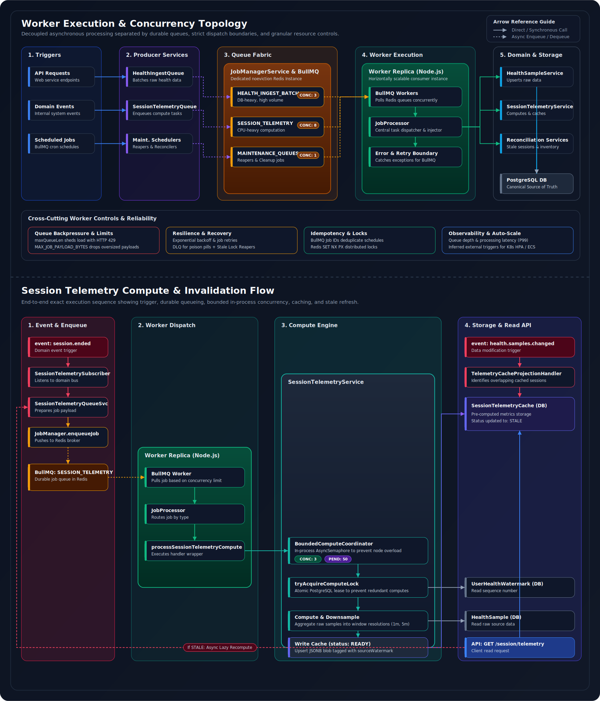
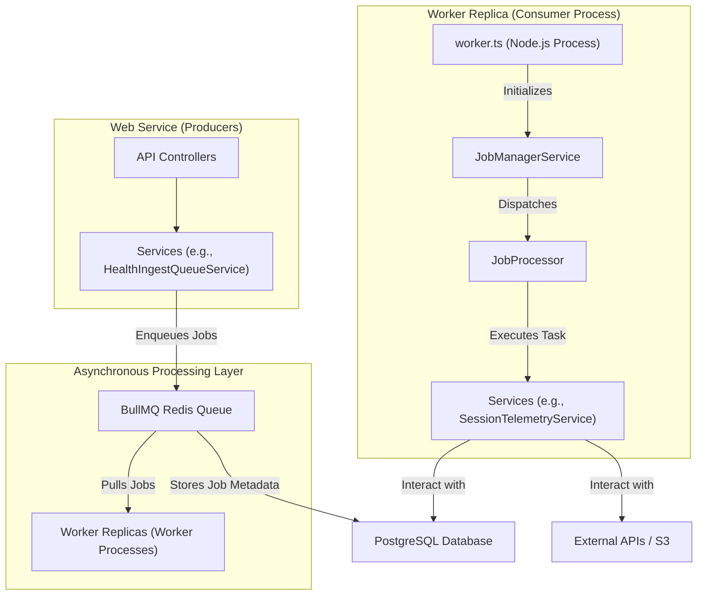
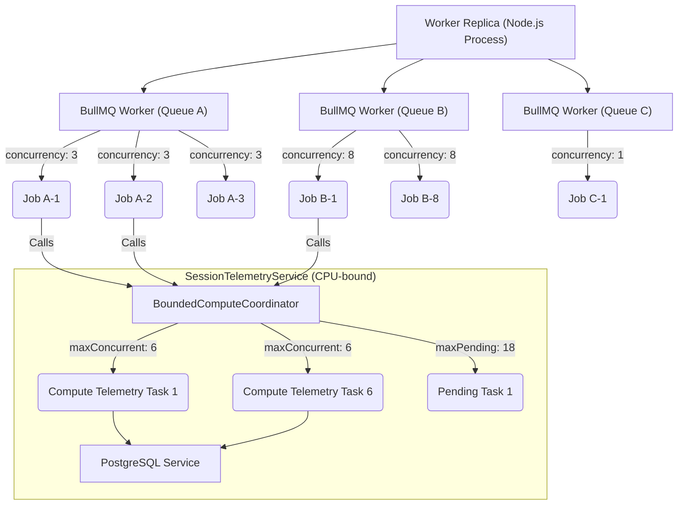
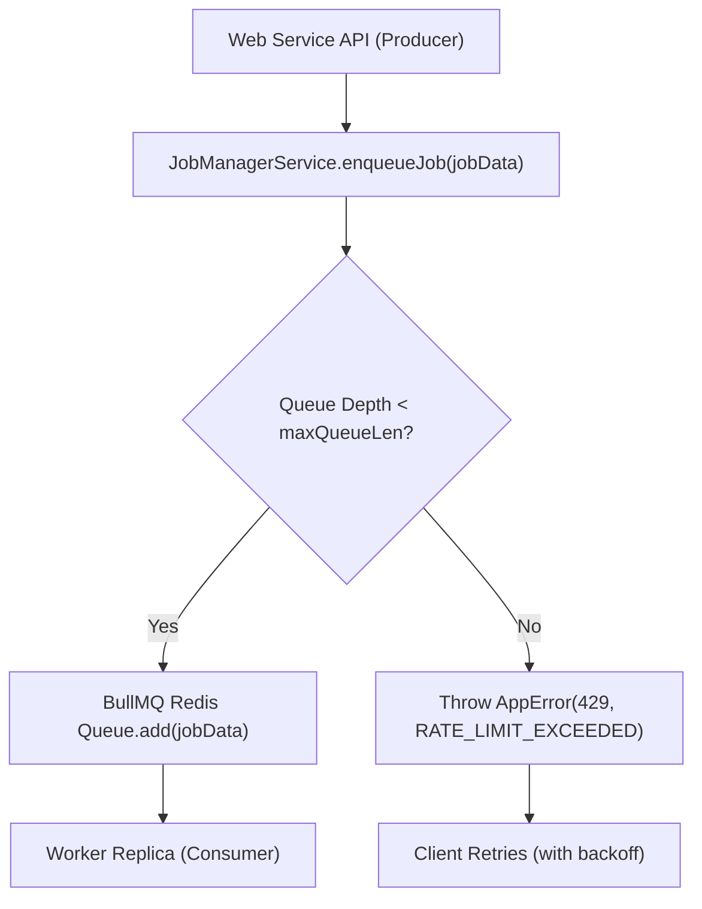
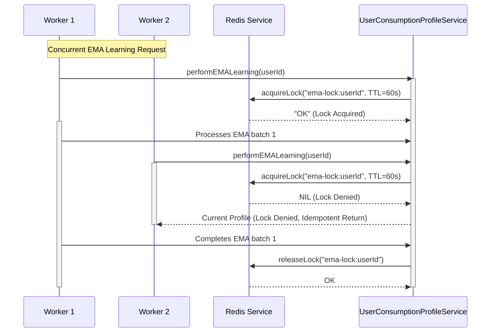
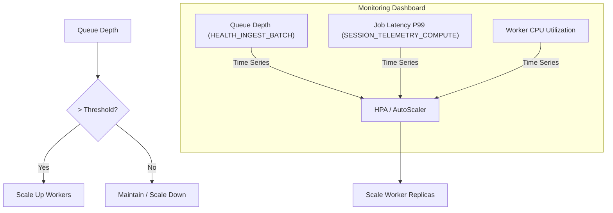

# Worker Scalability

<!--
  This document details the backend's asynchronous worker scalability, focusing on
  job queue management, worker deployment, concurrency, resource contention,
  and operational monitoring, grounded in the actual codebase.
-->

## Overview

This document describes the design and implementation of the backend's asynchronous worker infrastructure, which handles long-running, idempotent, and resilient background tasks. It explains how this infrastructure is designed for scalability, manages workloads, ensures data integrity, and provides operational visibility.

The worker system operates distinctly from the main web service, adhering to the principle of separation of concerns. This separation allows independent scaling and resource allocation for CPU-intensive, I/O-heavy, or time-sensitive background operations without impacting the real-time performance of the API.

| Principle | Implementation |
| :--- | :--- |
| **Resilience** | Job retries, exponential backoff, Dead Letter Queues (DLQ), and robust stale lock/lease recovery mechanisms |
| **Idempotency** | Unique job IDs, versioning, and distributed locks prevent duplicate processing of tasks |
| **Observability** | Comprehensive metrics and structured logging inform auto-scaling and operational decisions |
| **Configurability** | Granular control over queue parameters, concurrency limits, and retry policies for adaptive tuning |

> For a broader understanding of the overall system architecture, refer to [**Architecture**](ARCHITECTURE.MD).

  

 

---

## Asynchronous Processing Architecture

The backend separates work into two distinct asynchronous pipelines: a **BullMQ job-processing subsystem** for compute-heavy background tasks, and a **transactional outbox pipeline** for event-driven projections. Both run in a dedicated Worker Service process, sharing no state with the Web Service except through PostgreSQL and Redis. The design leverages [BullMQ](https://docs.bullmq.io/) for queue management, cleanly separating job creation from job execution.

  

 

### System Overview

The architecture comprises three main logical components:

1. **Web Service (Producers):** The API layer (`packages/backend/src/app.ts`, controllers, and services) enqueues tasks into BullMQ Redis queues.
2. **BullMQ Redis Queue:** A dedicated Redis instance serves as the central message broker, holding jobs in various states (waiting, active, delayed, failed, completed).
3. **Worker Replicas (Consumers):** Independent Node.js processes (`packages/backend/src/worker.ts` entry point) pull and execute jobs from the queues. Each worker instance hosts `JobProcessor` and BullMQ `Worker` instances.

<strong>Worker Architecture Diagram</strong>

 

 

### JobManagerService: The Orchestrator

`packages/backend/src/jobs/job-manager.service.ts`

The `JobManagerService` is the central component for managing BullMQ queues and workers.

- **Initialization** (`packages/backend/src/bootstrap.ts`): During application startup (specifically when `worker.ts` is run), `JobManagerService` is instantiated and configured via `bootstrap.ts`. It dynamically creates `Queue` and `Worker` instances for each job type defined in its `JobManagerConfig.queueNames`.

- **BullMQ Redis Configuration:**
  - **Dedicated Redis:** BullMQ requires a separate Redis instance (`BULLMQ_REDIS_URL`) configured with a `noeviction` policy. This prevents job data (which represents application state) from being lost under memory pressure, distinguishing it from the `volatile-ttl` Redis used by `CacheService` for temporary data.
  - **Connection Resilience:** `ioredis` client connections are configured with `tls` (for managed Redis services), `connectTimeout` (`30s`), and an `exponential retryStrategy` to handle transient network issues and cloud Redis cold starts. A crucial setting `maxRetriesPerRequest` is set to `null` to ensure BullMQ manages retries at the job level rather than `ioredis` blocking I/O operations.

- **Queue and Worker Management:**
  - The service creates `Queue` objects (producers) which allow other backend services to enqueue jobs.
  - When `enableWorker` is true (as in `worker.ts`), it also creates `Worker` instances (consumers) which pull and process jobs from their respective queues.
  - `JobManagerService.shutdown()` ensures all BullMQ queues and workers are closed gracefully, allowing in-flight jobs to complete.

- **Monitoring and Observability:** Event listeners (`queue.on('error')`, `worker.on('failed')`) are attached to BullMQ components, publishing operational events to the `LoggerService` for real-time visibility. Methods like `getQueueDepth` and `getQueueStats` expose queue metrics.

### JobProcessor: The Task Dispatcher

`packages/backend/src/jobs/job-processor.ts`

The `JobProcessor` acts as the central dispatcher for all jobs executed by BullMQ workers.

- **Responsibility:** It receives jobs from BullMQ workers and routes them to the appropriate handler method based on the `jobName`. This centralizes job execution logic and ensures proper dependency injection.
- **Dependency Injection:** `JobProcessor` is initialized in `bootstrap.ts` with all necessary service dependencies (e.g., `AnalyticsService`, `HealthSampleService`, various Repositories). This ensures job handlers have access to their required resources without needing to resolve them dynamically.
- **`processJob` Method:** This method serves as the main switch-case, dispatching incoming jobs (identified by `jobName` from `job.types.ts`) to specific handler methods (e.g., `processExportAnalyticsJob`, `processHealthIngestBatchJob`).
- **Job Handler Execution:** Each handler method within `JobProcessor` (e.g., `processHealthSampleSoftDeletePurgerJob`) contains the specific business logic for that task. These handlers interact with their injected services and repositories to perform the actual work.

### Job Definitions and Schedules

`packages/backend/src/jobs/job.types.ts` · `packages/backend/src/jobs/schedules.ts`

- **`JobNames`** (`job.types.ts`): A canonical enum defining all distinct asynchronous tasks (e.g., `REFRESH_ANALYTICS_MVS`, `HEALTH_INGEST_REAPER`, `SESSION_TELEMETRY_COMPUTE`).
- **`JobData`** (`job.types.ts`): Type-safe interfaces that define the payload (input data) for each job type. This ensures structured data transfer and compile-time validation. Common fields like `userId`, `correlationId`, `timestamp` are included.
- **`JobConfig`** (`job.types.ts`): Configurable options for individual jobs:

| Option | Purpose |
| :--- | :--- |
| `attempts` | Number of retries for failed jobs |
| `backoff` | Strategy (`exponential` or `fixed`) and `delay` for retries |
| `delay` | Deferred job execution (e.g., scheduling a task for 5 minutes later) |
| `removeOnComplete` / `removeOnFail` | Policies for retaining job data in Redis after completion or failure |
| `repeat` | Cron-based scheduling for repeatable jobs |

- **Job Schedules** (`schedules.ts`):
  - The `schedules.ts` module defines repeatable jobs using cron patterns (e.g., `scheduleAnalyticsMVsRefresh`, `scheduleHealthIngestReaper`).
  - These schedules are initialized only in "worker mode" (`initializeAllSchedules` within `bootstrap.ts`), ensuring that only one worker replica schedules repeatable jobs, preventing duplicate scheduling across horizontally scaled instances.
  - Initial `delay` values are applied to repeatable jobs to prevent immediate execution at worker startup, allowing services to fully initialize.

### Persistence Layer Interaction

The worker infrastructure interacts with two primary data stores:

- **PostgreSQL** (`packages/backend/src/services/database.service.ts`, Repositories):
  - The PostgreSQL database serves as the primary data store. All job handlers interact with it via injected repository instances.
  - `DatabaseService.executeWithRetry` handles transient database errors (e.g., connection pool exhaustion, Neon cold starts) with exponential backoff, enhancing worker resilience.
  - Transactional operations (`prisma.$transaction`) are used where atomicity is critical (e.g., `OutboxService` for durable eventing, specific handlers for complex multi-entity updates).

- **Redis** (`packages/backend/src/services/cache.service.ts`):
  - Beyond BullMQ's use of a dedicated Redis, the `CacheService` also leverages a separate Redis instance for distributed locks (`acquireLock`/`releaseLock`) to coordinate activities across workers (e.g., `UserConsumptionProfileService.performEMALearning`).
  - It can also be used for caching intermediate results or state in specific services, reducing database load.

> **Guarantee:** BullMQ uses a dedicated `noeviction` Redis instance. Job data is never evicted under memory pressure. The volatile-TTL Redis used by `CacheService` is kept entirely separate.

---

## Worker Scaling Dimensions

The asynchronous processing system is designed to scale both vertically (within a single worker) and horizontally (across multiple worker replicas).

### Vertical Scaling: Concurrency within a Worker Replica

Vertical scaling maximizes the resource utilization (CPU, memory, database connections) of a single Node.js worker process.

<strong>Concurrency Control Diagram</strong>

 

 

**BullMQ `workerConcurrency`** (`QUEUE_PROFILES` in `job-manager.service.ts`):

This is a *per-queue* setting defined in the `QUEUE_PROFILES` map. It specifies the maximum number of jobs from a particular queue that a *single worker replica* can process simultaneously. Different job types have different resource profiles:

| Job Profile | Concurrency | Rationale |
| :--- | :--- | :--- |
| **DB-Heavy** (e.g., `HEALTH_INGEST_BATCH`) | `3` | Low concurrency prevents saturating the PostgreSQL connection pool or overwhelming the database with concurrent writes |
| **CPU-Bound** (e.g., `SESSION_TELEMETRY_COMPUTE`) | `8` | Higher concurrency is tolerable as these tasks primarily consume CPU within the Node.js event loop |
| **Serial** (e.g., `HEALTH_SAMPLE_SOFT_DELETE_PURGER`) | `1` | Strict serialization prevents lock contention and deadlocks on large-scale database operations |

**In-Process Concurrency with `BoundedComputeCoordinator`** (`packages/backend/src/services/session-telemetry.service.ts`):

For `SESSION_TELEMETRY_COMPUTE` tasks, the `SessionTelemetryService` uses an internal `BoundedComputeCoordinator` (an `AsyncSemaphore`):

- **`MAX_CONCURRENT_COMPUTES`** (`6` by default) — Limits simultaneous telemetry computation tasks *within a single worker replica*. This provides a secondary, finer-grained vertical scaling control for CPU-intensive computations that might otherwise overwhelm the worker's single Node.js process despite BullMQ's `workerConcurrency` setting.
- **`MAX_PENDING_COMPUTE_DEPTH`** (`50` by default) — Limits tasks queued *within the worker process* while waiting for a `MAX_CONCURRENT_COMPUTES` slot. This acts as a localized backpressure mechanism, shedding load if the internal queue is full.

### Horizontal Scaling: Multiple Worker Replicas

Horizontal scaling increases overall system throughput and resilience by distributing asynchronous tasks across multiple independent worker processes.

- **Deployment Model** (`packages/backend/src/worker.ts`): The `worker.ts` entry point is designed as a standalone Node.js process, representing a single worker replica. This unit is deployed as a separate service (e.g., a Docker container in Kubernetes, an AWS ECS task, or a Render Background Worker). Scaling involves increasing the number of replicas of this worker service.

- **BullMQ Redis Adapter** (`packages/backend/src/websocket/socket.service.ts` — reused connection logic): BullMQ utilizes a Redis adapter (`@socket.io/redis-adapter`) to enable multiple worker replicas to connect to the same Redis queues. `JobManagerService` configures `pubClient` and `subClient` (Redis instances) for this purpose.

- **Task Distribution:** BullMQ automatically distributes jobs among all connected worker replicas. When a worker becomes available (i.e., its `concurrency` limit allows it to process more jobs), it fetches the next highest-priority job from Redis. This ensures jobs are processed efficiently and load is balanced across the entire fleet of workers.

> **Guarantee:** Horizontal scaling is stateless. Every worker replica connects to the same Redis and PostgreSQL instances. No shared in-process state exists between replicas.

---

## Workload Management and Backpressure

Effective workload management is critical for maintaining worker stability, preventing system overloads, and ensuring the health of downstream services.

### Queue Depth Monitoring

Real-time operational visibility into the current load on the asynchronous processing system. High queue depths are primary indicators of potential bottlenecks and processing backlogs.

- `JobManagerService.getQueueDepth(jobName)` — Returns the current number of jobs in `waiting`, `active`, and `delayed` states for a specific queue.
- `JobManagerService.getQueueStats(jobName)` — Provides detailed counts for `waiting`, `active`, `completed`, `failed`, and `delayed` jobs for a given queue.

These statistics are exposed via `PerformanceMonitoringService` and structured logging, making them available for external monitoring dashboards (e.g., Grafana, CloudWatch) and alerting systems.

### Explicit Backpressure and Load Shedding

Instead of silently failing or accumulating unbounded queues, the system explicitly rejects new work when capacity limits are reached.

- **`maxQueueLen`** (`QUEUE_PROFILES` in `job-manager.service.ts`): A configurable hard limit on the total number of jobs (including `waiting`, `delayed`, `active`) that a BullMQ queue can hold. When `JobManagerService.enqueueJob` detects that `queueDepth >= maxQueueLen`, it throws an `AppError(429, ErrorCodes.RATE_LIMIT_EXCEEDED)`. This acts as a producer-side load-shedding mechanism, preventing new jobs from overwhelming the Redis queue.
  - *Example:* The `HEALTH_INGEST_BATCH` queue has a `maxQueueLen: 50_000`, designed to handle high bursts of health data from mobile syncs without exhausting Redis memory.

- **`MAX_JOB_PAYLOAD_BYTES`** (`healthIngestQueue.service.ts`): Limits the maximum serialized size of a job payload (e.g., `5MB`). If `HealthIngestQueueService.maybeQueueBatch` detects an oversized payload, it rejects the job with an `AppError(413, ErrorCodes.INVALID_INPUT)`, preventing Redis OOMs and ensuring payload integrity.

- **`BoundedComputeCoordinator` Load Shedding** (`session-telemetry.service.ts`): If the in-process `pending` queue exceeds `MAX_PENDING_COMPUTE_DEPTH`, new `SESSION_TELEMETRY_COMPUTE` tasks are `shed` (rejected). The caller (`SessionTelemetryService.getSessionTelemetry`) detects this `shed` event and returns a `state: 'computing'` result to the UI, instructing it to retry after a short delay. This prevents unbounded memory growth within the Node.js worker process itself.

<strong>Backpressure Flow Diagram</strong>

 

 

### Resource Contention Mitigation

Active prevention of any single bottleneck (database, CPU, memory, network I/O) from degrading overall worker performance or overloading downstream systems.

| Resource | Mitigation Strategy |
| :--- | :--- |
| **Database I/O (PostgreSQL)** | `workerConcurrency` for DB-heavy queues (e.g., `HEALTH_INGEST_BATCH` at `3`) prevents connection pool exhaustion. Bulk operation handlers (`processHealthSampleSoftDeletePurgerJob` with `maxRows`, `processInventoryReconciliationJob` with `maxRows`/`lookbackDays`, `processStaleSessionReconciliationJob` with `maxUsers`/`maxSessionsPerUser`) explicitly limit data volume per job run. |
| **Redis Network I/O** | `ioredis` connections use `maxRetriesPerRequest: null`, preventing commands from blocking indefinitely and deferring to BullMQ's job-level retry logic. |
| **CPU / Memory** | `workerConcurrency` (per-queue) and `MAX_CONCURRENT_COMPUTES` (`BoundedComputeCoordinator`) limit parallel CPU work within a single Node.js worker replica, preventing CPU saturation. |
| **External Network I/O** | `INTER_BATCH_UPLOAD_DELAY_MS` (`HealthUploadEngine` in `packages/app/src/services/health/HealthUploadEngine.ts`) introduces delays between API upload batches. Scheduled jobs and cache warming operations (`schedules.ts`, `JobProcessor`) implement delays to pace their operations. |

### Distributed Locks and Idempotency

Data integrity, race condition prevention, and robust crash recovery in a distributed asynchronous environment.

- **BullMQ Job IDs:** BullMQ implicitly uses job IDs for basic deduplication of repeatable jobs. If a repeatable job with the same `jobId` is enqueued while an existing one is still active, BullMQ handles it as a no-op (depending on `JobConfig`).

- **`tryAcquireComputeLock`** (`packages/backend/src/repositories/session-telemetry-cache.repository.ts`): A distributed lease-based lock for `SESSION_TELEMETRY_COMPUTE` tasks. Ensures that only one worker (or request) computes telemetry for a specific session at any given time, preventing redundant or conflicting computations. Includes robust stale lock recovery logic.

- **`tryAcquireProjectionLease`** (`packages/backend/src/repositories/projection-checkpoint.repository.ts`): A lease-based lock for `health.samples.changed` projection handlers. Ensures that only one worker processes a specific projection for a given outbox event, recovering from abandoned leases.

- **`cache.service.ts.acquireLock`** (`packages/backend/src/services/cache.service.ts`): A generic Redis-based advisory lock using `SET NX PX`. Used by various services (e.g., `UserConsumptionProfileService.performEMALearning`) to serialize execution of critical code paths, preventing race conditions from concurrent updates (e.g., ensuring only one EMA learning process runs per user at a time).

- **`processedSessionIds` Ledger** (`packages/backend/src/repositories/user-routine-profile.repository.ts`): `UserRoutineProfile` maintains a bounded in-memory ledger (`processedSessionIds`) for explicit, replay-safe idempotency checks when updating temporal histograms, preventing duplicate updates from replayed events.

<strong>Distributed Lock Sequence Diagram</strong>

 

 

> **Guarantee:** No two workers can concurrently compute telemetry for the same session or run EMA learning for the same user. Stale locks are automatically recovered by dedicated reaper jobs.

---

## Observability and Auto-Scaling Triggers

The worker system provides comprehensive metrics and logging to support monitoring and inform auto-scaling decisions, adhering to the principles outlined in [**Observability**](OBSERVABILITY.MD).

### Key Metrics

`packages/backend/src/services/performanceMonitoring.service.ts`

The `PerformanceMonitoringService` records critical metrics that reflect the health, performance, and workload of the worker infrastructure.

| Metric | Source | Purpose |
| :--- | :--- | :--- |
| **Queue Statistics** | `JobManagerService.getQueueStats(jobName)` | Counts for `waiting`, `active`, `completed`, `failed`, and `delayed` jobs. Detects backlogs and processing bottlenecks. |
| **Job Processing Times** | `PerformanceMonitoringService` | Duration (in milliseconds) for job executions. Enables p50, p95, p99 percentile tracking. |
| **Job Success/Failure Rates** | BullMQ + `PerformanceMonitoringService` | Overall reliability of background tasks. |
| **SLA Violations** | `BoundedComputeCoordinator` | Logs `telemetry.freshness.sla_p95_violated` and `telemetry.freshness.sla_p99_violated` when compute tasks exceed freshness targets. |
| **Backpressure Events** | `JobManagerService` | Logs `telemetry.compute.backpressure_shed` when the internal `BoundedComputeCoordinator` queue is full. |

### Structured Logging

`packages/backend/src/services/logger.service.ts`

The `LoggerService` provides structured logging across all worker components, enhancing debuggability and traceability:

- All significant job events (enqueue, start, complete, fail, retry, timeout, lock acquisition/release) are logged.
- Logs include contextual information such as `userId`, `jobId`, `correlationId`, `durationMs`, and detailed `error` information, aiding in root cause analysis.
- BullMQ's internal errors and warnings are captured and logged by `JobManagerService`'s event listeners.

### Auto-Scaling Considerations

The comprehensive metrics provided by the backend are designed to inform and trigger external auto-scaling systems (e.g., Kubernetes Horizontal Pod Autoscalers, AWS ECS Service Auto Scaling).

| Signal | Trigger Condition | Action |
| :--- | :--- | :--- |
| **Queue Depth** (`queue_length`) | `waiting` jobs for a critical queue (e.g., `HEALTH_INGEST_BATCH`) consistently exceeds a predefined threshold | Scale up worker replicas |
| **Worker CPU/Memory** | Replicas consistently operating at high CPU or memory utilization (vertically saturated) | Increase number of replicas |
| **Job Latency** (`job_processing_duration_p99`) | Rising 99th percentile processing time for critical jobs, even if queues aren't overflowing | Scale up to restore latency targets |

<strong>Auto-Scaling Triggers Diagram</strong>

 

 

---

## Resilience and Failure Modes

The worker system is built with multiple layers of resilience to handle various failure modes gracefully, preventing data loss and ensuring eventual consistency. Refer to [**Failure Modes**](FAILURE-MODES.MD) for a broader perspective on system failures.

### Job Retries and Backoff

Jobs are configured with `attempts` and `backoff` strategies (typically `exponential`) within their `JobConfig` (`job.types.ts`). This ensures transient job failures (e.g., temporary database connection drops) are automatically retried with increasing delays.

### Dead Letter Queues

Jobs that exhaust their `maxRetries` (indicating a persistent or unresolvable error) are moved to a Dead Letter Queue. This prevents them from infinitely retrying and consuming resources. DLQ contents can be inspected via `JobManagerService.getQueueStats` or the BullMQ dashboard for manual intervention.

### Stale Lock and Lease Recovery

Dedicated maintenance jobs (scheduled in `schedules.ts`) periodically scan for and clean up abandoned `PROCESSING` states:

- **`HEALTH_INGEST_REAPER`** — Recovers stale `HealthIngestRequest` records (`health-sample.repository.ts`).
- **`SESSION_TELEMETRY_LOCK_REAPER`** — Recovers stale `SessionTelemetryCache` locks (`session-telemetry-cache.repository.ts`).

These jobs reset stale locks/leases, allowing other workers or subsequent requests to re-acquire and re-process the tasks, ensuring eventual consistency even if a worker crashes mid-task.

### Transactional Outbox Pattern

`packages/backend/src/services/outbox.service.ts`

The `OutboxService` implements the transactional outbox pattern, ensuring that critical domain events (e.g., `health.samples.changed`, `purchase.finished`) are durably persisted to the `outbox_events` table *within the same database transaction* as the primary data change. This guarantees *at-least-once delivery* of events to downstream subscribers, preventing event loss even if the application crashes immediately after the primary data write.

### Database Resilience

`DatabaseService.executeWithRetry` handles transient PostgreSQL errors (e.g., network glitches, Neon cold starts, connection pool exhaustion) with exponential backoff, making worker operations more robust against database instability.

> **Guarantee:** Background jobs survive worker crashes via durable Redis queues. Outbox events survive application crashes via transactional persistence. Both pipelines are idempotent and retry-safe.

---

## Limitations and Future Enhancements

While designed for scalability and resilience, the current worker architecture has certain limitations and areas targeted for future enhancements.

| Category | Description |
| :--- | :--- |
| **External Auto-Scaling Logic** (Limitation) | The actual implementation of auto-scaling policies (e.g., Kubernetes HPA, AWS ECS Auto Scaling rules) based on the provided metrics is external to this repository. The backend provides the necessary instrumentation but does not contain the scaling control logic itself. |
| **Monolithic Database** (Limitation) | The current PostgreSQL database serves as a single instance for all worker operations. While `TimescaleDB` is used for `HealthSample` partitioning by time, there is no explicit sharding strategy across multiple PostgreSQL instances for other high-volume tables (e.g., `outbox_events`). This could become a bottleneck for extreme data volumes. See [**Data Integrity**](DATA-INTEGRITY-GUARANTEES.MD). |
| **Inter-Worker Preemption** (Limitation) | BullMQ supports job prioritization *from the queue* (high-priority jobs are picked first) but does not support *active preemption* of a low-priority job already running on another worker. A long-running low-priority task might delay a critical high-priority one until it completes or fails. |
| **Worker Resource Isolation** (Enhancement) | All queues within a single Node.js worker replica share the same event loop and OS resources. For extreme workloads, more fine-grained isolation (e.g., separate worker processes per critical queue type, or leveraging Node.js worker threads for CPU-bound tasks) might be beneficial. |
| **Global Worker Concurrency** (Enhancement) | Overall worker concurrency is implicitly managed by the sum of `workerConcurrency` limits across all queues. A more explicit global limit might be desired to provide a single knob for overall worker throughput. |

---

## Related Documentation

| Document | Focus Area |
| :--- | :--- |
| [**Architecture**](ARCHITECTURE.MD) | High-level system architecture and design principles |
| [**Failure Modes**](FAILURE-MODES.MD) | Detailed analysis of system failure modes and recovery strategies |
| [**Observability**](OBSERVABILITY.MD) | Comprehensive guide to monitoring, logging, and alerting |
| [**Health Projection Pipeline**](PROJECTION-PIPELINE.MD) | Asynchronous health data projection pipeline |
| [**Health Ingestion Pipeline**](HEALTH-INGESTION-PIPELINE.MD) | Ingestion of health data from external sources |
| [**Data Integrity**](DATA-INTEGRITY-GUARANTEES.MD) | Mechanisms ensuring data consistency and correctness |
