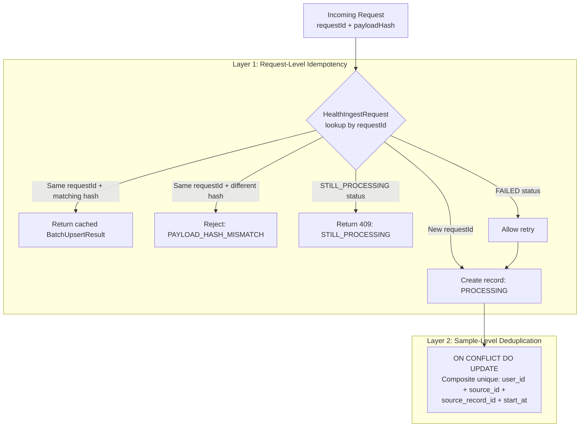
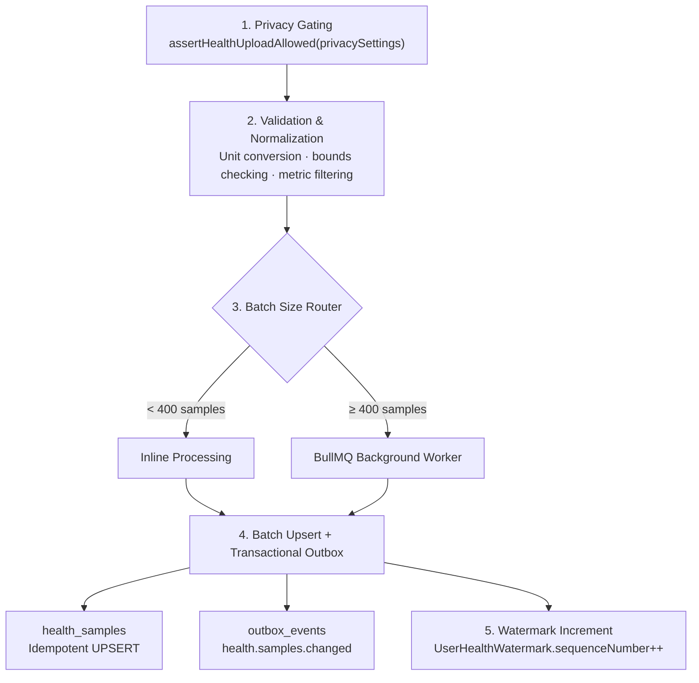

# Idempotent Health Data Ingestion Pipeline

## What It Is
A backend system that reliably receives and stores high volumes of sensitive health data from mobile clients. Submitting the same data multiple times never creates duplicates or inconsistent state.

## Why It's Hard
1. **Network unreliability** — Clients retry requests; server must distinguish originals from retries
2. **Concurrency** — Multiple clients may ingest overlapping data simultaneously
3. **Data sensitivity (PHI)** — Duplicating health records violates integrity and privacy
4. **Complex payloads** — Batches contain heterogeneous samples requiring granular deduplication
5. **Payload integrity** — Preventing erroneous modifications on retry

## Two-Layer Idempotency

### Layer 1: Request-Level (`HealthIngestRequest` table)
- Client sends `requestId` (UUID) + `payloadHash` (SHA-256 of canonicalized batch)
- Server checks `HealthIngestRequest` table:
  - Same `requestId` + matching `payloadHash` -> return cached response (idempotency hit)
  - Same `requestId` + different `payloadHash` -> reject as `PAYLOAD_HASH_MISMATCH`
  - `STILL_PROCESSING` -> return `409 Conflict`
  - `FAILED` -> allow retry

### Layer 2: Sample-Level (Unique Constraint)
- `HealthSample` table has composite unique: `(user_id, source_id, source_record_id, start_at)`
- `ON CONFLICT DO UPDATE` handles duplicate samples as idempotent updates
- Metadata changes are applied; core fields remain stable

## Pipeline Flow

1. Privacy gating: `assertHealthUploadAllowed(privacySettings)`
2. Validation & normalization: unit conversion, bounds checking, metric filtering
3. Optional async queuing: large batches -> BullMQ -> background worker
4. Batch upsert with transactional outbox: `health.samples.changed` event
5. Watermark increment: `UserHealthWatermark.sequenceNumber++`

## Failure Modes Handled
- Duplicate client requests -> cached response
- Payload tampering -> hash mismatch rejection
- Network retries -> handled at both request and sample level
- Partial failures -> individual sample rejection with batch-level success
- Privacy violations -> server-side gating, PHI redaction

## Key Files
- `src/services/healthSample.service.ts`
- `src/repositories/health-sample.repository.ts`
- `src/services/healthIngestQueue.service.ts`
- `src/services/ai-phi-redaction.service.ts`
