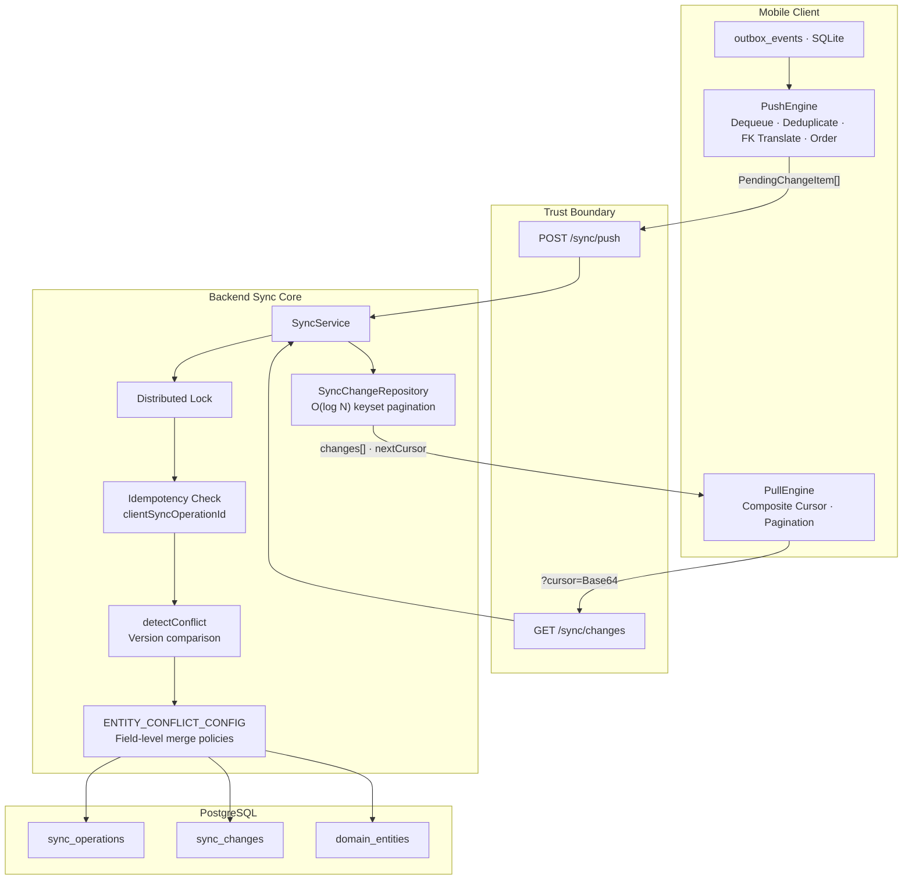
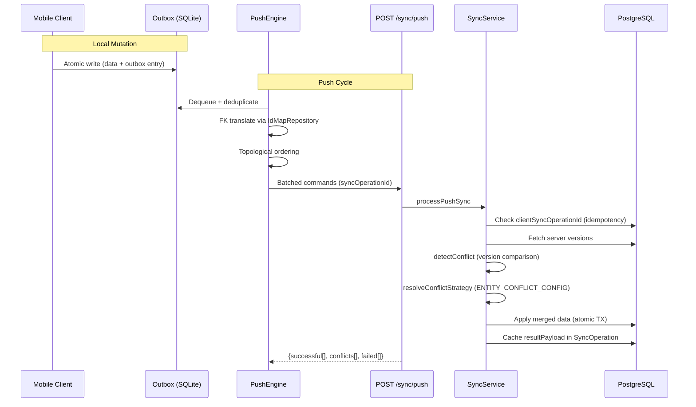

# Multi-Device Offline-First Sync Engine

## What It Is
A custom-built subsystem that orchestrates bidirectional data synchronization between multiple mobile clients and the backend API. Users make changes while offline; all local changes eventually reconcile with the server's authoritative state through deterministic conflict resolution.

## Why It's Hard
1. **Eventual consistency** — All devices must converge despite offline edits, network delays, and concurrent modifications
2. **Conflict resolution** — Same data modified on multiple devices requires deterministic merge without data loss
3. **Idempotency** — Network retries must not produce duplicate processing
4. **Ordering guarantees** — FK dependencies require topological ordering of entity changes
5. **Scalability** — Efficient sync for potentially millions of records

## How It Works

### Push Cycle (Client -> Server)
1. Local mutations are atomically recorded in `outbox_events` (SQLite)
2. `PushEngine` sends batched commands to `POST /sync/push`
3. Each command includes a client-generated `requestId` and entity `version`
4. `SyncService.processPushSync` checks idempotency via `clientSyncOperationId`
5. For each change, `detectConflict` compares client vs server `version`
6. Conflicts resolved via `ENTITY_CONFLICT_CONFIG` field-level policies
7. All results cached in `SyncOperation.resultPayload` for retry safety

### Pull Cycle (Server -> Client)
1. `GET /sync/changes` with opaque composite cursor
2. Changes fetched from `SyncChange` table, ordered by `ENTITY_SYNC_ORDER`
3. New `CompositeCursor` generated and Base64-encoded
4. Client applies changes to local SQLite, updates entity cursors

## Failure Modes Handled
- Network disconnections -> client retries push, pulls delta
- App crashes during sync -> outbox ensures pending changes survive
- Concurrent modifications -> optimistic locking + field-level merge
- Partial backend responses -> individual command success/failure tracking
- Clock skew -> cursor-based sync prefers composite keys over timestamps
- Corrupted cursor -> strict validation returns 400

## Key Files
- `code-snippets/services/sync.service.ts`
- `code-snippets/services/sync/handlers/*.handler.ts`
- `packages/shared/src/sync-config/conflict-configs.ts`
- `packages/shared/src/sync-config/cursor.ts`
