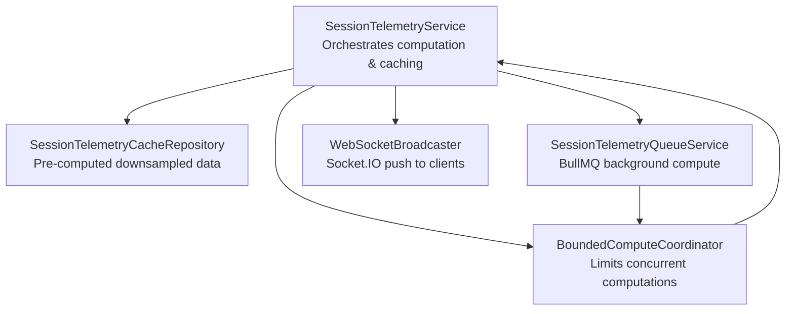
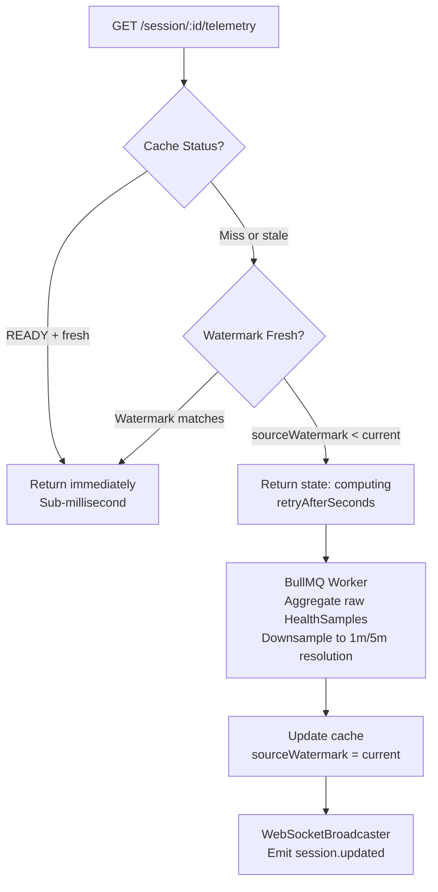

# Real-Time Session Telemetry

## What It Is
Live updates and historical visualizations of health metrics during and after consumption sessions. Combines fast caching, background computation, and WebSocket delivery for instant feedback and analytical insights.

## Architecture
1. **SessionTelemetryService** — Orchestrates computation, caching, and freshness detection
2. **SessionTelemetryCacheRepository** — Stores pre-computed, downsampled data
3. **BoundedComputeCoordinator** — Limits concurrent computations (prevents thundering herd)
4. **SessionTelemetryQueueService** — Offloads heavy aggregation to BullMQ workers
5. **WebSocketBroadcaster** — Pushes updates to connected clients via Socket.IO

## Flow
1. **Cache hit (READY + fresh):** Return immediately — sub-millisecond
2. **Cache miss or stale:** Trigger async recomputation, return `state: 'computing'` with `retryAfterSeconds`
3. **Background compute:** Worker aggregates raw `HealthSample` data, downsamples to 1m/5m resolution
4. **Freshness check:** Compare `sourceWatermark` in cache vs `currentSourceWatermark` — stale triggers recompute
5. **Real-time delivery:** `WebSocketBroadcaster` emits `session.updated` to connected clients

## Key Design Decisions
- Watermark-based freshness (not TTL) — precise staleness detection
- Bounded concurrency pool — prevents database overload during high demand
- Async-first computation — API returns immediately; client polls or subscribes
- Resolution-aware downsampling — 1m for short sessions, 5m for long

## Key Files
- `src/services/session-telemetry.service.ts`
- `src/services/sessionTelemetryQueue.service.ts`
- `src/subscribers/session-telemetry.subscriber.ts`
- `src/realtime/WebSocketBroadcaster.ts`
